# 종합실습 4 - E-Commerce 데이터 요청 및 SQL 튜닝 리포트

- 소속: 판교 5반
- 성명: 홍은비
- DBMS: PostgreSQL ______
- 실행환경: Local PC / DBeaver ______
- 측정 명령: `EXPLAIN (ANALYZE, BUFFERS, SUMMARY)`

> 시드 데이터는 `random()`으로 생성되므로 실행 결과와 시간은 환경마다 달라질 수 있다. 절대시간뿐 아니라 Scan/Join 방식, 반복 횟수, 예상·실제 행 수, Buffers 변화를 함께 비교한다.

## 1. 실습 목적

구매·재무 등 다른 실무 팀에서 요청한 E-Commerce 자료를 정확한 기준으로 산출하고, 같은 결과를 더 효율적으로 반환하도록 SQL과 인덱스를 개선한다. Q1~Q10은 튜닝 전후 쿼리와 실행계획을 비교하고, 별도로 PostgreSQL의 세 가지 물리 조인과 Materialized View 활용 방법을 검토한다.

## 2. 공통 데이터 기준

| 항목 | 정의 |
|---|---|
| 실매출 주문 | `order_status IN ('paid','shipped','delivered')` |
| 주문 매출 | `SUM(order_items.line_total)` |
| AOV | 실매출 합계 ÷ 실매출 주문 수 |
| Q1 기간 | 실행시점 기준 최근 1개월 |
| Q3 기간 | 실행시점 기준 최근 90일 |
| Q6 재구매 | 첫 구매 후 30일 이내 추가 실구매 |
| Q10 대상 | 전체 3,000명 누적매출 상위 1%인 30명 |
| Q10 표시금액 | 선정된 30명의 최근 60일 실매출 |

## 3. Q1 - 최근 1개월 실제 판매 총액

### 요청사항

`paid`, `shipped`, `delivered` 상태이면서 `now() - interval '1 month'` 이후인 주문의 `line_total` 합계를 제공한다.

### 튜닝 전 쿼리·결과 화면

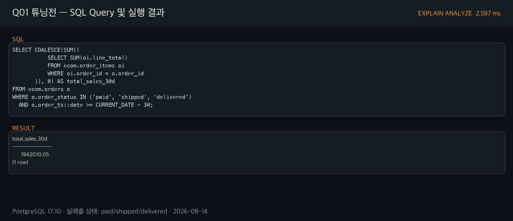

### 느린 이유

`order_ts`를 함수로 변환하면 일반 날짜 인덱스의 범위 탐색이 어려워질 수 있다. 또한 주문마다 주문상품 합계를 상관 서브쿼리로 반복 조회한다.

### 개선 방법

날짜 컬럼을 그대로 둔 SARG 범위 조건을 사용하고, 주문과 주문상품을 한 번 조인해 전체 합계를 계산한다. 실매출 상태만 포함하는 부분 인덱스로 대상 주문 탐색 범위를 줄인다.

### 튜닝 후 쿼리·결과 화면

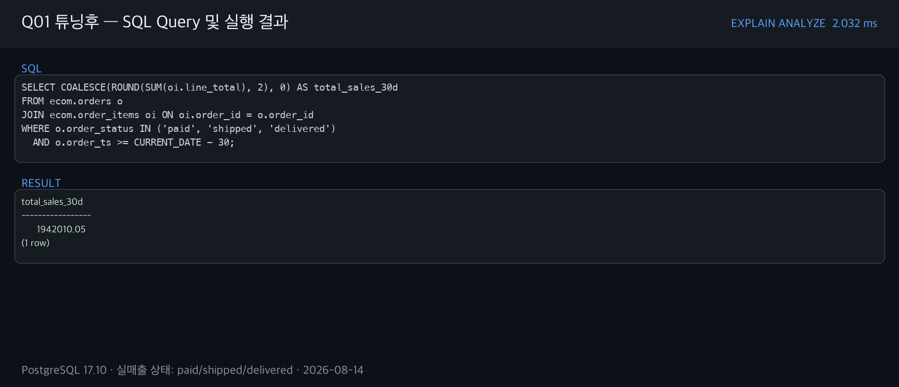

| 구분 | Scan/Join 방식 | Buffers | Execution Time | 결과 금액 |
|---|---|---:|---:|---:|
| 튜닝 전 | ______ | ______ | ______ ms | ______ |
| 튜닝 후 | ______ | ______ | ______ ms | ______ |

**결과 해석:** ______

## 4. Q2 - 월별 주문 수·매출·AOV

### 요청사항

월별 실매출 주문 수, 총매출, 주문당 평균 금액을 제공한다.

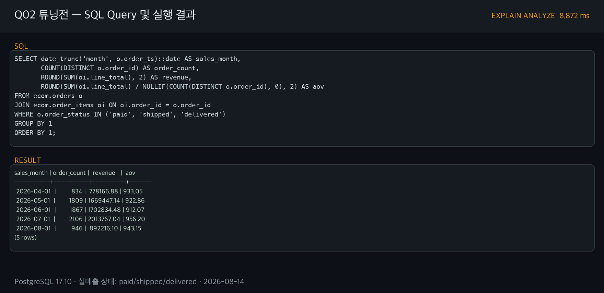

### 느린 이유와 개선 방법

상세 주문상품을 먼저 조인한 상태에서는 주문이 여러 행으로 증가하므로 `COUNT(DISTINCT order_id)`가 필요하다. 튜닝 후에는 주문별 금액을 먼저 집계한 다음 월별로 다시 집계해 중복 제거 비용을 줄인다.

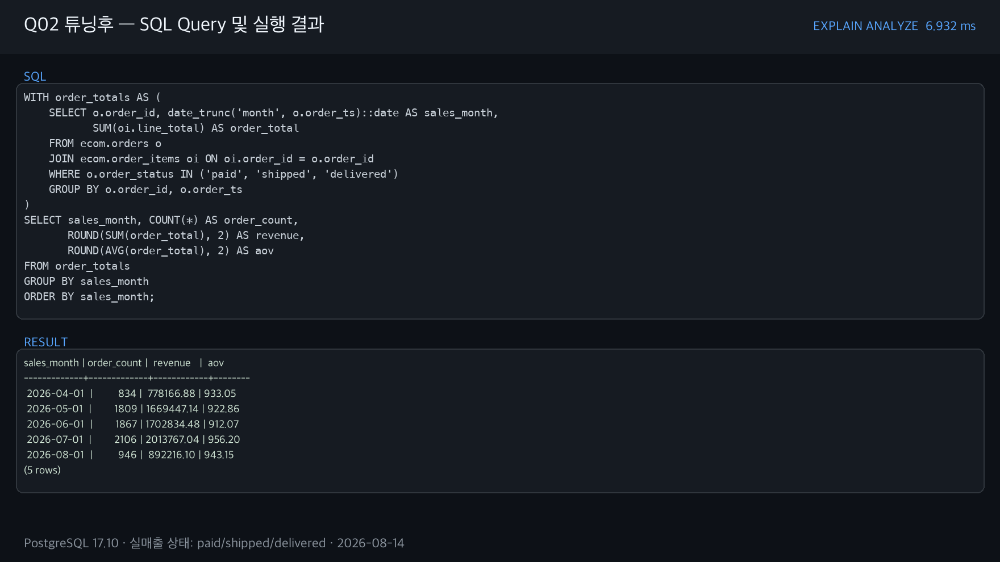

| 구분 | 집계 방식 | Buffers | Execution Time | 전후 결과 동일 여부 |
|---|---|---:|---:|---|
| 튜닝 전 | 상세행 + `COUNT(DISTINCT)` | ______ | ______ ms | - |
| 튜닝 후 | 주문별 선집계 + `COUNT(order_id)` | ______ | ______ ms | ______ |

**결과 해석:** ______

## 5. Q3 - 최근 90일 카테고리 매출 Top 10

### 요청사항

최근 90일 실매출을 카테고리별로 집계해 상위 10개를 제공한다.

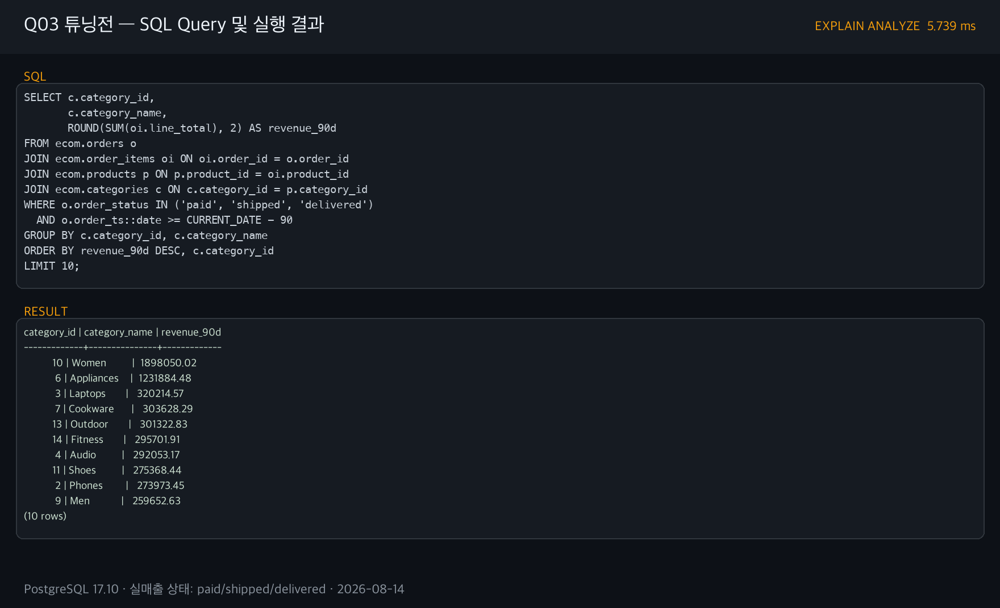

### 느린 이유와 개선 방법

비-SARG 날짜 조건은 인덱스 범위 탐색을 방해할 수 있다. 튜닝 후에는 최근 실매출 주문을 먼저 축소하고 `order_items → products → categories` 순서로 연결한다.

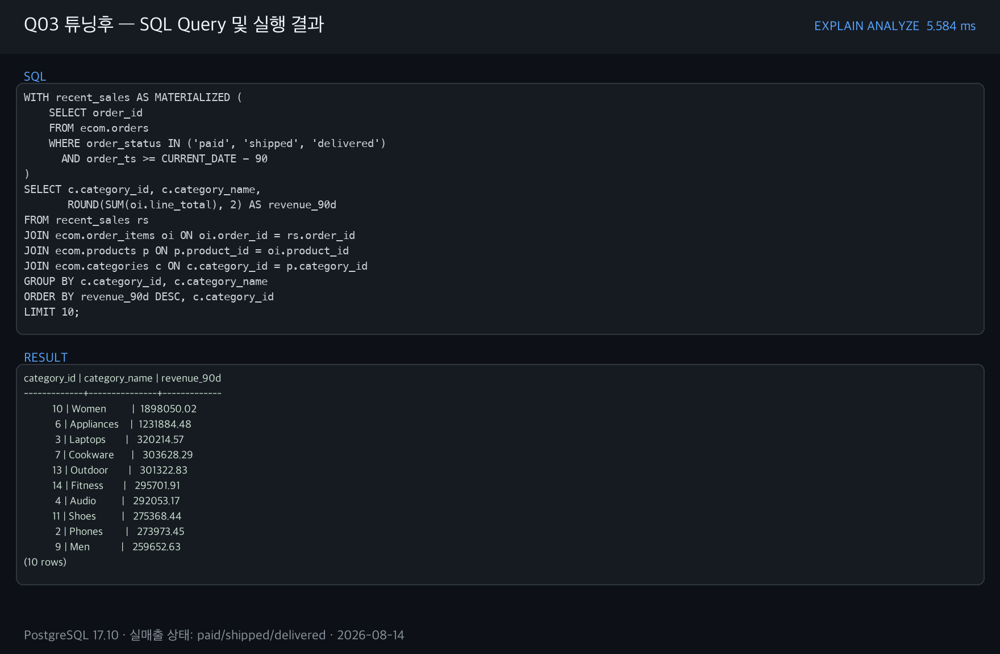

| 구분 | Orders 접근 방식 | Join 방식 | Buffers | Execution Time |
|---|---|---|---:|---:|
| 튜닝 전 | ______ | ______ | ______ | ______ ms |
| 튜닝 후 | ______ | ______ | ______ | ______ ms |

**Top 10 결과 및 해석:** ______

## 6. Q4 - 제품별 누적매출 RANK Top 20

### 요청사항

제품별 누적매출을 먼저 계산하고 `RANK()`로 상위 20개 제품을 제공한다.

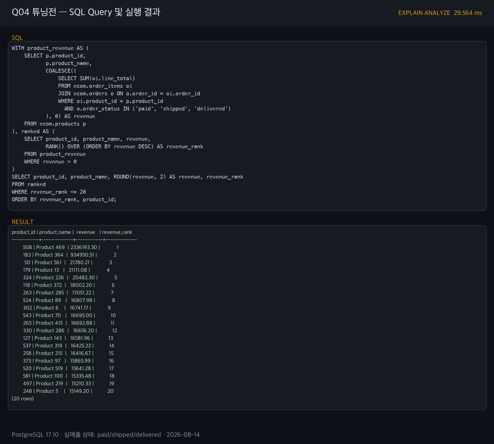

### 느린 이유와 개선 방법

튜닝 전에는 제품마다 주문상품과 주문을 반복 조회한다. 튜닝 후에는 전체 매출을 제품별로 한 번 집계한 후 Window Function을 적용한다.

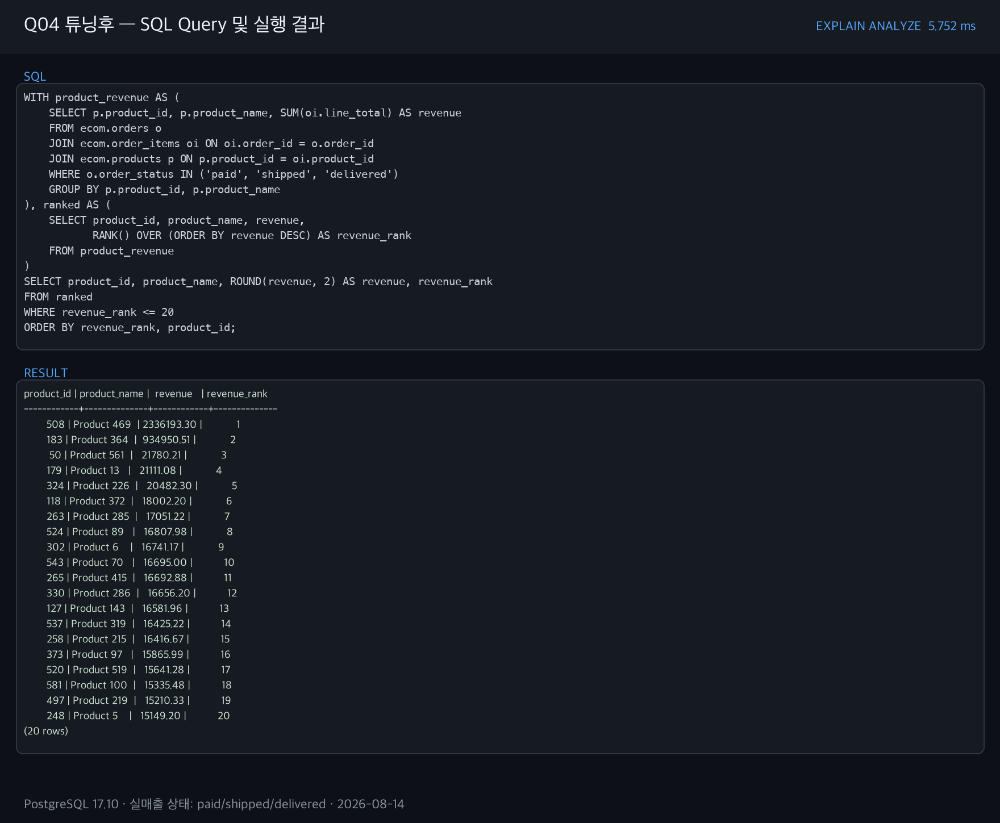

| 구분 | 반복 SubPlan | Buffers | Execution Time | 1위 제품/매출 |
|---|---:|---:|---:|---|
| 튜닝 전 | ______ | ______ | ______ ms | ______ |
| 튜닝 후 | ______ | ______ | ______ ms | ______ |

**결과 해석:** ______

## 7. Q5 - 고객별 RFM 분석

### 요청사항

고객별 최근성(최근 구매일), 빈도(주문 수), 금액(총매출)을 제공한다.

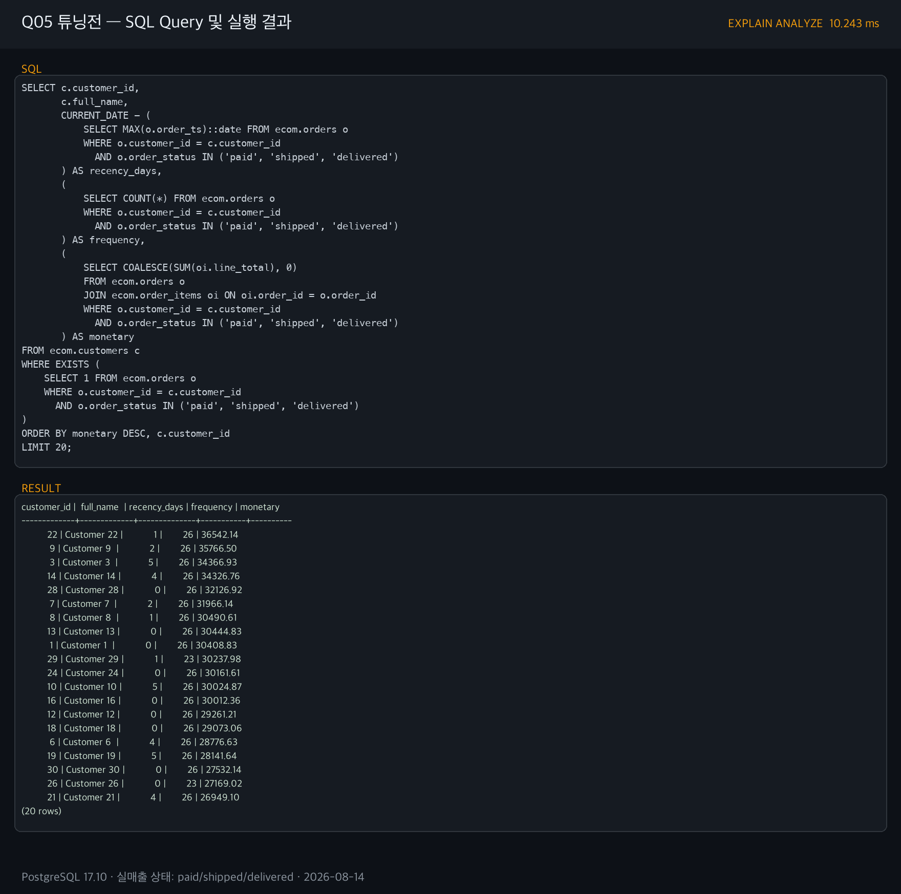

### 느린 이유와 개선 방법

튜닝 전에는 고객마다 최근 구매·빈도·금액을 각각 조회한다. 튜닝 후에는 주문별 금액을 선집계하고 고객별 `MAX`, `COUNT`, `SUM`을 한 번에 계산한다.

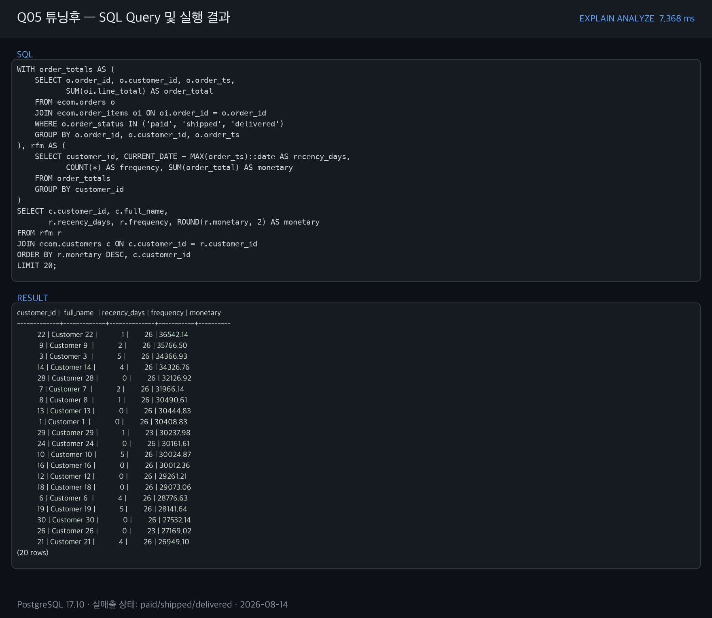

| 구분 | 집계 방식 | Buffers | Execution Time | 전후 결과 동일 여부 |
|---|---|---:|---:|---|
| 튜닝 전 | 고객별 상관 서브쿼리 | ______ | ______ ms | - |
| 튜닝 후 | 주문 선집계 후 고객 GROUP BY | ______ | ______ ms | ______ |

**RFM 결과 해석:** ______

## 8. Q6 - 첫 구매 후 30일 내 재구매율

### 요청사항

실구매 고객 중 첫 구매 후 30일 안에 추가 실구매가 있었던 고객의 비율을 제공한다.

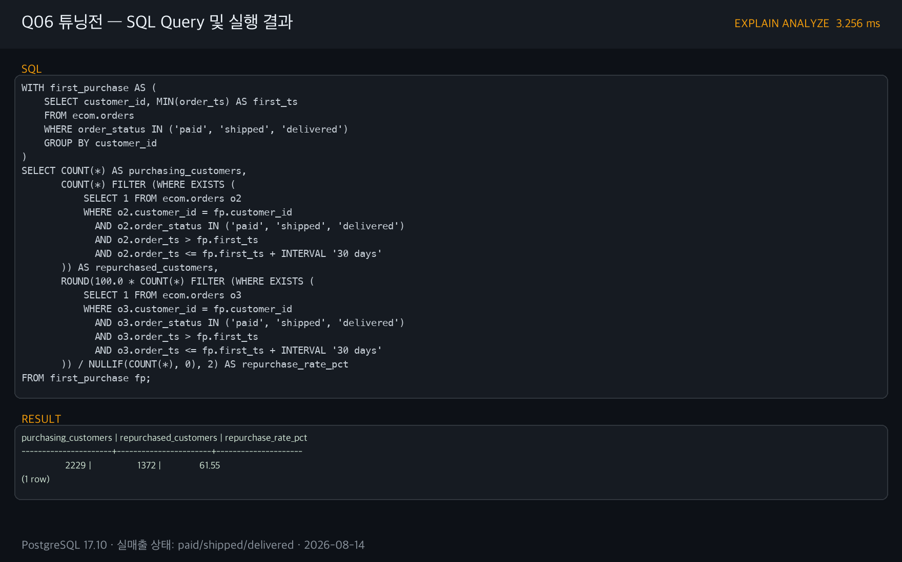

### 느린 이유와 개선 방법

튜닝 전에는 고객별 첫 구매 이후 주문을 `EXISTS`로 반복 탐색한다. 튜닝 후에는 Window Function으로 첫 구매시각을 표시하고 고객별 `BOOL_OR`로 재구매 여부를 한 번 집계한다.

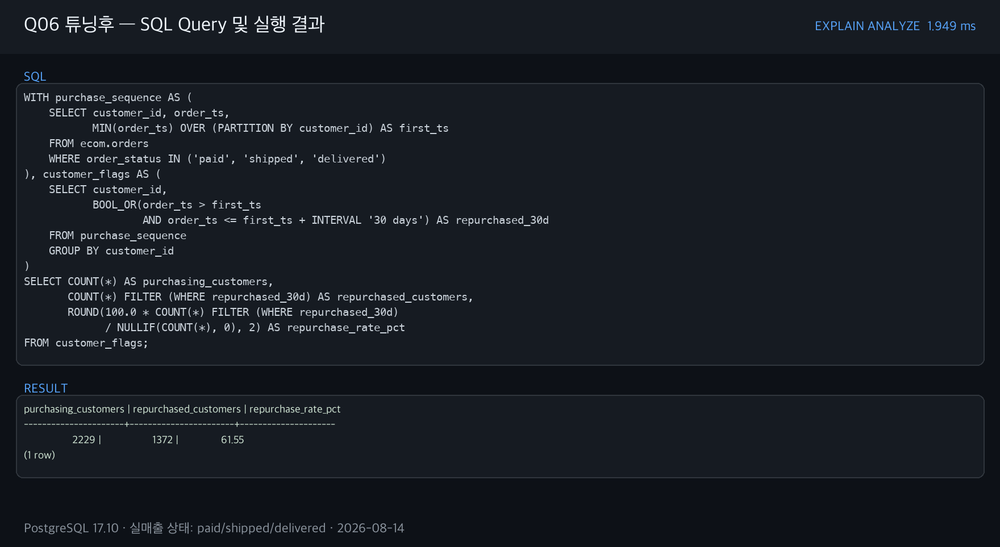

| 구분 | 구매고객 | 30일 내 재구매고객 | 재구매율 | Execution Time |
|---|---:|---:|---:|---:|
| 튜닝 전 | ______ | ______ | ______% | ______ ms |
| 튜닝 후 | ______ | ______ | ______% | ______ ms |

**결과 해석:** ______

## 9. Q7 - 재주문 임계치 미만 상품

### 요청사항

`qty_on_hand < reorder_point`인 상품과 부족수량을 제공한다.

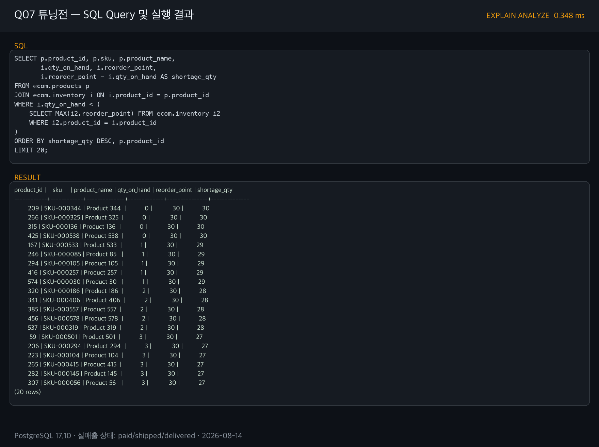

### 느린 이유와 개선 방법

튜닝 전에는 같은 재고 행의 임계치를 다시 상관 조회한다. 튜닝 후에는 직접 비교 조건과 저재고 행만 포함하는 부분 인덱스를 사용한다.

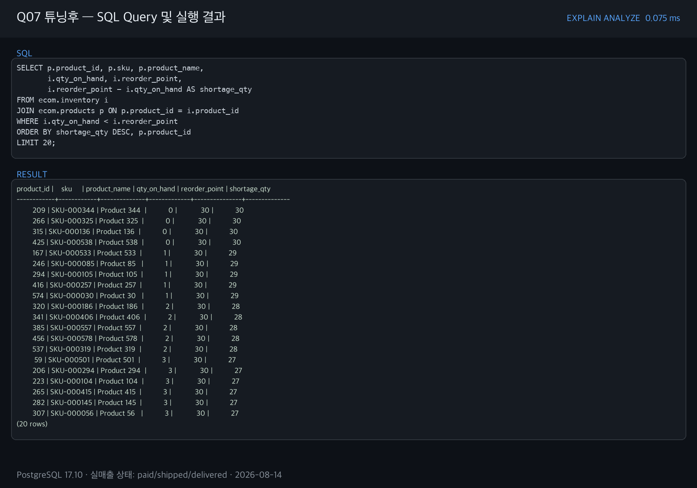

| 구분 | Inventory 접근 방식 | 반복 횟수 | Buffers | Execution Time |
|---|---|---:|---:|---:|
| 튜닝 전 | ______ | ______ | ______ | ______ ms |
| 튜닝 후 | ______ | ______ | ______ | ______ ms |

**부족 상품 결과 해석:** ______

## 10. Q8 - 리뷰 기반 효자상품

### 요청사항

평균 평점 4.5 이상이고 리뷰가 50개 이상인 제품을 제공한다.

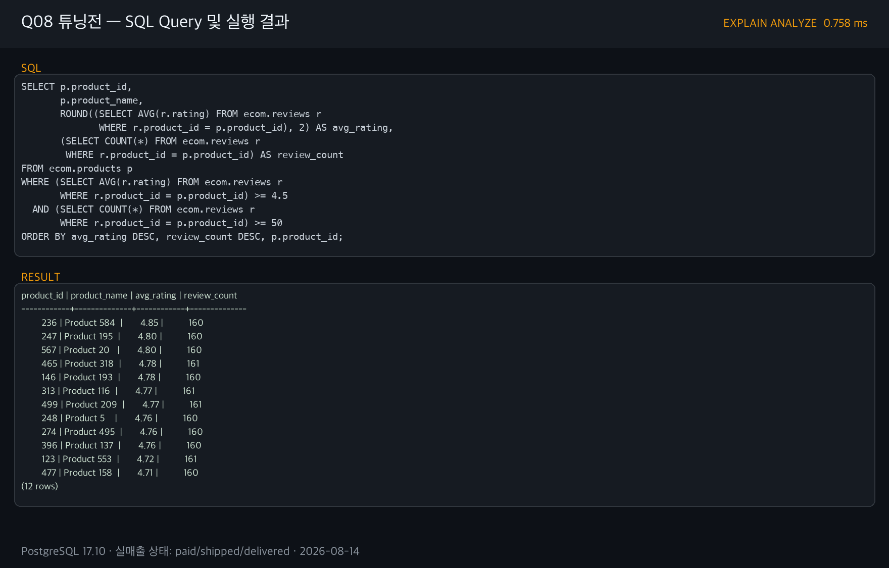

### 느린 이유와 개선 방법

튜닝 전에는 제품별 평균과 건수를 SELECT와 WHERE에서 반복 계산한다. 튜닝 후에는 리뷰를 한 번 읽고 `GROUP BY`와 `HAVING`으로 조건을 적용한다.

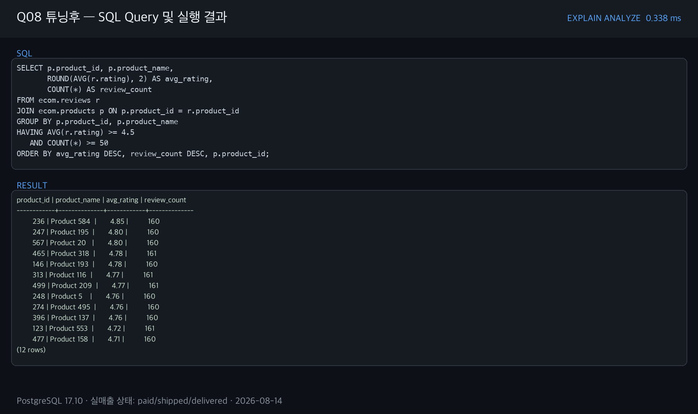

| 구분 | Reviews 접근 방식 | Buffers | Execution Time | 조건 충족 상품 수 |
|---|---|---:|---:|---:|
| 튜닝 전 | ______ | ______ | ______ ms | ______ |
| 튜닝 후 | ______ | ______ | ______ ms | ______ |

**결과 해석:** ______

## 11. Q9 - 쿠폰 사용 여부별 AOV

### 요청사항

쿠폰 사용 주문과 미사용 주문의 주문당 평균 금액을 비교한다.

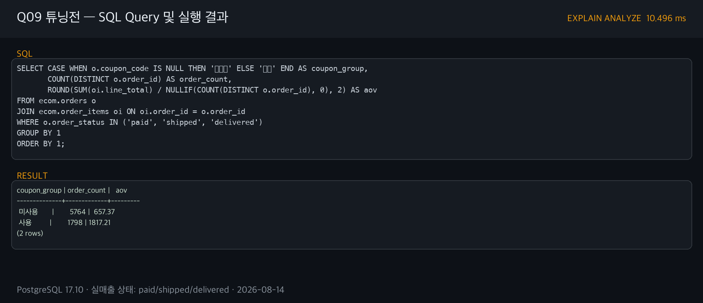

### 느린 이유와 개선 방법

상세행 조인 후에는 주문 수 복원을 위해 `COUNT(DISTINCT)`가 필요하다. 튜닝 후에는 주문별 금액을 먼저 계산한 뒤 쿠폰 사용 여부로 그룹핑해 `AVG(order_total)`을 계산한다.

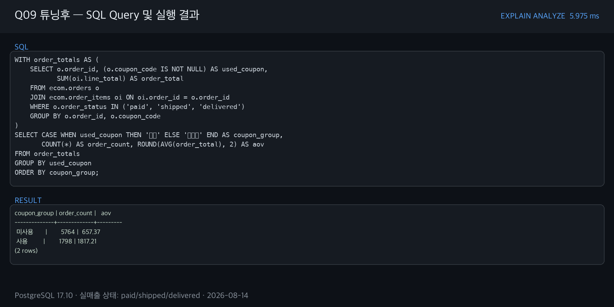

| 그룹 | 주문 수 | AOV | 해석 |
|---|---:|---:|---|
| 쿠폰 미사용 | ______ | ______ | ______ |
| 쿠폰 사용 | ______ | ______ | ______ |

| 구분 | Buffers | Execution Time |
|---|---:|---:|
| 튜닝 전 | ______ | ______ ms |
| 튜닝 후 | ______ | ______ ms |

> 쿠폰 사용과 높은 AOV의 상관관계만 확인할 수 있으며, 쿠폰의 인과효과를 의미하지는 않는다.

## 12. Q10 - 누적매출 상위 1% 고객의 최근 60일 매출

### 요청사항

전체 고객 3,000명을 누적매출로 정렬해 상위 1%인 정확히 30명을 먼저 선정하고, 선정된 고객의 최근 60일 매출을 제공한다.

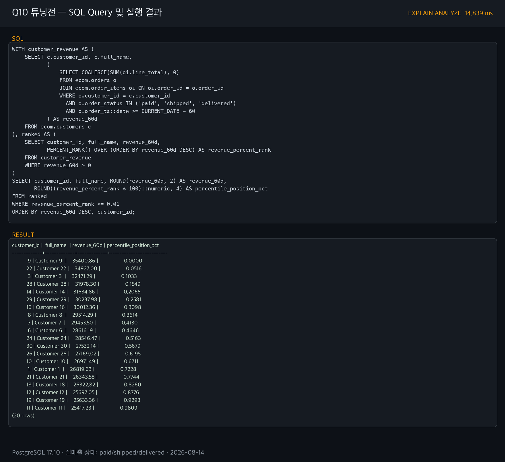

### 느린 이유와 개선 방법

튜닝 전에는 고객 3,000명의 누적매출과 상위 고객의 최근 매출을 상관 서브쿼리로 반복 계산한다. 튜닝 후에는 전체 고객을 기준으로 누적매출과 최근 60일 매출을 한 번에 집계하고, `ROW_NUMBER()`와 전체 고객 수를 이용해 30명을 정확히 추출한다.

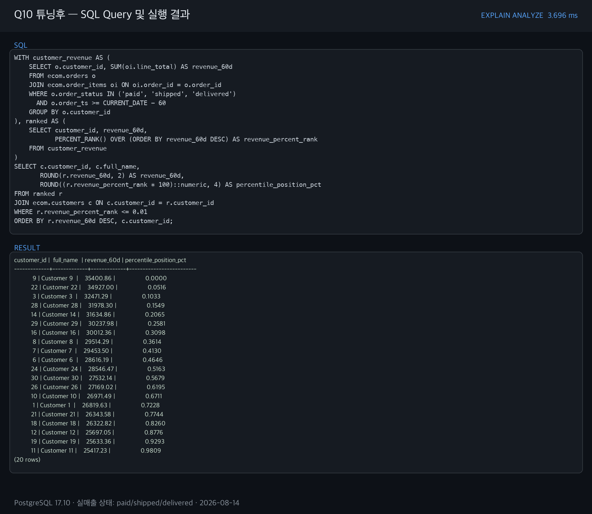

| 검증 항목 | 기대값 | 실제값 |
|---|---:|---:|
| 전체 고객 수 | 3,000 | ______ |
| 상위 1% 고객 수 | 30 | ______ |
| 누적매출 1위 고객 | - | ______ |
| 해당 고객 최근 60일 매출 | - | ______ |

| 구분 | 반복 SubPlan | Buffers | Execution Time |
|---|---:|---:|---:|
| 튜닝 전 | ______ | ______ | ______ ms |
| 튜닝 후 | ______ | ______ | ______ ms |

**결과 해석:** ______

## 13. Q11 - 안전 나눗셈 함수 비교

### 함수 정의 차이

| 함수 | 정의 파일 | 분모가 0일 때 |
|---|---|---|
| `ecom.f_safe_div` | 스키마 파일 | `0` 반환 |
| `ecom.safe_div` | 시드 파일 | `NULL` 반환 |


### 실행 결과

| 테스트 | `f_safe_div` | `safe_div` | 해석 |
|---|---:|---:|---|
| 정상 AOV | ______ | ______ | 분모가 0이 아니면 같은 계산 결과 |
| `100 / 0` | `0` | `NULL` | 보고서 요구에 맞는 정책을 선택해야 함 |

## 14. 물리 조인 3종 비교

### 실행 결과 화면


| 구분 | 처리 방식 | 일반적으로 유리한 조건 | Buffers | Execution Time |
|---|---|---|---:|---:|
| Nested Loop Join | 외부 행마다 내부 입력 탐색 | 외부 입력이 작고 내부 인덱스가 있을 때 | ______ | ______ ms |
| Hash Join | 작은 입력 해시 생성 후 큰 입력 탐색 | 큰 비정렬 동등 조인 | ______ | ______ ms |
| Merge Join | 정렬된 두 입력을 순차 병합 | 양쪽이 이미 정렬된 큰 입력 | ______ | ______ ms |

### 본인 환경에서의 결론

______

## 15. Materialized View 활용

### 생성 목적

매일 주문과 주문상품을 다시 조인·집계하지 않고, 미리 계산한 일별 주문 수와 GMV를 빠르게 조회한다.

### 생성 및 결과 화면


| 구분 | 핵심 실행계획 | Buffers | Execution Time |
|---|---|---:|---:|
| 원본 JOIN + GROUP BY | ______ | ______ | ______ ms |
| `mv_daily_gmv` 조회 | ______ | ______ | ______ ms |

### 갱신 전략

- 최초 적재: `REFRESH MATERIALIZED VIEW ecom.mv_daily_gmv;`
- 운영 갱신: `REFRESH MATERIALIZED VIEW CONCURRENTLY ecom.mv_daily_gmv;`
- 제안 주기: 매일 오후 3시
- 주의점: 오후 3시 이후 변경사항은 다음 갱신 전까지 조회 결과에 반영되지 않는다.

## 16. DBMS별 옵티마이저 비교 (Option)

자세한 조사 내용은 `종합실습4_06_DBMS별_옵티마이저_비교.md`를 참고한다.

| DBMS | 대표 조인 | 실행계획 확인 | 특징 |
|---|---|---|---|
| PostgreSQL | Nested Loop, Hash, Merge | `EXPLAIN ANALYZE` | 통계·비용 기반, 확장 통계, GEQO |
| MySQL | Nested Loop/BKA, Hash | `EXPLAIN ANALYZE` | optimizer switch·힌트·히스토그램 |
| Oracle | Nested Loop, Hash, Sort Merge | `DBMS_XPLAN` | Adaptive Plan, SQL Plan Management |
| SQL Server | Nested Loops, Hash, Merge, Adaptive | Actual Execution Plan | Query Store, Intelligent Query Processing |

## 17. 전체 튜닝 전후 비교

| 문항 | 튜닝 전 방식 | 튜닝 후 방식 | 전 Buffers | 후 Buffers | 전 시간 | 후 시간 | 감소율 |
|---|---|---|---:|---:|---:|---:|---:|
| Q1 | 함수 조건 + 상관 집계 | SARG 범위 + 단일 집계 | ______ | ______ | ______ | ______ | ______% |
| Q2 | 상세행 + DISTINCT | 주문별 선집계 | ______ | ______ | ______ | ______ | ______% |
| Q3 | 비-SARG 기간 조건 | 최근 주문 선필터 | ______ | ______ | ______ | ______ | ______% |
| Q4 | 제품별 상관 서브쿼리 | 전체 1회 집계 + RANK | ______ | ______ | ______ | ______ | ______% |
| Q5 | 고객별 3회 반복 조회 | 주문 선집계 + 고객 GROUP BY | ______ | ______ | ______ | ______ | ______% |
| Q6 | 고객별 EXISTS | Window + BOOL_OR | ______ | ______ | ______ | ______ | ______% |
| Q7 | 임계치 상관 조회 | 직접 비교 + 부분 인덱스 | ______ | ______ | ______ | ______ | ______% |
| Q8 | AVG/COUNT 반복 | GROUP BY + HAVING | ______ | ______ | ______ | ______ | ______% |
| Q9 | 상세행 + DISTINCT | 주문별 선집계 + AVG | ______ | ______ | ______ | ______ | ______% |
| Q10 | 누적/60일 매출 반복 조회 | 전체 1회 집계 + 정확히 30명 | ______ | ______ | ______ | ______ | ______% |

감소율 계산식:

```text
(튜닝 전 시간 - 튜닝 후 시간) / 튜닝 전 시간 × 100
```

## 18. 최종 분석

### 요청 대응 관점

어떤 주문 상태와 기간을 포함하는지, 주문 수와 주문상품 수를 혼동하지 않았는지, 상위 고객의 선정 기준과 표시 기간이 다른지 먼저 정의해야 한다. 특히 Q10은 최근 60일 매출로 상위 고객을 선정하는 것이 아니라 누적매출로 30명을 선정한 뒤 최근 60일 매출을 계산한다.

### 튜닝 관점

______

### 한계와 추가 확인사항

- 랜덤 시드이므로 재실행 시 결과가 달라진다.
- 로컬 단일 사용자 환경의 실행시간은 운영 부하를 반영하지 않는다.
- 쿠폰 사용 여부와 AOV의 관계는 인과관계가 아니다.
- 인덱스는 조회 성능을 높이지만 INSERT/UPDATE와 저장공간 비용을 추가한다.

### 최종 결론

______
