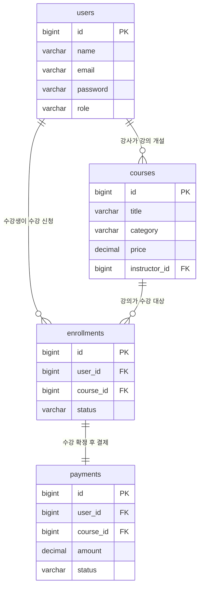
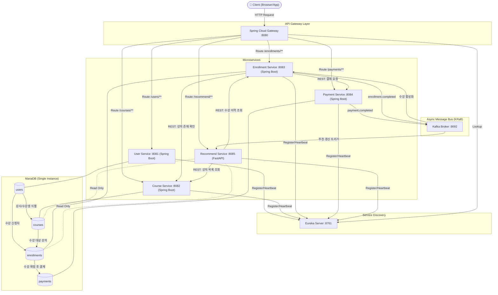
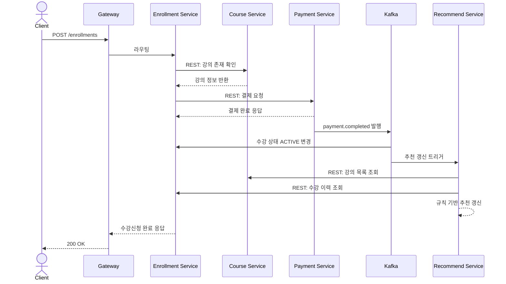

# 🧩 Agile 방법론 및 MSA 개발 완전 정리

> 💡 **한 줄 요약**
> Agile은 "어떻게 일할 것인가"의 **방법론**, MSA는 그 방식을 가능하게 하는 **기술 구조**다. 요구사항이 계속 변하는 AI 서비스에서는 작게 나눠 자주 검증하는 Agile과, 모듈 단위로 독립 교체가 가능한 MSA가 세트로 쓰인다. 이 문서는 이론(Scrum·User Story·Sprint) → 아키텍처(Gateway·Eureka·Kafka) → 실제 구현(온라인 교육 플랫폼 9개 컨테이너) → 운영(Docker·트러블슈팅)까지 전 과정을 하나로 연결한다.

**출처**

| 파일 | 페이지 | 역할 |
|---|---|---|
| `교재.Cloud_Agile 방법론 및 MSA 개발_임성열.pdf` | 127p | Agile 이론 + MSA 개념 + 사례 연구 |
| `가이드2.코드 템플릿 설명 문서.msa-practice_scenario.pdf` | 30p | 온라인 교육 플랫폼 7 Step 설계 + 서비스별 구조 |
| `가이드1.Agile_MSA_실습_가이드.pdf` | 41p | 수업 운영·제출물 + Docker 컨테이너 Q&A 41문항 |

**범위** : Day1(Agile 이론·Sprint Backlog 설계) + Day2(MSA 구현·Sprint 실행) 전체 + 부록(사례 연구, Docker 기초, Swagger 연동)

---

## 📑 목차

| # | 챕터 | 핵심 질문 | 슬라이드 |
|---|---|---|---|
| 1 | Agile 개요와 도입 로드맵 | Waterfall은 왜 실패했고, Agile은 무엇을 바꾸는가? | 교재 p5~8 |
| 2 | Scrum — 역할·산출물·이벤트 | Scrum의 3역할·3산출물·4이벤트는 각각 무엇을 책임지는가? | 교재 p9~15 |
| 3 | User Story와 Product Backlog | 요구사항이 Epic → Story → Task로 쪼개지는 기준은? | 교재 p16~22 |
| 4 | Release Planning과 Sprint Planning | 백로그를 언제 어떤 Sprint에 배치하는가? | 교재 p23~29 |
| 5 | 모의 프로젝트와 Day1→Day2 연계 | Day1 산출물이 Day2 구현으로 어떻게 이어지는가? | 교재 p30~43 |
| 6 | MSA 개요 — Cloud Ready→Native | MSA는 정말 필요한가? 전환은 어떤 단계를 거치는가? | 교재 p46~61 |
| 7 | MSA 구성요소 6종 | Gateway·Discovery·Config·Circuit Breaker는 각각 왜 필요한가? | 교재 p62, p78~80 |
| 8 | SOLID → 인증서버 전환 (Sprint 1) | 모놀리식 LoginService를 어떻게 인증서버로 분리하는가? | 교재 p63~71 |
| 9 | Eureka와 서비스 간 통신 (Sprint 2) | 서비스가 서로를 어떻게 찾아 호출하는가? | 교재 p72~75 |
| 10 | Kafka 이벤트 기반 통신 (Sprint 3) | 언제 REST 대신 Kafka를 쓰는가? | 교재 p76~77 |
| 11 | MSA에서의 데이터 처리 함정 | 서비스를 쪼개면 트랜잭션 격리는 어떻게 되는가? | 교재 p81~83 |
| 12 | 온라인 교육 플랫폼 설계 7 Step | 요구사항에서 컨테이너 구성까지 어떤 순서로 설계하는가? | 가이드2 p1~4 |
| 13 | 서비스별 코드 템플릿 상세 | 9개 컨테이너 각각의 구조와 책임은? | 가이드2 p5~18 |
| 14 | 프론트엔드 연동과 Swagger | 백엔드 코드를 몰라도 화면을 붙이는 방법은? | 가이드2 p19~21, 가이드1 부록1 |
| 15 | Docker 컨테이너 완전 이해 | 격리라는 하나의 뿌리에서 모든 문법이 어떻게 뻗어나오는가? | 가이드1 p20~41 |
| 16 | 사례 연구 — 아키텍처는 정답이 아니다 | 언제 MSA를 쓰고 언제 쓰지 않는가? | 교재 p102~127 |
| 17 | 실습 운영·제출 가이드 (부록) | 무엇을 이해하고 무엇은 몰라도 되는가? | 가이드1 p1~19 |
| ★ | 전체 흐름 한 장 요약 | — | — |
| ★ | 시험·면접 대비 핵심 문답 | — | — |
| ⚠️ | 원문 용어 검증 노트 | — | — |

---

# 1. Agile 개요와 도입 로드맵

> 📍 교재 p5~8 · Agile이 왜 등장했고, 실제 조직에 어떤 순서로 도입하는가

## 1-1. Agile이 필요한 상황

원문은 "필요성"과 "적합 상황"을 나눠서 제시한다. 둘의 차이는 **밀어내는 힘(도입 배경)** 과 **끌어당기는 조건(잘 맞는 환경)** 이다.

**도입 배경 · 필요성 (밀어내는 힘)**
- 시장·고객 요구가 빠르게 변화 → 초기에 요구사항을 100% 확정하기 어려움
- Waterfall은 후반 단계에서 결함/변경 발견 시 수정 비용이 매우 큼
- 짧은 주기로 동작하는 제품을 자주 검증해 리스크를 조기에 낮추는 접근이 필요
- 고객·이해관계자가 개발 중간에도 지속적으로 피드백을 반영할 수 있어야 함

**Agile이 잘 맞는 상황 (끌어당기는 조건)**

| 조건 | 구체적 상황 |
|---|---|
| 요구사항 변동성이 큼 | 시장/고객 니즈가 계속 바뀌는 신규 서비스·스타트업형 프로젝트 |
| 빠른 피드백이 중요 | 출시 후 사용자 반응을 보며 방향을 조정해야 하는 제품 |
| 점진적 가치 전달이 가능 | 기능 단위로 쪼개어 순차적으로 릴리즈할 수 있는 구조 |
| 협업 밀도가 높은 소규모 팀 | PO·개발팀 간 상시 커뮤니케이션이 가능한 환경 |

> ⭐ **핵심** : 네 조건 중 "점진적 가치 전달이 가능한 구조"는 **아키텍처가 받쳐줘야** 성립한다. 이 지점에서 Agile이 MSA를 요구한다.

## 1-2. Waterfall vs Agile 비교

| 구분 | Waterfall | Agile |
|---|---|---|
| 개발 방식 | 순차적 — 설계 → 개발 → 테스트 단계 진행 | 반복적·점진적 — 짧은 Sprint 단위 반복 |
| 요구사항 | 초기에 상세히 확정, 변경 최소화 지향 | 지속적으로 수집·재우선순위화 (Backlog) |
| 고객 피드백 | 프로젝트 종료 시점에 주로 확인 | 매 Sprint마다 Review로 상시 확인 |
| 산출물 확인 시점 | 최종 단계에 통합 결과물 확인 | 매 Sprint마다 동작하는 Increment 확인 |
| 변경 대응 | 변경 비용이 크고 절차가 무거움 | 변경을 전제로 유연하게 재계획 |
| 팀 구조 | 역할별 분업, 문서 기반 전달 | 교차기능팀, 상시 협업·짧은 피드백 루프 |

## 1-3. Agile 도입 5단계 로드맵

이론을 배우는 것과 실제 팀에 적용하는 것은 다르다. 원문은 다음 순서를 제시한다.

```plaintext
 ①현황 진단   →  ②파일럿팀 선정  →  ③Sprint 0 준비  →  ④첫 Sprint 실행  →  ⑤확산 & 정착
 기존 프로세스·      자발적 참여 의사가    백로그 초안 작성,      1~2주 짧은 Sprint로     성공 사례 공유 후
 조직 문화 점검,     있는 1~2개 소규모     Definition of Done   실제 실행,             타 팀으로 점진적
 병목 구간 파악      팀부터 시작          합의, 역할 지정        Retro로 즉시 보정        확산
```

> ⭐ **핵심 원칙** : 처음부터 전사 적용을 시도하지 않는다. 전체 영향이 없는 단위로 시작해 검증하고, 검증 성공 결과를 바탕으로 확산한다.

## 1-4. 실제 적용 시 흔한 문제 상황과 대응

| 문제 상황 | 증상 | 대응 방안 |
|---|---|---|
| **무늬만 Agile** | Sprint라는 이름만 쓰고 기존 Waterfall 방식 그대로 진행 | 이벤트·산출물을 형식이 아닌 **목적**에 맞게 실제로 운영 |
| **역할 겸직 병목** | PO가 다른 업무와 겸직하여 의사결정이 지연 | PO 전담 배치, 또는 일부 의사결정 권한을 팀에 위임 |
| **회고 없는 반복** | Sprint만 반복하고 프로세스 개선이 없음 | Retrospective 액션 아이템을 **다음 Sprint에 반드시 반영** |
| **과도한 문서화 병행** | Waterfall식 문서 프로세스를 Agile과 병행 유지 | 꼭 필요한 산출물만 유지, 대화·시각화 중심으로 전환 |
| **진행상황 미가시화** | Sprint Board 없이 진행 상태를 아무도 모름 | Sprint Board·Burndown Chart로 매일 가시화 |

## 1-5. Agile 전환 체크리스트

| Sprint 0 이전 | Sprint 0 | 첫 Sprint 종료 후 |
|---|---|---|
| ☐ PO / SM / Dev 역할을 명확히 확정했는가? | ☐ Sprint 목표(Goal)를 한 문장으로 정의했는가? | ☐ Retrospective를 진행하고 액션 아이템을 도출했는가? |
| ☐ Definition of Done 초안을 팀과 합의했는가? | ☐ Sprint Backlog(Task 단위)를 구성했는가? | ☐ Velocity(팀 처리량) 기록을 시작했는가? |
| ☐ Product Backlog에 최소 10~15개 항목을 확보했는가? | ☐ Sprint Board(물리 또는 디지털)를 셋업했는가? | ☐ 도출된 개선사항을 다음 Sprint 계획에 반영했는가? |

## 1-6. Agile 적용 실패 사유

원문은 State of Agile Report 2016·2018을 인용하며 한 문장으로 정리한다.

> ✅ **결론** : Agile 실패의 원인은 대부분 기법이 아니라 사람이다. **Agile 가치와 철학을 실현하려는 조직·팀의 의지와 지원**이 가장 중요한 성공 요인이다. 원문은 이와 함께 "Boss와 Leader의 차이" 슬라이드를 배치해, 자율적이고 주도적인 팀 구성이 전제되어야 함을 강조한다.

---

# 2. Scrum — 역할·산출물·이벤트

> 📍 교재 p9~15 · Agile을 실제로 굴리는 가장 널리 쓰이는 공정

## 2-1. Scrum 3역할 (Role)

| 역할 | 책임 |
|---|---|
| **Product Owner (PO)** | 제품 백로그 관리, 우선순위 결정, ROI 책임 |
| **Scrum Master (SM)** | 프로세스 촉진, 장애물 제거, 팀 보호 |
| **Development Team** | 기능 설계·구현·테스트, Increment 완성 |

## 2-2. Scrum 3산출물 (Artifacts)

| 산출물 | 정의 |
|---|---|
| **Product Backlog** | 제품에 필요한 **모든** 요구사항의 우선순위화된 목록. PO가 소유·관리하며 지속적으로 정제(Refinement)됨 |
| **Sprint Backlog** | 이번 Sprint에서 완료하기로 선택한 백로그 항목 + 이를 구현하기 위한 **Task 계획** |
| **Increment** | Sprint 종료 시점까지 완료된 모든 백로그 항목의 합. **'완료(Done)' 기준 충족 필요** |

**Definition of Done (완료의 정의)**

| 관점 | 설명 |
|---|---|
| 비유로 말하면 | 팀이 함께 정한 "이 정도는 돼야 다 만든 거다"라는 합격선 |
| 정확히 말하면 | Increment가 '완료'로 인정받기 위한 **팀 공통 기준**. 팀별 모의 프로젝트에서도 실습 시작 전 합의 필요 |

## 2-3. Scrum 4이벤트 실전 진행 가이드

| 이벤트 | 권장 소요시간 | 참석자 | 핵심 아젠다 |
|---|---|---|---|
| **Sprint Planning** | 2시간 (2주 Sprint 기준) | 전체 팀 | 목표 합의 → Backlog 선택 → Task 분할 |
| **Daily Scrum** | 15분 | Dev팀 + SM | 어제 한 일 / 오늘 할 일 / 장애물 공유 |
| **Sprint Review** | 1시간 | 전체 + 이해관계자 | 동작하는 결과물 데모, 피드백 수집 |
| **Retrospective** | 45분 | 전체 팀 | Keep / Problem / Try 회고 |

> ⚠️ **주의** : **타임박스(Timebox)** 를 정하고 지키는 것이 핵심이다. 논의가 길어지면 별도 회의로 분리하여 해당 이벤트 시간을 지킨다.

## 2-4. 2주 Sprint 캘린더 예시

```plaintext
  Day 1        Day 2-4         Day 5-8        Day 9           Day 10
 Sprint        개발 +           개발 +        개발 마무리 +      Review +
 Planning    Daily Scrum     Daily Scrum    Daily Scrum       Retro
```

**하루 일과 예시**

| 시간 | 활동 |
|---|---|
| 09:30 - 09:45 | Daily Scrum — 어제/오늘/장애물 공유 |
| 09:45 - 12:00 | 개발 집중 시간 (Task 작업) |
| 14:00 - 17:00 | 개발 집중 시간 + 필요 시 Backlog Refinement |
| 17:00 - 17:15 | Sprint Board 업데이트 (Task 상태 갱신) |

## 2-5. Daily Scrum 대화 예시와 3가지 질문

일일 스크럼(Stand-Up Meeting)에서 각자가 답해야 하는 세 질문은 다음과 같다.

1. 나는 어제 하루 동안 개발팀의 Sprint 목표 달성을 위해 **무엇을 했는지?**
2. 나는 오늘 하루 동안 개발팀의 Sprint 목표 달성을 위해 **무엇을 할 것인지?**
3. 나 혹은 개발팀이 Sprint 목표 달성을 하는 데 **방해 요소가 있는지?**

**실제 대화 예시**

> **팀원 A (백엔드)** — 어제는 로그인 API 개발을 완료했습니다. 오늘은 토큰 갱신 로직을 진행합니다. 특별한 장애물은 없습니다.
>
> **팀원 B (백엔드)** — 어제는 Gateway 라우팅 설정 작업 중이었고, 오늘 이어서 진행합니다. Kafka 연동 설정 관련해서 SM님과 논의가 필요합니다.
>
> **팀원 C (프론트)** — 어제는 로그인 화면 UI를 완성했습니다. 오늘은 API 연동을 시작합니다. 팀원 A님의 API 완료 시점 확인이 필요합니다.

> 💡 **팁** : 장애물(Kafka 연동, API 완료 시점 등)은 Daily Scrum에서 **발견만** 하고, 실제 논의는 종료 후 별도 시간(SoS Meeting)에 진행한다. 한 사람이 발언권을 독점하지 않도록 SM이 조율한다.

## 2-6. Agile 공정 — 현실 SI 프로젝트로의 커스터마이징

원문은 순수 Scrum이 실제 SI 프로젝트에 그대로 적용되지 않는다는 점을 지적하며, **Sprint #0(준비 단계)** 를 추가한 공정을 제시한다.

```plaintext
┌─────────────── Planning ───────────────┐┌────── Executing & Control ──────┐
│         프로젝트 수행을 위한 준비 단계          ││          본격적인 수행 단계          │
│                                        ││                                 │
│              Sprint #0                 ││   Sprint Planning               │
│    (요구사항 확인·상세화, 업무 우선순위,        ││      ↓                          │
│     환경 구성, 인력 투입, Risk 식별)         ││   분석 → 설계 → 코딩 → 테스트      │
│                                        ││      ↓                          │
│                                        ││   Scrum Meeting (Daily)         │
│                                        ││   Review Meeting                │
│                                        ││   Retrospective Meeting         │
└────────────────────────────────────────┘└─────────────────────────────────┘
```

> ⭐ **핵심** : Scrum 원전에는 없는 Sprint #0을 두는 이유는, SI 프로젝트에는 **착수·준비 단계**가 실재하기 때문이다. 이번 실습에서 Day1이 곧 Sprint 0에 해당한다.

---

# 3. User Story와 Product Backlog

> 📍 교재 p16~22 · 요구사항이 구현 단위로 구체화되는 흐름

## 3-1. 요구사항 → Task 흐름

```plaintext
  비즈니스 요구  →  Epic  →  User Story  →  Task
                  └─── Product Backlog ───┘  └ Sprint Backlog ┘
```

Product Backlog는 Epic/User Story 단위로 구성되며, Sprint에 들어온 User Story가 Task로 쪼개져 Sprint Backlog가 된다.

**작성 템플릿**

```plaintext
As a [사용자 유형], I want [원하는 기능/행동], So that [얻고자 하는 가치/이유]

예) As a 회원, I want 비밀번호를 재설정하고 싶다,
    So that 계정 접근 권한을 다시 얻을 수 있다.
```

원문은 한글 템플릿도 함께 제시한다.

```plaintext
[ 사용자 역할(user role) ] 는
[ 목적을 이루기(goal) ] 위해
[ 어떤 활동 or 작업(task) ] 을 하기 원한다.

Definition of Done : [ 스토리 완료 여부를 판단하는 검증 기준 ]
```

**용어 정리**

| 용어 | 비유로 말하면 | 정확히 말하면 |
|---|---|---|
| **User Story** | 개발자 말고 **쓰는 사람 입장**에서 쓴 요구사항 한 줄 | 사용자 관점에서 짧게 기술된 기능 설명. PO는 이 기능이 **누구에게 무슨 value를 주는지**를 설명하고, 개발자는 그 Value를 제공하기 위한 기술적 역할과 책임을 가짐 |
| **Product Backlog** | 팀이 할 일 전부를 순서대로 줄 세운 목록 | 우선순위가 부여된 User Story의 집합체 목록. Ownership은 제품 책임자(PO)가 가짐 |
| **Acceptance Criteria** | "이러면 통과" 조건표 | 사용자 스토리를 완료시키기 위한 조건 명세 (**Given, When, Then**) |

> ⭐ **핵심 등식** : `요구사항 ≒ 사용자스토리 ≒ 백로그 ≒ 일감`
> 팀이 일하는 근거는 백로그가 되며, 모든 커뮤니케이션·성과·측정은 **백로그를 중심으로** 이루어진다.

## 3-2. INVEST 원칙과 적용 수준

| 약자 | 원칙 | 의미 |
|---|---|---|
| **I** | Independent | 다른 스토리와 독립적으로 개발 가능 |
| **N** | Negotiable | 세부 구현은 협의 가능 — 계약이 아닌 대화 |
| **V** | Valuable | 사용자 및 고객에게 명확한 가치 제공 |
| **E** | Estimable | 팀이 규모를 추정할 수 있을 정도로 명확 |
| **S** | Small | 한 Sprint 내 완료 가능한 크기 |
| **T** | Testable | 완료 여부를 검증할 수 있는 기준 존재 |

**얼마나 상세히 쓰는가 — 시점별 적용 수준**

| 시점 | 상세화 수준 |
|---|---|
| 백로그 초기 등록 시 | 제목 + 한 줄 가치 정도로 개략적으로 기록 (Epic 수준) |
| Backlog Refinement 시점 | Sprint 진입 후보로 좁혀지면 팀과 함께 세부 조건·인수기준 논의 |
| Sprint Planning 직전 | INVEST 기준 충족하도록 상세화 — **Task 분할이 가능한 수준까지** |
| Sprint 진행 중 | 필요 이상으로 앞서 상세화하지 않음 (**Just-in-time 원칙**) |

> 💡 **팁** : "언제 얼마나 쓰냐"가 시험 포인트다. 처음부터 모든 Story를 상세히 쓰는 것은 Waterfall식 낭비이고, Sprint 진입 직전에만 상세화하는 것이 Just-in-time 원칙이다.

## 3-3. 백로그 그루밍(Refinement) 실전 프로세스

| 항목 | 내용 |
|---|---|
| **주기** | Sprint 중반 1회, 1시간 이내 |
| **참석자** | PO 필수 참석, Dev팀 일부 순환 참석 |
| **목표** | 다음 1~2 Sprint 분량의 Story를 **'Ready' 상태로 유지** |

**진행 순서**

1. **우선순위 재정렬** — PO가 비즈니스 가치 기준으로 Backlog 순서를 재검토
2. **상위 항목 상세화** — Sprint 진입 후보 Story의 세부 조건·인수기준을 팀과 함께 논의
3. **INVEST 체크** — 각 Story가 6개 기준을 충족하는지 점검
4. **Story Point 추정** — Planning Poker 등으로 팀이 함께 규모를 추정

> **백로그 그루밍(Backlog Grooming)** 이란, Sprint 시작 **전**에 제품 백로그의 항목들을 정리·구체화·우선순위화하는 **사전 준비 활동**을 의미한다.

## 3-4. Before / After 비교

| Before — 모호한 작성 | After — INVEST 적용 |
|---|---|
| **"로그인 기능 개발"** | **As a 회원, I want 이메일/비밀번호로 로그인하고 싶다, So that 내 계정에 안전하게 접근할 수 있다** |
| ▸ 누가(사용자 유형) 사용하는지 불명확 | **인수 기준 (Acceptance Criteria)** |
| ▸ 왜(가치) 필요한지 이유가 없음 | ▸ 올바른 이메일/비밀번호 입력 시 메인 화면으로 이동한다 |
| ▸ 완료 기준(인수조건)이 없어 검증 불가 | ▸ 잘못된 정보 입력 시 오류 메시지를 표시한다 |
| ▸ 팀마다 다르게 해석할 위험이 큼 | ▸ 5회 연속 실패 시 계정이 일시 잠긴다 |

## 3-5. 팀 Backlog 채우기 5단계

1. **기능 브레인스토밍 (Epic 단위)** — 팀 전체가 모여 제품에 필요한 큰 기능 덩어리를 나열
2. **Epic을 User Story로 분해** — 각 Epic을 "As a ~, I want ~, So that ~" 형식의 작은 단위로 쪼갬
3. **MoSCoW로 우선순위 태깅** — Must / Should / Could / Won't 기준으로 각 Story에 우선순위 부여
4. **상위 10개 INVEST 체크 및 상세화** — 우선순위 상위 항목부터 다듬고 인수기준 작성
5. **Planning Poker로 추정** — 팀이 함께 Story Point를 추정하여 규모에 대한 공통 이해 형성

---

# 4. Release Planning과 Sprint Planning

> 📍 교재 p23~29 · 백로그를 실제 일정에 배치하는 두 단계

## 4-1. Release Planning 3단계

릴리즈 계획은 백로그의 우선순위에 기반하여 제품의 출시 계획 및 Sprint 일정을 수립하는 활동이다.

```plaintext
① 비즈니스 우선순위 정의  →  ② Release Roadmap 수립  →  ③ Sprint 일정 수립
   (MoSCoW / User 행동기법)     (Release별 Epic 배치)      (Sprint 주기·회차 정의)
```

| 단계 | 방법 | 세부 |
|---|---|---|
| ① 우선순위 정의 | **MoSCoW 기법** | Must Have / Should Have / Could Have / Won't Have |
| | **User 행동 기법** | 사용자가 실제로 밟는 행동 순서(①문제가 나온다 → ②답을 입력한다 → ③정답/오답 표시 → …)를 나열하고, 빈도·중요도로 묶어 릴리즈 단위(#1~#5)를 가른다 |
| ② Release Roadmap | Epic 배치 | Release #1.0에 Must Have Story 배치, 이후 #1.1·#1.2·#2.0으로 확장 |
| ③ Sprint 일정 | 주기 결정 | **Sprint 주기는 2~4주 사이**, 전체 기간과 출시 계획 고려 |

**Product Backlog → Release Plan 전개 예시 (물류 도메인)**

```plaintext
Product Backlog                 Release #1.0 (1차 Open)        Release #2.0 (2차 Open)
 A 차량정보                     "차주들이 차량 및 운송 정보를     "화주들이 오더를 내고,
 B 운송정보                      등록하고 물동량에 따라           차주를 예약/선택할 수 있다"
 C 오더처리                      수수료를 선택할 수 있다"
 D 정산  E VIP관리  F 카톡연계
   ↓                              A(차량정보) B(운송정보)         C(오더처리) D(정산)
 A.1 차주 정보 등록                A.1 A.2 A.3 / B.1 B.2          C.1 C.2 …
 A.2 차량 정보 등록
 A.3 공차 정보 등록                Sprint#1  Sprint#2  Sprint#3   Sprint#4  Sprint#5 …
```

## 4-2. Release Plan 실제 산출물 형태

프로젝트 이해관계자와 공유하기 위한 Release Plan은 월 단위 타임라인 위에 Milestone과 Sprint를 얹은 표로 작성한다.

| 구분 | 내용 |
|---|---|
| 주요 Milestone | 착수보고 → Demo-day → 통합Test → 1차 Release → 2차 Release |
| Sprint Plan | Sprint#0(요건분석/기초설계) → Sprint#1~#3 → Clean-up → Sprint#4~#5 → 통합테스트/이행작업 → Sprint#6(시범운영) → 안정화 |
| Sprint#0 활동 | 요구사항 확인·상세화, 업무 우선순위 및 업무량 산정, To-Be 기본 업무프로세스 및 연동대상 식별, 프로젝트 수행환경 구성 및 인력투입, Issue/Risk 식별 및 대응방안 수립, 개발환경 구성, As-Is Infra 현황 및 To-Be 구성 방안 수립 |

## 4-3. Sprint Planning

Sprint Planning은 **Sprint 목표**와 **Sprint Backlog**를 구체적으로 정의하는 과정이다.

**Sprint Planning Meeting에서 하는 일**
1. Sprint의 목표를 수립한다
2. Sprint 목표에 필요한 제품 백로그를 선정한다
3. 목표 달성(백로그 완료)을 위한 작업(Task/Activity)을 상세화한다
4. 개발팀 구성원은 각자의 역량에 따라 수행할 작업을 할당한다
5. Sprint 주기와 일감 크기를 고려하여 작업 완료 일정을 계획한다
6. 스크럼 팀원들과 함께 Sprint Backlog 및 일정을 공유한다

> ⚠️ **주의사항**
> - 스크럼 팀은 공동으로 작업하며, **주도적·자율적으로 일감을 선택**한다
> - 작업량이 너무 많거나 적을 경우, 개발팀은 PO와 제품 백로그 항목들을 **재협상**할 수 있다
> - Sprint Planning 시간은 Sprint 주기(2~4주)에 따라 **4~8시간을 넘지 않도록** 한다

## 4-4. 백로그 내용이 충분하지 않다면?

원문은 "HTML 편집 기능" Story의 Story Point가 **20 → 9로 줄어드는** 사례를 제시한다.

```plaintext
[Before] HTML 편집 기능 ................ 20 point
  DoD: HTML5 지원 / Tag 자동 작성 / 저장 후 Syntax 자동 체크 / Preview 제공
       → 범위가 넓고 모호해 추정치가 부풀려짐

[After]  HTML 편집 기능 ................. 9 point
  DoD: Preview 제공 / Preview 시 HTML5 지원 / Tag 입력 시 기존 Tag 자동 선제공
       / 저장 버튼 클릭 시 Syntax 체크하여 Warning
       → DoD가 구체화되면서 팀이 규모를 정확히 볼 수 있게 됨

  Task 분할 : 웹 에디터(오픈소스) 후보 조사 → 웹 에디터 검증 및 선정
            → 웹 에디터 커스터마이징 → 태그 입력 및 저장 기능 개발
            → Warning 창 보여주기 개발
```

> ✅ **결론** : 백로그 내용이 충분하지 않다면 **PO와 함께 User Story를 먼저 구체화**해야 한다. 추정이 안 되는 이유는 팀의 실력이 아니라 Story가 모호하기 때문인 경우가 대부분이다.

---

# 5. 모의 프로젝트와 Day1→Day2 연계

> 📍 교재 p30~43 · Day1 산출물이 Day2 구현으로 이어지는 구조

## 5-1. 모의 프로젝트 MSA 아키텍처

```plaintext
                        ┌─── 인증서버 (Auth) ───┐
                        │                      │
  Client ──→ API Gateway ┤                      ├──→  Kafka (이벤트 브로커)
                        │  Eureka (Discovery)  │
                        └──────────┬───────────┘
                                   ↓
                             비즈니스 서비스
```

**요청 흐름**
1. Client가 API Gateway로 요청을 전송 (**모든 요청의 단일 진입점**)
2. Gateway가 Eureka에서 대상 서비스 위치를 조회 후 라우팅
3. 인증이 필요한 요청은 인증서버에서 **JWT 토큰을 검증**
4. 비즈니스 서비스 처리 후, 상태 변경 이벤트를 **Kafka로 발행** (다른 서비스가 비동기로 구독)

## 5-2. 컴포넌트별 역할과 통신 방식

| 컴포넌트 | 역할 | 통신 방식 |
|---|---|---|
| **인증서버 (Auth)** | 로그인 처리, JWT 토큰 발급·검증 | REST (동기) |
| **Eureka** | 서비스 등록 및 위치 탐색 (Discovery) | REST 등록, 클라이언트 조회 |
| **API Gateway** | 모든 요청의 진입점, 라우팅·인증 필터 | REST (동기) |
| **Kafka** | 서비스 간 이벤트 기반 비동기 통신 | Producer / Consumer, Topic 기반 |

> ⭐ **동기(REST) vs 비동기(Kafka) 선택 기준**
> **즉시 응답이 필요하면 REST**, **서비스 간 느슨한 결합·이벤트 전파가 목적이면 Kafka**를 사용한다.

## 5-3. Day1 User Story → Day2 구현 매핑

| Day1에서 작성한 User Story | Day2 구현 컴포넌트 |
|---|---|
| As a 회원, I want 로그인하고 싶다, So that 내 계정에 접근할 수 있다 | 인증서버(Auth) API 구현 |
| As a 서비스, I want 다른 서비스를 찾고 싶다, So that 요청을 라우팅할 수 있다 | Eureka 등록/조회 연동 |
| As a 사용자, I want 주문 상태 변경을 실시간으로 알고 싶다, So that 대기 없이 확인할 수 있다 | Kafka 이벤트 발행/구독 구현 |

> ⭐ **핵심** : Day1에 작성한 User Story의 **인수기준이 Day2 구현의 테스트 기준**이 된다. 상세할수록 Day2 실습이 원활하다.

## 5-4. 팀 구성 및 역할 배분

| 역할 | 배정 기준 | 책임 |
|---|---|---|
| **Product Owner** 1명 | 팀 내 우선순위 결정 경험자 또는 자원자 | User Story 우선순위 결정, 인수기준 확정 |
| **Scrum Master** 1명 | 프로세스 진행을 도울 수 있는 인원 | 타임박스 관리, 진행 촉진, 장애물 정리 |
| **Development Team** 나머지 전원 | 구현을 담당할 팀원 | Task 수행, 추정 참여, 상호 리뷰 |

> 💡 **팁** : 역할은 실습 중 고정하지 않아도 된다. 다음 Sprint(Day2)에서는 **다른 역할을 경험**해 보는 것을 권장한다.

## 5-5. 샘플 User Story 3종

| 인증 관련 | Gateway 관련 | Kafka 관련 |
|---|---|---|
| As a 회원, I want 이메일/비밀번호로 로그인하고 싶다, So that 내 계정에 접근할 수 있다 | As a 시스템 운영자, I want 모든 요청이 Gateway를 거치게 하고 싶다, So that 인증을 한 곳에서 일관되게 처리할 수 있다 | As a 사용자, I want 주문 상태 변경을 실시간 알림으로 받고 싶다, So that 진행 상황을 바로 알 수 있다 |

팀별로 담당 컴포넌트(인증서버/Eureka/Gateway/Kafka)별로 **최소 2개 이상**의 User Story를 작성한다.

## 5-6. 가이드 세션 진행 체크리스트 (60분)

| 시간 | 활동 | 내용 |
|---|---|---|
| 10분 | 팀 킥오프 | 팀원 소개, 역할(PO/SM/Dev) 배분 |
| 15분 | 도메인 이해 | 모의 프로젝트 MSA 시스템 개요 재확인, 질의응답 |
| 15분 | Epic 도출 | 인증/Gateway/Kafka 등 컴포넌트 단위로 큰 기능 나열 |
| 15분 | User Story 작성 | Epic별 최소 2개 이상 User Story를 템플릿에 맞춰 작성 |
| 5분 | 팀 내 리뷰 | 작성한 Story가 INVEST 기준을 충족하는지 상호 점검 |

## 5-7. Sprint Planning 실전 진행 순서

| 단계 | 소요시간 | 진행 내용 |
|---|---|---|
| 목표 합의 | 20분 | PO가 이번 Sprint에서 달성할 목표를 **한 문장**으로 제안, 팀이 합의 |
| Backlog 선택 | 30분 | 우선순위 상위 User Story 중 이번 Sprint에 넣을 항목 선택 |
| Task 분할 | 50분 | 선택된 Story를 구현 가능한 Task 단위로 쪼갬 |
| 추정 + 배분 | 20분 | Task별 담당자·예상 소요시간을 팀이 함께 배분 |

> 💡 실습에서는 위 시간 배분을 **절반으로 축소**해 진행한다(총 60분 내외). 핵심은 **순서를 지키는 것**이다.

## 5-8. Task 분할 & Story Point 추정 예시

| User Story | Task | Point |
|---|---|---|
| 로그인 API 구현 | 인증서버 엔드포인트 개발 | 3 |
| | JWT 토큰 발급 로직 구현 | 2 |
| | 단위 테스트 작성 | 1 |
| Kafka 메시지 발행 | 주문 상태 변경 이벤트 Producer 구현 | 3 |
| | Topic/Consumer 그룹 설정 | 2 |

> ⭐ **Story Point는 절대적 시간이 아닌 상대적 난이도**로 추정한다 (피보나치: 1, 2, 3, 5, 8 …). 팀 내 기준을 먼저 합의할 것.

## 5-9. Sprint Board 운영

```plaintext
┌──── To Do ────┬─── In Progress ───┬──────── Done ────────┐
│ Kafka Topic 설정 │  로그인 API 구현      │  Gateway 라우팅 설정      │
│ 단위 테스트 작성   │  JWT 토큰 로직       │                        │
└───────────────┴──────────────────┴───────────────────────┘
```

**Daily Scrum 시나리오**
> "어제 Gateway 라우팅 설정을 완료해서 Done으로 옮겼습니다. 오늘은 로그인 API 구현을 시작하는데, JWT 관련 라이브러리 버전 확인이 필요해서 In Progress에 유지하겠습니다."

## 5-10. Day1 → Day2 실행 로드맵

```plaintext
① 백로그 도출 (Day1)  →  ② Sprint 분할 (경계)  →  ③ Scrum 진행 (Day2)

Epic → User Story 작성,   확정된 Backlog를 Sprint    Sprint Backlog 기준으로
MoSCoW 우선순위화,        단위로 나눔 → Sprint       Daily Scrum → 구현 →
Story Point 추정 →       Goal / Sprint Backlog     Sprint Review(데모) →
Product Backlog 확정      확정 (Sprint Planning)     Retrospective
```

| 구분 | 목표 | 주요 활동 |
|---|---|---|
| **Sprint 0 (Day1)** | 백로그 정리 + Sprint 계획 | User Story·Backlog 확정, Sprint Backlog·Task 분할 |
| **Sprint 1 (Day2)** | Scrum 사이클 실행 | Daily Scrum → 구현 → Sprint Review → Retrospective |


---

# 6. MSA 개요 — Cloud Ready→Native

> 📍 교재 p46~61 · 모놀리식에서 클라우드 네이티브까지, 그리고 그 사이의 단계들

## 6-1. MSA란 무엇인가

| 관점 | 설명 |
|---|---|
| 비유로 말하면 | 하나의 거대한 뷔페 주방을 **작은 전문 가게 여러 개**로 쪼개 각자 독립적으로 문 열고 닫게 하는 것 |
| 정확히 말하면 | Application을 작은 단위로 쪼개 개발하는 아키텍처. **단일 배포 단위(모놀리식)** vs **독립 배포 가능한 서비스 단위(MSA)** |

**서비스 분리 기준**
- 도메인 경계 (**Bounded Context**)
- 데이터 소유권
- 변경 빈도

## 6-2. MSA는 정말 필요한가?

> ⚠️ 원문의 첫 메시지는 "MSA를 하자"가 아니라 **"마이크로서비스 아키텍처로 달성해야 하는 Biz. 요구사항이 명확히 정의되어야 함"** 이다.

```plaintext
   Time to market ↗           Cost of quality ↗
   (출시까지 걸리는 시간 증가)     (품질 확보 비용 증가)
              ↓         ↓
            "작고, 독립적인"
```

**MSA로 얻고자 하는 것 — 3가지 질문**

| 축 | 던지는 질문 |
|---|---|
| **Speed** | 한 줄의 코드 변경이 2주 후에 반영된다는 사실이 자연스러운가? |
| **Safety** | 장애 발생으로 인한 서버 다운 시간을 프로세스로 줄일 수 있다고 믿는가? |
| **Scale** | DB Connection Pool이 모자라서, 이중화가 안 돼서 장애가 발생하였다는 것이 장애 사유가 될 수 있는가? |

> ✅ **결론** : 세 질문에 "그렇다"고 답할 수 있다면, **Cloud Native가 아니면 현재와 동일**하다. 즉 MSA로 바꾸는 의미가 없다.

## 6-3. XaaS 스펙트럼 — 무엇까지 남이 관리해주는가

| 모델 | 내가 관리하는 것 | 제공받는 것 |
|---|---|---|
| **On Premise** | 인프라, 서비스 아키텍처, 앱, 보고 생성 — **전부 직접** | 없음 |
| **IaaS** | 서비스 아키텍처, 앱 | 인프라 |
| **PaaS** | **앱만** | 인프라 + 서비스 아키텍처 관리 |
| **XaaS** | 없음 | 보고/결과만 받음 |

## 6-4. MSA가 적합한 영역

원문은 산업을 "빨라야 하는 것 / 느려도 되는 것" 축으로 나눈다.

```plaintext
  빨라야    ┌──────────────────────────────────────────┐
  하는 것   │  [커머스]  [인터넷 서비스]                    │  ← MSA 적합 영역
          │   ┌─────┐                                  │
  ─ ─ ─ ─ ┼ ─ │ 금융 │ ─ ─ ─ ─ ─ ─ ─ ─ ─ ─ ─ ─ ─ ─ ─ ┼ ─ ─
  느려도    │   └─────┘   [건설]  [제조]  [에너지/화학]      │
  되는 것   └──────────────────────────────────────────┘
```

> ⭐ **핵심** : 커머스·인터넷 서비스는 변경 속도가 곧 경쟁력이라 MSA가 잘 맞는다. 건설·제조·에너지/화학은 변경 빈도가 낮아 MSA의 운영 복잡도 비용이 이득보다 클 수 있다. **금융은 경계선**에 걸쳐 있다.

## 6-5. Bounded Context Map — 서비스 경계를 긋는 도구

Domain Driven Design(DDD)의 **Modularity with Bounded Contexts** 개념. 같은 이름의 엔티티라도 컨텍스트가 다르면 다른 모델로 취급한다.

```plaintext
  ┌── Vehicle Context ──┐    ┌── Business Partner Context ──┐
  │ Option  Model  Make │    │  Contact  BusinessPartner     │
  │      Vehicle        │───→│           Address             │
  │   Owner  Warranty   │    └───────────────────────────────┘
  └─────────┬───────────┘              ↑
            │              ┌── Transport Context ──┐
            └──────────────│ Transport Consumer     │
                           │ Transport Supplier     │
                           │ Transport  Location    │
                           │ Transported Item       │
                           └────────────────────────┘
```

> 💡 각 컨텍스트의 경계(점선)를 넘는 참조는 **화살표(API 호출)로만** 연결된다. 모델을 공유하지 않는 것이 핵심이다.

## 6-6. DB는 어떻게? — 3단계 진화

```plaintext
① Monolithic          ② Internally           ③ Microservices
   application           componentized           application
                         application

┌───────────────┐    ┌───────────────┐     ┌──────────────┐
│  Silo logic   │    │ logic  logic  │     │ MS component │
│      ↕        │    │    logic      │     │      ↕ DB    │
│ Silo database │    │      ↕        │     └──────┬───────┘
└───────────────┘    │ Silo database │       ┌────┴────┐
                     └───────────────┘    ┌──────┐ ┌──────┐
                                          │MS+DB │ │MS+DB │
                                          └──────┘ └──────┘

 Application 모듈화  →  API만으로 Communication  →  Database 분리
```

> ⚠️ **주의** : 원문은 이 슬라이드에 *Refactoring Databases* (Scott W. Ambler, Pramod J. Sadalage) 서적을 함께 배치한다. **DB 분리는 코드 분리보다 훨씬 어려운 단계**이며, 별도의 기법이 필요하다는 신호다.

## 6-7. Cloud Application 3유형 비교 ⭐

| 특징 | Cloud Ready | Cloud Friendly | Cloud Native |
|---|---|---|---|
| **전환 유형** | Replatforming | Refactoring | ReArchitecturing |
| **전환 이점** | PaaS 플랫폼을 사용하는 이점 | 자동으로 스케일링 가능, 설정 자동화 절차 체계화로 새 환경/개발자 참여 시간·비용 최소화 | 새로운 요구사항이나 장애 등에 **빠르게 대응** |
| **전환 고려사항** | PaaS에 배포하기 위해 수정해야 되는 내용 도출 | Scalability, 설정 자동화, 코드와 환경에 대한 내용 분리, CI/CD | Microservice |
| **기술 요건** | PaaS 플랫폼 특징 이해 | **12 factor**, 배포 파이프라인 | Design for failure, **API first Design**, **Event driven Design** |
| **전환 목적** | 진화된 Cloud Application으로 발전하기 위한 단계로 활용 | 현재 아키텍처 수준에서 클라우드 효과를 최대로 보기 위한 전환 | 변화나 수정에 유연한 구조의 애플리케이션으로 전환 |

> ⭐ **핵심 3원칙**
> - Cloud Application 유형 분리는 **절대적인 기준이 아니다**. 한 번에 최적화를 이루기 어렵기 때문에 단계적으로 진화 가능한 수준을 보여주기 위한 분리다.
> - 실제 전환 시 기존 시스템의 특성에 따라 **최대 효과를 볼 수 있는 전환 수준을 도출**해야 한다. (예: Cloud Ready 수준에 scalability만 확보하면 최소 노력으로 최대 효과라고 분석되면, Cloud Ready 고려사항 + Cloud Friendly 중 scalability 확보 기술까지만 적용)
> - `Cloud Ready → Cloud Friendly → Cloud Native` 순으로, Cloud Native 전환 설계 시에는 **앞 두 단계의 특징을 모두 고려**해야 한다.

## 6-8. Replatforming — Cloud Ready 만들기 체크리스트

| 구분 | 고려 사항 | 설명 |
|---|---|---|
| **JDK** | JDK 버전 | 빌드팩에서 지원되는 JDK 버전을 확인하고 업그레이드 |
| **Library** | Spring Framework 버전 | Spring FWK 사용 시 빌드팩 지원 버전 확인 후 업그레이드 |
| | WAS 및 JAVA Dependency | WAS·JDK 변경/업그레이드로 라이브러리 오류 발생 시 최신 library로 대체하거나 불필요한 library 삭제 (예: JDK 업그레이드 시 JDBC 오류 → JDBC도 최신으로) |
| | 3rd party library | PaaS에서 구동 가능한지 확인, 필요 시 PaaS 환경에 맞는 라이브러리로 교체 (예: 설치형 라이브러리) |
| | 기타 | 3rd party library의 **라이선스**가 Cloud 환경에 적합한지 확인 |

## 6-9. 12 Factors — Cloud Application 표준 설계 원칙 ⭐

Cloud Application 구축을 위한 표준 설계 원칙(개발 방법 및 개발/운영 환경 포함).

| # | Factor | 내용 | 달성 방법 | 달성 수단 |
|---|---|---|---|---|
| 1 | 동일한 Repo | 개발/운영을 하나의 저장소로 관리 | DevOps Pipeline | DevOps |
| 2 | 의존성 설정 | 소스가 아닌 설정으로 의존성 관리 | Maven | Refactor |
| 3 | 환경변수 | 소스가 아닌 환경변수로 관리 | ENV, Spring Config | Refactor |
| 4 | 서비스 바인딩 | DB, 연계는 서비스 바인딩으로 간주 | Backing Services | **PaaS** |
| 5 | 릴리스 분리 | 빌드/릴리스/실행의 완전한 분리 | DevOps Pipeline | DevOps |
| 6 | 무상태 | 무상태 처리를 기본으로 함 | Stateless / Shared Nothing | Refactor |
| 7 | Self-Contained | 컨테이너가 아닌 Appl. 자체가 URL | Manifest & Container | **PaaS** |
| 8 | 동시성 | 스케일 아웃을 위한 프로세스 모델 | Router, Microservices | Refactor |
| 9 | 빠른 Reboot | 빠른 부팅과 Graceful 셧다운 | Cloud Foundry Container | **PaaS** |
| 10 | 실행환경일치 | 개발계/검증계/운영계 환경 일치 | DevOps Pipeline | DevOps |
| 11 | 중앙 로깅 | 플랫폼에서 이벤트 로그를 수집 | Metric & Logging | **PaaS** |
| 12 | JOB 관리 | DB변경과 같은 JOB을 소스에 포함 | Infrastructure as a Code | Refactor |

> ⭐ **핵심** : **PaaS와 DevOps만으로 4~7개 Factor가 자동 달성**된다. 나머지는 애플리케이션 코드를 직접 고치는 Refactoring이 필요하다. 어디까지가 플랫폼의 몫이고 어디부터가 개발자의 몫인지를 가르는 표다.

원문은 이를 자동 검출하는 도구(**Code Inspector for 12 factors on DevOps**)로 위배 요소를 Error 마킹하고 리포팅하는 방식을 함께 소개한다.

## 6-10. ReArchitecture — Cloud Native 목표 구조

```plaintext
                                                     ┌──────────────┐
  index.html ─ Web UI ─┐                            │ Microservice1│
                       │   ┌───────┐  Rest API/JSON  ├──────────────┤
      Mobile UI ───────┼──→│ API GW│────────────────→│ Microservice2│
                       │   └───────┘                 ├──────────────┤     ┌──────────┐
      3rd Party UI ────┘      (BFF)                  │ Microservice3│─ACL→│  Legacy  │
                                                     ├──────────────┤     │Applications│
                                                     │ Microservice4│     └──────────┘
                                                     │      …       │
                                                     │ Microservice n│
                                                     └──────────────┘
                                                          (PaaS)
```

| 약어 | 의미 |
|---|---|
| **BFF** | Backend For Frontend — 프론트 유형별(Web/Mobile/3rd Party)로 맞춤 API를 제공하는 계층 |
| **API GW** | 모든 요청의 단일 진입점 |
| **ACL** | Anti-Corruption Layer — 레거시 모델이 신규 서비스로 새어 들어오지 않게 막는 방어막 |

---

# 7. MSA 구성요소 6종

> 📍 교재 p62, p78~80 · 서비스를 쪼갠 대가로 반드시 갖춰야 하는 인프라

```plaintext
         ┌──────────────┐                        ┌──────────────────┐
         │   Service    │      microservice      │  Circuit breaker │
         │  Discovery   │                        │      Monitor     │
         └──────┬───────┘   ┌──────────────┐     └──────────────────┘
                └──────────→│ API Gateway  │
                            └──────┬───────┘     ┌──────────────────┐
      ┌──────────┬──────────┬──────┴───┬────┐    │  Tracing Monitor │
      ↓          ↓          ↓          ↓    │    └──────────────────┘
  microservice microservice microservice … │
      └──────────┴──────────┴──────────┴───┘
                       ↓
              ┌────────────────┐      ┌─────┐
              │  Config server │←────→│ git │
              └────────────────┘      └─────┘
```

| 구성요소 | 설명 |
|---|---|
| **API Gateway** | API 단일 진입 포인트. 인증·권한을 부여하거나 프로토콜 변경 등의 단일 포인트가 된다 |
| **Service Discovery** | Microservice들 간 **동적 참조**를 위해 각 서비스의 네트워크를 등록하는 역할. **서비스 명으로 서비스 간 통신이 가능**하도록 해준다 |
| **Config Server** | 여러 개의 설정 정보를 한곳에 모아 관리 포인트 일원화 (git 저장소). 설정이 변경되어도 앱을 다시 빌드/배포하지 않고, git에 push하면 변경된 정보를 사용 가능 |
| **Tracing Monitor** | 전체 애플리케이션 모니터링. 서비스의 타이밍 데이터를 모아 잠재적 문제 해결 자료로 사용하고, 서비스 간 **요청의 종속성**을 확인 |
| **Circuit Breaker & Monitor** | 한 서비스의 장애가 다른 서비스로 **전이되는 것을 막기** 위해, 오류가 있는 서비스에 서킷 브레이커를 발동시켜 사용 불가 상태로 전환. 연쇄적인 오류(장애 전파)를 방지 |

## 7-1. Circuit Breaker — 실패에 대한 설계

```plaintext
                     ┌──────────────┐
                     │ API Gateway  │
                     └──────┬───────┘
      microservice          │          microservice
            │           fallback              │
            ↓               ↓                 ↓
      microservice ──✗──→ microservice   microservice
                      (장애 발생 → 차단)
```

**역할**
- 서비스 간 의존성이 발생하는 접근 포인트에 설계해서 **장애 전파를 막고 fallback 함수를 지원**한다
- 현재 Circuit Breaker의 상태를 **대시보드를 통해 모니터링**한다

## 7-2. Anti-Corruption Layer (ACL)

**역할**
- 서비스 간에는 **API만으로 통신**하고, 서로 **모델을 공유하지 않는다**
- 필요한 경우 API를 호출한 서비스에서 ACL을 두고 API 결과를 이 영역에서 가공한다
- 마이크로서비스는 각 서비스가 다른 서비스와 영향 없이 독립적으로 개발하는 **개발 용이성**이 중요한 포인트이므로, 서비스 간 모델을 공유하는 형태가 아니라 API 결과를 자기 서비스에서 가공하여 사용하는 방식으로 개발한다

> ⚠️ **트레이드오프** : 이 방식은 **서비스별 중복 코드 발생 O, 중복 데이터 발생 O**. 원문이 이를 명시한다는 점이 중요하다. MSA는 중복을 감수하고 독립성을 사는 구조다.

## 7-3. Monitoring

마이크로서비스 여러 개가 하나의 단일 애플리케이션으로 구성되므로, 서비스 간 연계에서 오는 **복잡도가 증가**함에 따라 단일 서비스는 물론 **여러 마이크로서비스의 연계 관계에 대한 모니터링**이 필요하다.

---

# 8. SOLID → 인증서버 전환 (Sprint 1)

> 📍 교재 p63~71 · Pure Java 로그인 로직을 Spring Boot OAuth 인증서버로 옮기는 과정

## 8-1. Before / After 구조 비교

| Before — Pure Java 단일 클래스 | After — SOLID 적용 후 구조 |
|---|---|
| ▸ `LoginService` 클래스 하나가 입력 검증, 비밀번호 확인, 세션 생성, 로그 기록을 **모두 담당** | **SRP** — `CredentialValidator` / `SessionManager` / `AuthLogger`로 책임 분리 |
| ▸ 책임이 얽혀 있어 인증 로직만 따로 떼어 재사용하거나 다른 서비스로 옮기기 어려움 | **OCP** — 인증 방식(비밀번호/OAuth) 추가 시 기존 코드 수정 없이 확장 |
| ▸ 테스트 시 전체 클래스를 실행해야 하며, 일부 로직만 검증하기 힘듦 | **DIP** — `UserRepository` 인터페이스에 의존, 구현체는 주입받아 교체 가능 |

> ⭐ 분리된 `CredentialValidator` / `SessionManager`가 각각 **인증서버의 독립 컴포넌트로 이관**된다.

## 8-2. SOLID 5원칙 ⭐

| 약자 | 원칙 (영문) | 원칙 (한글) | 핵심 내용 | Java·SpringBoot 예시 |
|---|---|---|---|---|
| **S** | Single Responsibility Principle | 단일 책임 원칙 | 하나의 클래스는 하나의 책임만 가져야 한다 | Controller, Service, Repository 등 **계층 분리** |
| **O** | Open Closed Principle | 개방 폐쇄 원칙 | 기존 코드는 수정하지 않고 기능을 확장할 수 있어야 한다 | 인터페이스 기반 구현체 추가, **전략 패턴** 활용 |
| **L** | Liskov Substitution Principle | 리스코프 치환 원칙 | 부모 타입 대신 자식 객체를 사용해도 동일하게 동작해야 한다 | 인터페이스 구현체 교체 가능 |
| **I** | Interface Segregation Principle | 인터페이스 분리 원칙 | 필요한 기능만 가진 작은 인터페이스로 분리한다 | **역할별 인터페이스 설계** |
| **D** | Dependency Inversion Principle | 의존성 역전 원칙 | 구현 클래스가 아닌 **추상화 인터페이스에 의존**한다 | Spring의 **DI와 IoC의 핵심 원칙** |

## 8-3. 모놀리스 컴포넌트 → MSA 서비스 매핑표 ⭐

| 기존 모놀리스 컴포넌트 | SOLID 적용 후 역할 | 이관될 MSA 서비스 |
|---|---|---|
| `CredentialValidator` | 회원 자격 검증 (SRP 적용) | 인증서버(Auth Server) 내부 로직 |
| `SessionManager` / `TokenIssuer` | 세션 관리 → **JWT/OAuth 토큰 발급**으로 전환 | 인증서버 OAuth 모듈 |
| `LoginController` | 요청 수신 및 응답 반환 | API Gateway(진입점) + 인증서버 REST API |
| `AuthLogger` | 인증 이력 기록 | 이벤트 발행 후 **Kafka로 비동기 전달** (Sprint 3) |

> ⭐ **핵심** : 이 매핑표가 곧 **Sprint 1의 Product Backlog 항목(= User Story)** 이 된다. 리팩토링 대상 식별 → 백로그 → Task 분할이 하나의 흐름으로 연결된다.

## 8-4. Sprint 1 Planning — Task 분할

**Sprint 목표** : Pure Java 인증/로그인을 SOLID 적용 후 Spring Boot 기반 OAuth 인증서버로 전환한다

| Task | 세부 내용 | Point |
|---|---|---|
| 기존 로그인 로직 분석 | `CredentialValidator`/`SessionManager` 등 책임 단위 식별 | 3 |
| SOLID 리팩토링 | SRP/OCP/DIP 적용하여 인터페이스·클래스 분리 | 5 |
| Spring Boot 프로젝트 구조화 | 분리된 클래스를 Spring Boot 프로젝트로 이관 | 3 |
| OAuth 2.0 Authorization Server 설정 | Spring Authorization Server 설정 및 토큰 발급 엔드포인트 구현 | 5 |
| Gateway 라우팅 설정 | 인증서버로 향하는 라우팅 규칙 및 인증 필터 구성 | 3 |

## 8-5. 구현 프로세스 5단계

1. **기존 Pure Java 로그인 로직 분석** — `LoginService` 내부에서 검증/세션/로깅 책임이 어떻게 얽혀 있는지 식별
2. **인터페이스 분리 (SRP/DIP 적용)** — `CredentialValidator`, `TokenIssuer` 등 인터페이스로 책임을 분리하고 구현체는 주입
3. **Spring Boot 프로젝트로 이관** — 분리된 클래스를 `@Service`/`@Component`로 등록, 기존 로직은 최대한 재사용
4. **OAuth 2.0 Authorization Server 구성** — `spring-security-oauth2-authorization-server`로 토큰 발급 엔드포인트 구현
5. **Gateway 인증 필터 연동** — Gateway에서 발급된 JWT를 검증하는 필터를 추가해 인증서버와 연결

## 8-6. 로그인 요청 흐름 데모

```plaintext
 학생 로그인 요청 → API Gateway 수신 → 인증서버로 라우팅 → OAuth 토큰 발급 → Gateway 필터 검증
```

1. 학생이 Postman(또는 프론트)으로 `/api/login`에 학번/비밀번호를 전송
2. Gateway가 요청을 인증서버로 라우팅 (Eureka에서 위치 조회 — Sprint 2에서 연동)
3. 인증서버가 `CredentialValidator`로 자격을 검증 후 OAuth 토큰(JWT)을 발급
4. 이후 모든 요청은 Gateway의 인증 필터가 토큰을 검증한 뒤 대상 서비스로 전달

---

# 9. Eureka와 서비스 간 통신 (Sprint 2)

> 📍 교재 p72~75 · 서비스가 서로를 자동으로 찾아 통신하게 만들기

## 9-1. Eureka란

| 관점 | 설명 |
|---|---|
| 비유로 말하면 | 서비스들의 **전화번호부**. "AUTH-SERVICE 어디 있어?"라고 물으면 현재 IP:Port를 알려준다 |
| 정확히 말하면 | Service Discovery 서버. 각 서비스가 시작 시 자신을 **등록(Register)** 하고, 다른 서비스는 **이름으로 조회(Discovery)** 하여 동적 참조가 가능해진다 |

## 9-2. Sprint 2 Planning — Task 분할

**Sprint 목표** : 인증서버·Gateway·수강신청 서비스가 서로를 자동으로 찾아 통신하게 한다

| Task | 세부 내용 | Point |
|---|---|---|
| Eureka Server 구축 | Spring Cloud Netflix Eureka Server 프로젝트 생성 및 실행 | 3 |
| 각 서비스에 Eureka Client 등록 | 인증서버·Gateway·수강신청 서비스에 `@EnableEurekaClient` 적용 | 3 |
| Gateway 동적 라우팅 설정 | 서비스명 기반 라우팅으로 전환 (**고정 IP 제거**) | 3 |
| 서비스 간 REST 호출 구현 | 수강신청 서비스가 인증서버 사용자 정보를 조회하는 REST 클라이언트 구현 | 5 |

## 9-3. Eureka 등록/조회 연동 프로세스

1. **Eureka Server 실행** — `spring-cloud-starter-netflix-eureka-server` 의존성 추가 후 기본 포트(**8761**)로 기동
2. **각 서비스에 Client 설정 추가** — `application.yml`에 `eureka.client.service-url` 지정, `@EnableEurekaClient` 어노테이션 부여
3. **서비스 등록 확인** — Eureka 대시보드에서 인증서버·Gateway·수강신청 서비스가 모두 등록되었는지 확인
4. **Gateway 라우팅을 서비스명 기반으로 전환** — `lb://AUTH-SERVICE` 형태로 라우팅 규칙 수정
5. **서비스 간 호출 테스트** — 수강신청 서비스에서 인증서버를 이름으로 호출해 정상 응답 확인

> 💡 **팁** : `lb://`의 `lb`는 **load balance**. 서비스명 뒤에 붙는 인스턴스가 여러 개여도 Ribbon/Spring Cloud LoadBalancer가 자동 분산한다. 고정 IP를 쓰지 않는 이유가 여기에 있다.

## 9-4. 서비스 탐색 흐름 데모

```plaintext
 수강신청 요청 수신 → Eureka에 AUTH-SERVICE 위치 조회 → 인증서버로 REST 호출
                  → 사용자 정보 확인 → 수강신청 처리
```

1. 학생이 로그인 후 발급받은 토큰으로 `/api/courses/apply` 요청
2. 수강신청 서비스가 Eureka에게 "AUTH-SERVICE 어디 있어?"라고 조회
3. Eureka가 인증서버의 현재 위치(IP:Port)를 응답
4. 수강신청 서비스가 해당 위치로 직접 REST 호출하여 사용자 유효성 확인 후 신청 처리

**추가 개념** : 서비스 간 통신 시 장애 대응(**Fallback**) — 호출 대상이 죽었을 때 대체 응답을 반환해 장애 전파를 막는다(→ 7-1 Circuit Breaker).

---

# 10. Kafka 이벤트 기반 통신 (Sprint 3)

> 📍 교재 p76~77 · 즉시 응답이 필요 없는 통신을 비동기로 떼어내기

## 10-1. Kafka 3대 개념

| 개념 | 정의 |
|---|---|
| **Producer** | 데이터를 생성해 Topic으로 전송하는 주체 |
| **Topic** | 메시지가 저장·분류되는 **논리적 채널** |
| **Consumer** | Topic을 구독해 메시지를 읽어가는 주체 |

**왜 MSA에서 이벤트 기반 통신이 필요한가** — 서비스 간 **느슨한 결합(loose coupling)**. Producer는 누가 구독하는지 몰라도 되고, Consumer가 죽어 있어도 Producer는 정상 동작한다.

## 10-2. Sprint 3 Planning — Task 분할

**Sprint 목표** : 수강신청 완료 시 이벤트를 발행하고, 다른 서비스가 이를 비동기로 구독한다

| Task | 세부 내용 | Point |
|---|---|---|
| Kafka 브로커 기동 및 Topic 생성 | `course-applied` Topic 생성, Partition/Replication 기본값 설정 | 2 |
| Producer 구현 | 수강신청 서비스에 `KafkaTemplate`으로 이벤트 발행 로직 작성 | 3 |
| Consumer 구현 | 알림 서비스(또는 로그 서비스)에서 `@KafkaListener`로 이벤트 구독 | 3 |
| 통합 테스트 | 수강신청 → 이벤트 발행 → 구독 서비스 로그 확인까지 End-to-End 검증 | 3 |

## 10-3. Producer / Consumer 구현 프로세스 5단계

1. **Topic 설계** — `"course-applied"` 등 **이벤트 성격이 드러나는 이름**으로 Topic 이름 결정
2. **Producer 작성** — 수강신청 처리 로직 마지막에 `KafkaTemplate.send()`로 이벤트 발행
3. **이벤트 메시지 설계** — 학번·과목코드·신청시각을 포함한 **최소한의 JSON 페이로드**로 구성
4. **Consumer 작성** — `@KafkaListener(topics="course-applied")`로 구독 서비스에서 이벤트 수신
5. **장애 대응 고려** — Consumer 처리 실패 시 **재시도** 또는 **Dead Letter Topic** 개념 적용

> 💡 **Topic 이름 짓기** : 과거형 명사구(`course-applied`, `payment.completed`)로 짓는다. "무슨 일이 일어났다"는 사실을 알리는 것이지, "무엇을 해라"고 명령하는 것이 아니기 때문이다.

## 10-4. 이벤트 발행/구독 데모

```plaintext
 수강신청 완료 → course-applied 이벤트 발행 → Kafka Topic 적재
              → 알림 서비스 구독 → 완료 알림 로그 출력
```

1. 학생이 원하는 과목에 수강신청을 완료
2. 수강신청 서비스가 `course-applied` Topic으로 이벤트(학번/과목코드/시각)를 발행
3. 알림 서비스가 해당 Topic을 구독하고 있다가 이벤트를 즉시 수신
4. 알림 서비스 콘솔에 "OOO님 OOO 과목 신청 완료" 로그가 실시간으로 출력됨을 시연

## 10-5. Sprint 1~3 통합 아키텍처

```plaintext
                        ┌── 인증서버 (OAuth) ──┐
   학생                  │                     │        Kafka
 (Client) ──→ API Gateway┤                     ├──→ (course-applied)
                        │      Eureka         │
                        └──────────┬──────────┘
                                   ↓
                            수강신청 서비스
```

**전체 데모 흐름**
1. 학생이 로그인 → Gateway → 인증서버(OAuth) → **JWT 토큰 발급**
2. 학생이 과목 목록 조회 및 수강신청 → Gateway → **Eureka로 수강신청 서비스 위치 탐색** → 서비스 호출
3. 수강신청 완료 → **Kafka(course-applied) 이벤트 발행** → 알림 서비스가 구독하여 완료 알림 처리

## 10-6. Sprint별 Task 현황판

| Sprint | Task | 상태 |
|---|---|---|
| Sprint 1 | 인증서버 OAuth 구축 | ✅ Done |
| Sprint 1 | Gateway 인증 필터 연동 | ✅ Done |
| Sprint 2 | Eureka Server 구축 및 Client 등록 | ✅ Done |
| Sprint 2 | 수강신청 서비스 ↔ 인증서버 REST 연동 | 🔄 In Progress |
| Sprint 3 | Kafka Topic 및 Producer 구현 | 🔄 In Progress |
| Sprint 3 | 알림 서비스 Consumer 구현 | ⬜ To Do |

## 10-7. 팀별 통합 데모 시연 순서 (12분)

| 시간 | 항목 | 내용 |
|---|---|---|
| 3분 | 로그인 데모 | OAuth 인증서버를 통해 학생 계정으로 로그인, 발급된 JWT 확인 |
| 2분 | 서비스 탐색 데모 | Eureka 대시보드에서 등록된 서비스 목록과 상태 확인 |
| 3분 | 수강신청 데모 | 발급받은 토큰으로 과목 조회 후 수강신청 요청 실행 |
| 2분 | 이벤트 처리 데모 | Kafka Topic에 이벤트가 발행되고 알림 서비스가 구독해 로그 출력되는 과정 시연 |
| 2분 | Q&A | 다른 팀 질문에 답변, 구현 중 겪은 이슈 공유 |

## 10-8. Sprint Review & Retrospective

**Sprint Review 진행 가이드 (20분)**

| 단계 | 소요시간 | 진행 내용 |
|---|---|---|
| 데모 시연 | 10분 | 수강신청 시스템의 전체 흐름(로그인 → 신청 → 이벤트)을 직접 실행 |
| 산출물 리뷰 | 5분 | 인증서버/Eureka/Kafka 각 컴포넌트가 계획대로 동작하는지 확인 |
| 이해관계자 피드백 | 5분 | 강사 및 타 팀이 개선점·질문을 제시 |

> ⭐ Review는 **"무엇을 완성했는가"** 를 보여주는 자리다. 미완성 Task가 있다면 **솔직히 공유**하고 다음 계획에 반영한다.

**Day1 계획 vs Day2 실행 갭 분석**

| Day1 계획 항목 | Day2 실행 결과 | 차이 원인 / 코멘트 |
|---|---|---|
| 인증/로그인 API 구현 | 완료 | 예상보다 SOLID 리팩토링에 시간 소요 |
| Eureka 연동 | 완료 | 계획대로 진행 |
| Kafka 이벤트 발행/구독 | **부분 완료** | Consumer 장애 대응 로직은 다음 Sprint로 이월 |

**갭 분석 질문 (Retrospective 전 팀 내 논의)**
- 계획보다 오래 걸린 Task는 무엇이고, 원인은 **추정 오류**였는가 **기술적 난이도**였는가?
- 다음 Sprint(또는 실제 프로젝트)에서는 어떤 추정 기준을 보완할 것인가?

**Retrospective — Keep / Problem / Try**

| Keep (유지할 것) | Problem (문제점) | Try (다음에 시도할 것) |
|---|---|---|
| Sprint 단위로 나누니 Kafka 같은 낯선 기술도 부담 없이 접근했다 | Story Point 추정이 실제 구현 난이도보다 낮게 잡혔다 | 다음 프로젝트에서는 **Spike(사전 조사) Task**를 별도로 배정 |
| Daily Scrum으로 막힌 부분을 빨리 공유할 수 있었다 | OAuth 설정 문서를 찾는 데 예상보다 시간이 걸렸다 | 기술 난이도가 높은 Task는 Point를 **보수적으로 추정** |


---

# 11. MSA에서의 데이터 처리 함정

> 📍 교재 p81~83 · 원문에서 가장 실무적이고 논쟁적인 파트. "쪼개면 트랜잭션 격리는 어떻게 되는가"

## 11-1. 문제 제기 — 데이터 처리 중심은 APP 서버인가 DB 서버인가?

MSA는 "조인하지 말고 API로 가져와 애플리케이션에서 조립하라"고 말한다. 그런데 이 방식은 **트랜잭션 격리 수준(Isolation Level)을 위배**할 수 있다.

## 11-2. Case A — SQL 조인을 사용하는 경우 (Consistent Mode)

```plaintext
              WAS
        ┌─────────────────┐
        │   조인 쿼리 실행    │
        └────────┬────────┘
                 ↓ SCN : 12:00:00.000초
   ┌──────┬──────┬──────┬──────┐
   │  A   │  B   │  C   │  D   │   ← 모두 12:00:00 시점 기준으로 읽음
   └──────┴──────┴──────┴──────┘
                 ↑ RBS(롤백 세그먼트)로 시작 시점 값 복원
        트랜잭션2 트랜잭션3 트랜잭션4 트랜잭션5 (12시 이후 commit)
```

1. 12시 00분 00초에 SQL 조회 시작
2. 타 트랜잭션 2~5가 12시 이후로 데이터를 수정하고 commit
3. SQL 조인은 시작 시점 기준으로 **SCN**을 이용해 조회하고, 타 트랜잭션이 commit한 수정 값의 영향을 받지 않음 — 트랜잭션 격리 시작 시점의 SCN과 비교하여 값이 다르면 **RBS(롤백 세그먼트)** 를 이용해 시작 시점의 값을 찾아내 데이터 시점을 맞춤
4. 즉 12:00:00 시점에 시작된 SQL은 **시작 시점에 전 테이블의 데이터를 동기화하여 조회**한다
5. DBMS가 자동 제공하는 **트랜잭션 격리화 수준**을 이용하면 정확한 값을 쉽게 얻을 수 있다

```sql
select A.번호, B.주소, C.점수, D.주소
from A, B, C, D
where A.번호 = B.번호
  and B.번호 = C.번호
  and C.번호 = D.번호;
```

| 용어 | 비유로 말하면 | 정확히 말하면 |
|---|---|---|
| **SCN** | 쿼리가 시작한 순간 찍은 **타임스탬프 도장** | Oracle의 System Change Number. SQL 시작 시점을 기준으로 다른 테이블을 조인해도 타 트랜잭션이 commit한 변경 데이터를 읽지 않도록 데이터를 일치시켜줌 (Consistent Mode) |
| **RBS** | 바뀌기 **전 값을 보관해 둔 창고** | Rollback Segment. 시작 시점 이후 변경된 데이터를 만나면 여기서 원래 값을 되찾아온다 |

## 11-3. Case B — WAS로 가져가서 처리하는 경우 (격리 위배) ⚠️

```plaintext
   ┌──────┐   12:00:00 조회
   │  A   │ ──────────────→  WAS
   └──────┘
   ┌──────┐   12:00:03 조회 (그 사이 commit된 값 포함 가능)
   │  B   │ ──────────────→  WAS
   └──────┘
   ┌──────┬──────┐   12:00:07 조회
   │  C   │  D   │ ────────→  WAS  → 잘못된 결과 조합
   └──────┴──────┘
```

1. A테이블에서 12시에 데이터를 조회하여 WAS로 가져온다
2. B테이블에서 해당 데이터를 가져오나 **A테이블의 조회 시점보다 늦기 때문에** 12:00:00 이후의 수정된 COMMIT 정보를 가져올 수 있다
3. C, D테이블에서 데이터를 각각 가져온다 — 12시 이후에 수정된 COMMIT 값들을 가져올 수 있다
4. 가져온 값들을 WAS에서 처리하면 **잘못된 값이 만들어질 수 있다**

> ⚠️ **가정** : 조회 시 1시간 정도 소요되고 테이블이 10개 정도 조회하는 경우가 있다면 **심각하게 데이터가 안 맞을 수 있다**. Dirty Read, Phantom Read 등도 발생 가능하다.

**회피하려면?** A테이블 데이터를 가져오기 전에 **전 테이블에 LOCK**을 걸어 DML을 방지해야 한다.

```sql
-- 이렇게 해야 격리가 지켜지지만, 현실적으로 쓸 수 없는 방식
Lock table A;  Lock table B;  Lock table C;  Lock table D;
... 데이터를 WAS 단으로 가져가서 처리 ...
Commit;
```

## 11-4. ERD 없는 파일형 테이블의 위험

MSA에서 조인을 하지 않기 위해 테이블을 **파일형처럼 사용**하는 경우가 있는데, 이 역시 격리화 수준에 위배될 수밖에 없고, 중복되는 칼럼들의 데이터 동기화를 위해 **동일 처리를 2번 이상** 하는 방법을 쓰게 되어 **대용량 DB에서 심각한 성능 저하**를 발생시킬 수 있다.

```plaintext
   Session 1
   Insert A ….
   Insert B (중복칼럼1)     ← 같은 값을 여러 테이블에 중복 저장
   Insert C (중복칼럼2)
   Commit;
```

> ✅ **원문의 결론** : **※ MSA 적용 시에도, ERD를 작성하고 SQL은 조인 형태 사용 필요**

> ⚠️ **시험/면접 포인트** : 이 챕터는 "MSA는 무조건 DB를 쪼개고 조인을 없애야 한다"는 통념에 대한 **반론**이다. 실제로는
> - **같은 데이터를 다루는 트랜잭션들은 MSA로 분리할 수 없다** (가이드1의 서브노트 질문과 동일)
> - 분리할 수 없다면, 하나의 서비스 안에서 트랜잭션을 어떻게 격리할지를 설계해야 한다
> - 이번 실습의 템플릿이 **MariaDB 단일 인스턴스 + 테이블 단위 분리**를 택한 이유가 바로 이것이다

---

# 12. 온라인 교육 플랫폼 설계 7 Step

> 📍 가이드2 p1~4, 교재 p93~101 · 요구사항에서 컨테이너 구성까지의 설계 순서

이 7단계는 **MSA 설계의 표준 순서**다. 시험·면접에서 "MSA 프로젝트를 어떻게 설계하겠는가"를 물으면 이 순서로 답하면 된다.

```plaintext
① 요구사항 분석 → ② 도메인 분리 → ③ 인프라 구성 설계 → ④ 서비스 간 통신 설계
                → ⑤ DB 설계/ERD → ⑥ API 명세 설계 → ⑦ 컨테이너 구성 설계
```

## 12-1. Step 1 — 요구사항 분석

> 목적 : 전체 기능을 파악하고 **서비스 경계 도출의 기반** 마련

| 주체 | 기능 |
|---|---|
| **수강생** | 회원가입, 로그인, 강의 검색, 수강신청, 결제, 추천 강의 조회 |
| **강사** | 회원가입, 로그인, 강의 등록 |
| **시스템** | 결제 완료 후 수강 활성화, 수강 완료 후 추천 갱신 |

> 💡 "시스템" 주체의 기능이 곧 **비동기 이벤트 후보**다. 사람이 직접 누르지 않는데 자동으로 일어나야 하는 일 = Kafka 대상.

## 12-2. Step 2 — 도메인 분리

> 목적 : 기능을 묶어 **서비스 경계 직접 도출**

| 서비스 | 스택 | 포트 | 묶인 기능 | 핵심 데이터 |
|---|---|---|---|---|
| **User Service** | Spring Boot | 8081 | 회원가입, 로그인, JWT 인증 | `users` |
| **Course Service** | Spring Boot | 8082 | 강의 등록, 목록, 검색, 카테고리 관리 | `courses` |
| **Enrollment Service** | Spring Boot | 8083 | 수강신청, 수강 상태 관리 | `enrollments` |
| **Payment Service** | Spring Boot | 8084 | 결제 처리, 결제 내역 | `payments` |
| **Recommend Service** | **FastAPI** | 8085 | 수강 이력 기반 규칙 추천 | `enrollments` + `courses` 조회 |

> ⭐ **분할 기준** : Microservice는 **업무 단위로 분할**하는데, 통상 업무 결과가 데이터로 생성되기 때문에 **데이터 생성/처리 그룹 단위로 분할**하는 것이 일반적이다. 위 표에서 각 서비스가 정확히 하나의 테이블을 소유하는 이유가 이것이다. (Recommend Service만 예외 — 소유 테이블 없이 읽기 전용)

## 12-3. Step 3 — 인프라 구성 설계

> 목적 : 서비스를 둘러싼 인프라 요소와 역할 정의

| 인프라 | 포트 | 역할 |
|---|---|---|
| **Spring Cloud Gateway** | 8080 | 단일 진입점, 라우팅, 인증 필터 |
| **Eureka Server** | 8761 | 서비스 등록/탐색 |
| **Kafka Broker (KRaft)** | 9092 | 비동기 이벤트 메시지 버스 |
| **MariaDB** | 3306 | **단일 인스턴스, 테이블 단위 분리** |
| (Auth Server) | 9000 | OAuth2 인증 서버 — 가이드2 상세 섹션에서 추가됨 |

> ⚠️ **KRaft** : Kafka Raft. 기존 Kafka가 필요로 하던 **ZooKeeper 없이** Kafka 자체가 메타데이터를 관리하는 모드. 컨테이너 개수를 하나 줄일 수 있어 실습 환경에 적합하다.

## 12-4. Step 4 — 서비스 간 통신 설계

> 목적 : **동기/비동기 통신 구간 판단**

**동기 통신 (REST)**

| 호출 방향 | 이유 |
|---|---|
| Enrollment → Course | 강의 존재 여부 **즉시 확인** 필요 |
| Enrollment → Payment | 결제 결과 **즉시** 필요 |
| Recommend → Enrollment | 수강 이력 조회 |
| Recommend → Course | 강의 목록/카테고리 조회 |

**비동기 통신 (Kafka)**

| 이벤트 | Producer | Consumer | 처리 내용 |
|---|---|---|---|
| `payment.completed` | Payment Service | Enrollment Service | 수강 상태 **ACTIVE로 변경** |
| `enrollment.completed` | Enrollment Service | Recommend Service | 추천 결과 갱신 트리거 |

> ⭐ **판단 기준 정리** : 응답을 **기다려야 다음 단계를 진행할 수 있으면 REST**, 결과를 기다릴 필요 없이 **"알려만 주면 되면 Kafka"**. 위 표에서 Enrollment→Payment는 결제 성공 여부를 알아야 하니 REST지만, 그 결제 완료 사실을 다시 Enrollment에 반영하는 건 Kafka다.

## 12-5. Step 5 — DB 설계 / ERD

> 목적 : 테이블 구조 및 **업무 선후 관계** 설계

| 테이블 | 컬럼 | 비고 |
|---|---|---|
| `users` | id, name, email, password, role | role: **STUDENT / INSTRUCTOR** |
| `courses` | id, title, category, price, instructor_id | `instructor_id` → `users.id` |
| `enrollments` | id, user_id, course_id, status | status: **PENDING / ACTIVE** |
| `payments` | id, user_id, course_id, amount, status | status: **COMPLETED / FAILED** |

**Recommend Service의 DB 접근**
- `enrollments`, `courses` 테이블 **Read Only 조회**
- **별도 테이블 불필요** (추론은 규칙 기반으로 진행)

**ERD (Mermaid)**



## 12-6. Step 6 — API 명세 설계

> 목적 : 서비스 간 **인터페이스 계약(contract) 정의**

**Gateway 라우팅**

| 경로 | 대상 서비스 |
|---|---|
| `/users/**` | User Service :8081 |
| `/courses/**` | Course Service :8082 |
| `/enrollments/**` | Enrollment Service :8083 |
| `/payments/**` | Payment Service :8084 |
| `/recommend/**` | Recommend Service :8085 |

**User Service**

| Method | Endpoint | 설명 |
|---|---|---|
| POST | `/users/register` | 회원가입 |
| POST | `/users/login` | 로그인 (JWT 발급) |
| GET | `/users/{id}` | 회원 정보 조회 |

**Course Service**

| Method | Endpoint | 설명 |
|---|---|---|
| POST | `/courses` | 강의 등록 (강사) |
| GET | `/courses` | 강의 목록 조회 |
| GET | `/courses/{id}` | 강의 상세 조회 |
| GET | `/courses/category/{category}` | 카테고리별 강의 조회 |

**Enrollment Service**

| Method | Endpoint | 설명 |
|---|---|---|
| POST | `/enrollments` | 수강 신청 |
| GET | `/enrollments/user/{userId}` | 수강 목록 조회 |
| PATCH | `/enrollments/{id}/status` | 수강 상태 변경 (**Kafka 수신 후**) |

**Payment Service**

| Method | Endpoint | 설명 |
|---|---|---|
| POST | `/payments` | 결제 요청 |
| GET | `/payments/{id}` | 결제 내역 조회 |

**Recommend Service (FastAPI)**

| Method | Endpoint | 설명 |
|---|---|---|
| GET | `/recommend/{userId}` | 수강 이력 기반 추천 강의 목록 반환 |

**추천 규칙 정의**
1. 사용자의 **수강 완료 강의 카테고리** 추출
2. 동일 카테고리의 **미수강** 강의 목록 조회
3. **수강생 수 기준 내림차순** 정렬 후 반환

## 12-7. Step 7 — 컨테이너(Docker Compose) 구성 설계

> 목적 : 전체 시스템을 컨테이너로 어떻게 묶을지 설계

| 컨테이너 | 이미지 | 포트 | 의존성 |
|---|---|---|---|
| `mariadb` | mariadb:11.2 | 3306 | - |
| `kafka` | confluentinc/cp-kafka:7.7.0 | 9092 | - (KRaft) |
| `eureka-server` | 빌드 | 8761 | - |
| `auth-server` | 빌드 | 9000 | mariadb, eureka |
| `api-gateway` | 빌드 | 8080 | eureka, auth |
| `user-service` | 빌드 | 8081 | mariadb, eureka, auth |
| `course-service` | 빌드 | 8082 | mariadb, eureka, auth |
| `enrollment-service` | 빌드 | 8083 | mariadb, eureka, auth, kafka |
| `payment-service` | 빌드 | 8084 | mariadb, eureka, auth, kafka |
| `recommend-service` | 빌드 | 8085 | eureka, auth, kafka |

**기동 순서 (`depends_on` 기반)**

```plaintext
 MariaDB / Kafka (인프라)
   → Eureka (서비스 등록)
      → Auth Server (인증)
         → API Gateway + 4개 서비스
            → Recommend Service
```

## 12-8. 전체 워크플로우 다이어그램



## 12-9. 수강신청 시퀀스 다이어그램



## 12-10. 확정 기술 스택 ⭐

| 항목 | 선택 |
|---|---|
| Spring Boot | **3.4.x** |
| Java | **21** |
| 빌드 도구 | Gradle |
| OAuth2 Grant Type | **Authorization Code** (사용자) + **Client Credentials** (서비스 간) |
| 서비스 간 REST 호출 | **WebClient** |
| 인증 구조 | Spring Authorization Server + Resource Server |
| 메시지 브로커 | Kafka (KRaft) |
| DB | MariaDB |
| Service Discovery | Eureka |
| API Gateway | Spring Cloud Gateway |

## 12-11. 인증 흐름

```plaintext
 Client → Auth Server            (로그인 → Access Token 발급)
 Client → Gateway → 각 서비스      (Access Token 첨부)
 각 서비스 → Auth Server           (토큰 검증, JWK Set 조회)
```

## 12-12. 코드 작성 순서 ⭐

의존성이 낮은 것부터 쌓아 올린다. 이 순서를 지키지 않으면 앞 단계가 없어 테스트가 불가능하다.

```plaintext
1. eureka-server        (서비스 등록/탐색 기반)
2. auth-server          (인증 기반 먼저 확립)
3. api-gateway          (라우팅 + 토큰 검증)
4. user-service         (Resource Server 기본 패턴)
5. course-service       (Resource Server)
6. enrollment-service   (Resource Server + Kafka Producer/Consumer)
7. payment-service      (Resource Server + Kafka Producer)
8. docker-compose.yml   (전체 통합)
```

**전체 프로젝트 구조**

```plaintext
online-lecture-platform/
├── eureka-server/
├── auth-server/
├── api-gateway/
├── user-service/
├── course-service/
├── enrollment-service/
├── payment-service/
├── recommend-service/
└── docker-compose.yml
```


---

# 13. 서비스별 코드 템플릿 상세

> 📍 가이드2 p5~18 · 9개 컨테이너 각각의 디렉토리 구조와 설계 포인트

## 13-1. eureka-server

```plaintext
eureka-server/
├── build.gradle
├── settings.gradle
├── gradle/wrapper/gradle-wrapper.properties
└── src/main/
    ├── java/com/lecture/eureka/
    │    └── EurekaServerApplication.java
    └── resources/
        └── application.yml
```

**주요 설정 포인트**

| 설정 | 값 | 이유 |
|---|---|---|
| `port` | 8761 | Eureka 기본 포트 |
| `register-with-eureka` | **false** | 자기 자신 등록 불필요 |
| `fetch-registry` | **false** | 자기 자신 조회 불필요 |
| `enable-self-preservation` | **false** | 개발 환경에서 **유령 서비스 방지** |

> 💡 `enable-self-preservation`은 운영에서는 true가 기본이다. 네트워크 장애로 하트비트가 끊겨도 서비스를 지워버리지 않기 위한 안전장치인데, 개발 환경에서는 죽은 서비스가 목록에 남아 있으면 오히려 헷갈리므로 끈다.

## 13-2. auth-server

```plaintext
auth-server/
├── build.gradle
├── settings.gradle
└── src/main/java/com/lecture/auth/
    ├── AuthServerApplication.java
    ├── config/
    │     ├── AuthorizationServerConfig.java   ← 핵심
    │     ├── UserDetailsConfig.java
    │     └── DataInitializer.java
    ├── model/
    │     └── User.java
    ├── repository/
    │     └── UserRepository.java
    └── service/
          └── CustomUserDetailsService.java
```

**주요 설계 포인트**

| 항목 | 내용 |
|---|---|
| 포트 | **9000** |
| Authorization Code | `web-client` → 사용자 로그인 처리 |
| Client Credentials | `service-client` → 서비스 간 통신 |
| JWT 서명 | **RSA 2048 키쌍 자동 생성** |
| JWK Set URI | `http://localhost:9000/oauth2/jwks` (각 서비스가 **공개키** 조회) |
| 초기 데이터 | `student` / `instructor` 계정 자동 생성 |

**주요 OAuth2 엔드포인트**

```plaintext
POST /oauth2/token                       - 토큰 발급
GET  /oauth2/authorize                   - 인증 코드 요청
GET  /oauth2/jwks                        - 공개키 조회 (Resource Server 사용)
GET  /.well-known/openid-configuration   - OIDC 메타데이터
```

> ⭐ **핵심 개념 — 왜 JWK가 필요한가**
> 단일 서버에서는 토큰을 만든 사람과 검증하는 사람이 같아서 비밀키 하나면 충분했다. MSA에서는 **발급자(auth-server)와 검증자(각 서비스)가 분리**된다. 그래서 auth-server는 **개인키로 서명**하고, 각 서비스는 JWK Set URI에서 **공개키를 받아 검증**한다. 비밀키를 모든 서비스에 뿌리지 않아도 되는 구조다.

## 13-3. api-gateway

```plaintext
api-gateway/
├── build.gradle
├── settings.gradle
└── src/main/java/com/lecture/gateway/
    ├── ApiGatewayApplication.java
    ├── config/
    │    └── SecurityConfig.java
    └── filter/
        ├── JwtAuthenticationFilter.java   ← JWT 클레임 → 헤더 전달
        └── LoggingFilter.java             ← 요청/응답 로깅
```

**주요 설계 포인트**

| 항목 | 내용 |
|---|---|
| 포트 | 8080 |
| 토큰 검증 | Auth Server **JWK Set URI**로 공개키 조회 후 검증 |
| 라우팅 | Eureka **`lb://`** 기반 로드밸런싱 |
| 헤더 전달 | `X-User-Id` / `X-User-Email` / `X-User-Role` → 하위 서비스 |
| 공개 경로 | `/users/register`, `/users/login`, `/oauth2/**` |
| 필터 순서 | **LoggingFilter(-2) → JwtAuthenticationFilter(-1)** |

> 💡 **헤더 전파(header propagation)** 가 이 구조의 핵심이다. Gateway가 JWT를 한 번 검증하고, 그 안의 클레임을 `X-User-*` 헤더로 풀어서 하위 서비스에 넘긴다. 하위 서비스는 JWT를 다시 파싱할 필요 없이 헤더만 읽으면 된다.

## 13-4. user-service

```plaintext
user-service/
├── build.gradle
├── settings.gradle
└── src/main/java/com/lecture/user/
    ├── UserServiceApplication.java
    ├── config/
    │    ├── SecurityConfig.java          ← Resource Server 설정
    │    ├── JpaConfig.java               ← Auditing 활성화
    │    └── GlobalExceptionHandler.java
    ├── controller/UserController.java
    ├── dto/UserDto.java                  ← Register/Response/ApiResponse
    ├── entity/User.java
    ├── repository/UserRepository.java
    └── service/UserService.java
```

**주요 설계 포인트**

| 항목 | 내용 |
|---|---|
| 포트 | 8081 |
| 인증 | **Resource Server**, JWK Set URI로 토큰 검증 |
| `/api/users/register` | 인증 불필요 (공개) |
| `/api/users/internal/**` | **`SCOPE_service.read` 필요** (서비스 간 호출) |
| `/api/users/me` | JWT `sub` 클레임으로 본인 정보 조회 |
| 비밀번호 | **BCrypt** 암호화 |
| Auditing | `createdAt` / `updatedAt` 자동 관리 |

> ⭐ **`/internal/**` 패턴** : 모든 서비스에 공통으로 등장한다. 외부 사용자는 접근할 수 없고, **Client Credentials로 받은 서비스 토큰(`service.read` scope)** 을 가진 다른 마이크로서비스만 호출할 수 있는 내부 전용 API다.

## 13-5. course-service

```plaintext
course-service/
└── src/main/java/com/lecture/course/
    ├── CourseServiceApplication.java
    ├── config/{SecurityConfig, JpaConfig, GlobalExceptionHandler}.java
    ├── controller/CourseController.java
    ├── dto/CourseDto.java
    ├── entity/Course.java
    ├── repository/CourseRepository.java
    └── service/CourseService.java
```

**주요 설계 포인트**

| 항목 | 내용 |
|---|---|
| 포트 | 8082 |
| 강의 등록 | **`ROLE_INSTRUCTOR`만 가능** |
| 강의 조회 | 인증 불필요 (공개) |
| `/internal/exists/{id}` | Enrollment Service → 강의 존재 확인 |
| `/internal/{id}/enrollment-count` | 수강 활성화 시 수강생 수 증가 |
| `/internal/recommend` | Recommend Service → 카테고리별 미수강 강의 조회 |
| `enrollmentCount` | **추천 정렬 기준**, 수강 활성화 시 자동 증가 |

**API 엔드포인트 요약**

| Method | Path | 권한 | 설명 |
|---|---|---|---|
| POST | `/api/courses` | INSTRUCTOR | 강의 등록 |
| GET | `/api/courses` | 없음 | 전체 목록 |
| GET | `/api/courses/{id}` | 없음 | 상세 조회 |
| GET | `/api/courses/category/{category}` | 없음 | 카테고리별 |
| GET | `/api/courses/internal/exists/{id}` | `service.read` | 존재 확인 |
| POST | `/api/courses/internal/{id}/enrollment-count` | `service.read` | 수강생 수 증가 |
| GET | `/api/courses/internal/recommend` | `service.read` | 추천용 조회 |

## 13-6. enrollment-service ⭐ (가장 복잡한 서비스)

```plaintext
enrollment-service/
└── src/main/java/com/lecture/enrollment/
    ├── config/
    │    ├── SecurityConfig.java
    │    ├── JpaConfig.java
    │    ├── KafkaConfig.java             ← 토픽 자동 생성
    │    ├── WebClientConfig.java         ← lb:// 로드밸런싱
    │    └── GlobalExceptionHandler.java
    ├── controller/EnrollmentController.java
    ├── dto/EnrollmentDto.java
    ├── entity/Enrollment.java
    ├── kafka/
    │    ├── KafkaEvent.java                  ← 이벤트 DTO
    │    ├── EnrollmentKafkaConsumer.java     ← payment.completed 수신
    │    └── EnrollmentKafkaProducer.java     ← enrollment.completed 발행
    ├── repository/EnrollmentRepository.java
    └── service/
        ├── EnrollmentService.java        ← 핵심 비즈니스 로직
        ├── CourseServiceClient.java      ← WebClient
        └── PaymentServiceClient.java     ← WebClient
```

**핵심 흐름 — 동기 구간과 비동기 구간이 나뉘는 지점**

```plaintext
[동기 - 요청 처리 중]
수강신청 요청
 → Course Service REST (강의 존재 확인)
 → Enrollment 생성 (PENDING)
 → Payment Service REST (결제 요청)

[비동기 - Kafka Consumer]
payment.completed 수신
 → Enrollment ACTIVE 전환
 → Course Service REST (수강생 수 증가)
 → enrollment.completed 발행 (→ Recommend Service)
```

> ⭐ **이 서비스 하나가 MSA 통신의 4가지 패턴을 전부 보여준다**
> ① REST 호출자(→Course, →Payment) ② Kafka Consumer(payment.completed) ③ Kafka Producer(enrollment.completed) ④ REST 피호출자(Recommend←)

**API 엔드포인트**

| Method | Path | 권한 | 설명 |
|---|---|---|---|
| POST | `/api/enrollments` | 인증 필요 | 수강신청 |
| GET | `/api/enrollments/user/{userId}` | 인증 필요 | 수강 목록 |
| GET | `/api/enrollments/internal/history/{userId}` | `service.read` | 추천용 이력 조회 |

## 13-7. payment-service

```plaintext
payment/
├── PaymentServiceApplication.java
├── config/{SecurityConfig, JpaConfig, GlobalExceptionHandler}.java
├── controller/PaymentController.java
├── dto/PaymentDto.java
├── entity/Payment.java
├── kafka/PaymentKafkaProducer.java
├── repository/PaymentRepository.java
└── service/PaymentService.java
```

**핵심 흐름**

```plaintext
Enrollment Service → POST /payments/internal/request
  → Payment 생성 (PENDING)
  → 결제 처리 (실습: UUID 트랜잭션 ID)
  → Payment 상태 COMPLETED
  → Kafka: payment.completed 발행
    → Enrollment Service (수강 활성화)
```

**API 엔드포인트**

| Method | Path | 권한 | 설명 |
|---|---|---|---|
| POST | `/api/payments/internal/request` | `service.read` | 내부 결제 요청 |
| GET | `/api/payments/{id}` | 인증 필요 | 결제 단건 조회 |
| GET | `/api/payments/user/{userId}` | 인증 필요 | 결제 내역 조회 |

## 13-8. 공통 build.gradle

```gradle
plugins {
    id 'java'
    id 'org.springframework.boot' version '3.4.1'
    id 'io.spring.dependency-management' version '1.1.7'
}

group = 'com.lecture'
version = '0.0.1-SNAPSHOT'

java {
    toolchain {
        languageVersion = JavaLanguageVersion.of(21)
    }
}

repositories {
    mavenCentral()
}

ext {
    set('springCloudVersion', "2024.0.0")
}

dependencies {
    implementation 'org.springframework.cloud:spring-cloud-starter-netflix-eureka-server'
    testImplementation 'org.springframework.boot:spring-boot-starter-test'
}

dependencyManagement {
    imports {
        mavenBom "org.springframework.cloud:spring-cloud-dependencies:${springCloudVersion}"
    }
}

tasks.named('test') {
    useJUnitPlatform()
}
```

> 💡 위 `dependencies` 블록은 **eureka-server 기준**이다. 다른 서비스는 여기에 `spring-boot-starter-web`, `spring-boot-starter-data-jpa`, `spring-boot-starter-oauth2-resource-server`, `spring-kafka` 등이 추가된다. `springCloudVersion 2024.0.0`은 Spring Boot 3.4.x와 짝을 이루는 버전이다.

## 13-9. recommend-service (FastAPI)

```plaintext
recommend-service/
├── main.py                          ← FastAPI 앱 진입점
├── requirements.txt
├── Dockerfile
├── .env
└── app/
    ├── config/
    │    ├── settings.py             ← 환경 설정
    │    └── security.py             ← JWT 검증
    ├── model/schemas.py             ← Pydantic 스키마
    ├── client/
    │    ├── enrollment_client.py    ← Enrollment Service 호출
    │    └── course_client.py        ← Course Service 호출
    ├── service/recommend_service.py ← 추천 핵심 로직
    ├── kafka/consumer.py            ← enrollment.completed 수신
    └── router/recommend_router.py   ← API 엔드포인트
```

**추천 규칙 흐름**

```plaintext
GET /recommend/{userId}
 → Enrollment Service: 수강 이력(activeCourseIds) 조회
 → Course Service: 전체 강의 목록으로 카테고리 분석
 → Counter로 최빈 카테고리 선택
 → Course Service: 해당 카테고리 미수강 강의 조회
 → 수강생 수 기준 정렬 → 상위 5개 반환

수강 이력 없는 신규 사용자 (Cold Start):
 → 전체 강의 수강생 수 기준 인기순 상위 5개 반환
```

> ⭐ **왜 이 서비스만 FastAPI인가** : 추천/AI 로직은 Python 생태계(scikit-learn, pandas 등)와 붙는 것이 자연스럽다. **MSA는 서비스마다 다른 언어·프레임워크를 쓸 수 있다**는 점(Polyglot)을 보여주는 사례다. Eureka에는 동일하게 등록되고, Gateway는 다른 서비스와 똑같이 라우팅한다.

## 13-10. 전체 기동 명령어

```bash
docker compose build --no-cache && docker compose up -d
```

**로그 확인**

```bash
docker compose logs -f
```

```bash
docker compose logs -f enrollment-service
```

**전체 종료 (또는 빌드 실패 시 기존 컨테이너 정리)**

```bash
docker compose down
```

**서버 기동 상태 확인** — `http://localhost:8761/` (Eureka 대시보드)

**Swagger UI 확인**

| 서비스 | Swagger UI URL |
|---|---|
| user-service | `http://localhost:8081/swagger-ui.html` |
| course-service | `http://localhost:8082/swagger-ui.html` |
| enrollment-service | `http://localhost:8083/swagger-ui.html` |
| payment-service | `http://localhost:8084/swagger-ui.html` |
| recommend-service | `http://localhost:8085/docs` (FastAPI 기본 경로) |

---

# 14. 프론트엔드 연동과 Swagger

> 📍 가이드2 p19~21, 가이드1 부록1 · 백엔드 코드를 몰라도 화면을 붙이는 방법

## 14-1. Vue.js 프론트엔드 구조

```plaintext
vue-frontend/
├── src/
│   ├── assets/            ← 이미지, 글로벌 CSS
│   ├── components/        ← 공통 컴포넌트 (Header, Nav, CourseCard 등)
│   ├── views/             ← 페이지 단위
│   │    ├── LoginView.vue
│   │    ├── CourseListView.vue
│   │    ├── CourseDetailView.vue
│   │    ├── EnrollmentView.vue
│   │    └── MyPageView.vue
│   ├── store/             ← Pinia 상태 관리
│   │    ├── auth.js       ← 토큰, 사용자 정보
│   │    └── course.js     ← 강의 목록 캐싱
│   ├── api/               ← axios 인스턴스 + API 모듈
│   │    ├── index.js      ← axios 인터셉터 설정
│   │    ├── auth.js       ← 로그인/토큰 API
│   │    ├── course.js     ← 강의 API
│   │    └── enrollment.js ← 수강신청 API
│   ├── router/index.js    ← 라우팅 + 인증 가드
│   ├── App.vue
│   └── main.js
├── .env                   ← API Gateway URL 등 환경변수
├── vite.config.js
├── package.json
└── Dockerfile
```

**적용 기술 스택**

| 항목 | 선택 |
|---|---|
| 프레임워크 | Vue 3 |
| 빌드 도구 | Vite |
| 상태 관리 | Pinia |
| HTTP 클라이언트 | axios |
| 라우터 | Vue Router 4 |
| 배포 | **nginx Docker 컨테이너** |

**파일별 역할**

| 파일 | 역할 |
|---|---|
| `package.json` | Vue3 + Vite + Pinia + axios + vue-router |
| `vite.config.js` | `@` alias, dev proxy → `localhost:8080` |
| `.env` | API Gateway URL, OAuth2 설정 |
| `src/router/index.js` | 라우팅 + **인증 가드** |
| `src/store/auth.js` | 토큰/사용자 상태, OAuth2 흐름 |
| `src/store/course.js` | 강의 목록 캐싱, 썸네일 매핑 |
| `src/api/*.js` | axios 인터셉터 + 각 서비스 API |
| `Dockerfile` + `nginx.conf` | 빌드 + 서빙 |

**로컬 실행**

```bash
cd vue-frontend && npm install && npm run dev
```

브라우저에서 `http://localhost:3000` 접속.

## 14-2. Swagger UI로 프론트·백엔드 연결하기 (6단계)

> ⚠️ 원문은 "일부 팀이 백엔드 연결 방법을 몰라 **목업(mock) 데이터만으로 화면을 만들고 실제 연결을 건너뛰었다**"는 문제 상황을 지적하며 이 부록을 붙였다.

**1단계. Swagger UI 구조 읽기**
API Gateway 주소 뒤에 Swagger 문서 경로로 접속하면 서비스별로 태그가 묶여 있고, 그 아래 Method(GET/POST/PUT/DELETE)와 Path가 나열된다. 각 항목을 펼치면 다음 3가지를 볼 수 있다.
- **Parameters** — 요청에 필요한 값
- **Request body** — POST/PUT일 때 보낼 JSON 형식
- **Responses** — 응답 형식과 예시

> ⭐ **이 세 가지가 프론트엔드 코드를 작성하는 데 필요한 전부다.**

**2단계. Try it out으로 먼저 직접 호출해보기**
코드를 짜기 전에 "Try it out" 버튼을 눌러 값을 입력하고 Execute를 눌러본다. 어떤 요청에 어떤 응답이 오는지 **코드 없이 먼저 눈으로 확인**할 수 있다. Execute 후 화면 하단의 **curl 명령어를 복사**해두면 코드로 옮길 때 그대로 참고할 수 있다.

**3단계. 인증이 필요한 API는 토큰부터 발급**
로그인 API를 Try it out으로 먼저 호출해 응답 토큰을 복사한다. 우측 상단 **"Authorize"** 버튼을 누르고 `Bearer 복사한토큰` 형식으로 입력하면, 이후 모든 요청에 인증 헤더가 자동 포함된다.

**4단계. 확인한 내용을 그대로 프론트엔드 코드로 옮기기**

```html
<!-- login.html -->
<input id="email" type="text" placeholder="이메일">
<input id="password" type="password" placeholder="비밀번호">
<button id="loginBtn">로그인</button>

<script>
  document.getElementById("loginBtn").addEventListener("click", () => {
    fetch("http://localhost:8080/api/users/login", {
      method: "POST",
      headers: { "Content-Type": "application/json" },
      body: JSON.stringify({
        email: document.getElementById("email").value,
        password: document.getElementById("password").value
      })
    })
      .then(res => res.json())
      .then(data => {
        sessionStorage.setItem("token", data.token); // 다음 화면에서도 쓰기 위해 저장
        location.href = "course-list.html";          // 로그인 성공 후 다음 화면으로 이동
      });
  });
</script>
```

```html
<!-- course-list.html -->
<ul id="courseList"></ul>

<script>
  const token = sessionStorage.getItem("token");

  fetch("http://localhost:8080/api/courses", {
    method: "GET",
    headers: { "Authorization": "Bearer " + token }
  })
    .then(res => res.json())
    .then(courses => {
      const list = document.getElementById("courseList");
      courses.forEach(c => {
        const li = document.createElement('li');
        li.textContent = c.title;
        list.appendChild(li);
      });
    });
</script>
```

> ⭐ **핵심 두 가지**
> ① `fetch`는 반드시 `addEventListener("click", ...)` **안에** 있어야 "버튼을 눌렀을 때" 동작한다.
> ② 로그인에서 받은 토큰을 `const token` 변수에만 담아두면 **페이지를 이동하는 순간 사라진다**. 여러 화면에서 쓰려면 `sessionStorage` 같은 브라우저 저장소에 저장해야 한다.

**5단계. 자주 겪는 오류 — CORS** ⚠️
프론트엔드에서 호출했는데 브라우저 콘솔에 CORS 오류가 뜬다면, **개별 서비스 포트(8081~8085)로 직접 호출**했기 때문일 가능성이 크다. 반드시 **API Gateway 주소(8080)** 로 호출해야 한다.

**6단계. 그래도 막히면**
목업으로 넘어가기 전에 **1~3단계(Swagger에서 Try it out으로 성공하는 요청 확인)까지는 반드시** 해본다. Swagger에서 이미 성공한 요청이라면, 프론트엔드 코드로 옮기는 것은 그 URL·헤더·body를 그대로 옮기는 것뿐이다.

## 14-3. 인증 트러블슈팅 가이드 ⚠️

> 원문은 "API Gateway + Authorization Server + MSA 구조에서 인증 연동 트러블슈팅은 **난이도가 있는 예제**"라고 명시하며 집중 학습을 요구한다.

**단일 서버 vs MSA 인증 흐름**

```plaintext
[단일 서버]  client → server                                       (단순)

[MSA]       client → api-gateway → auth-server → user-service
                   → course-service → payment-service              (복잡)
```

**이 과정에서 다음 요소들이 모두 맞아야 정상 동작한다**

| 요소 | 의미 |
|---|---|
| `issuer` | JWT를 발급한 인증 서버의 식별자(URL) |
| `jwk-set-uri` | JWT 서명 검증용 **공개키(public key) 목록** 제공 주소 |
| `redirect-uri` | 로그인 완료 후 인증 서버가 사용자를 되돌려보내는 주소 |
| `client-id` | OAuth2 인증 요청을 보내는 클라이언트 애플리케이션 식별자 |
| `client-secret` | `client-id`에 대응하는 클라이언트 인증용 비밀번호 |
| `scope` | 클라이언트 또는 사용자가 접근 가능한 **권한 범위** |
| `grant type` | 토큰을 발급받는 인증 방식 종류 |
| **JWT claim 구조** | JWT 내부에 저장되는 사용자 정보 및 인증 메타데이터 |
| **gateway header 전달 방식** | Gateway가 JWT 검증 후 downstream service로 사용자 정보를 전달하는 방법 |
| **downstream service 인증 방식** | 내부 서비스(user-service 등)가 사용자 인증 정보를 처리하는 방식 |

> ✅ **원문의 결론** : **인증은 단순한 기능이 아니라 시스템 전체 계약(contract)** 이며, 네트워크 · 토큰 구조 · 필터 체인 · 시큐리티 설정 · 서비스 간 통신 방식 · 프론트 redirect 흐름 · OAuth2 spec이 **모두 연결**되어 있다. 일반 CRUD API보다 다루는 기술 요소가 많으므로, 의미 있는 웹 서비스 개발 트러블슈팅 경험으로 정리할 것.


---

# 15. Docker 컨테이너 완전 이해

> 📍 가이드1 p20~41 · 질의응답 41문항을 9개 카테고리로 재구성한 학습 자료

## 15-0. 전체 개념 지도 — 모든 질문은 어디서 출발하는가

도커를 처음 접할 때 겪는 대부분의 혼란은, 사실 서로 다른 여러 개념이 아니라 **단 하나의 뿌리**에서 뻗어 나온 가지들이다. 그 뿌리는 바로 **"격리(Isolation)"** 다.

> ⭐ 컨테이너는 호스트 컴퓨터와도, 다른 컨테이너와도 **완전히 분리된 자기만의 세계**에 있다. 우리가 배우는 문법과 옵션들은 결국 **"이 격리된 벽의 어디에, 어떻게 구멍을 뚫어 필요한 것만 연결할 것인가"** 를 다루는 도구들이다.

이 원리를 먼저 이해하면 다음이 자연스럽게 설명된다.
- 왜 `WORKDIR`가 호스트 폴더와 무관한지
- 왜 포트를 두 번(호스트·컨테이너) 지정해야 하는지
- 왜 컨테이너 여러 개를 묶으려면 별도의 네트워크 설정이 필요한지

**학습 흐름 5단계**

| 단계 | 이 단계에서 답하는 핵심 질문 | 관련 카테고리 |
|---|---|---|
| 1단계 · 개념의 뿌리 | 이미지와 컨테이너는 무엇이고 어떻게 다른가? 왜 "격리"되어 있다고 하는가? | Ⅰ |
| 2단계 · 이미지 만들기 | Dockerfile의 각 명령어는 무엇을 하며, 왜 그 순서로 쓰는가? | Ⅱ, Ⅲ |
| 3단계 · 이미지 실행하기 | 만든 이미지를 어떻게 실행하고, 외부와는 어떻게 연결하는가? | Ⅳ, Ⅴ |
| 4단계 · 여러 개 함께 운영 | 여러 컨테이너를 어떻게 하나의 서비스처럼 묶어 관리하는가? | Ⅷ |
| 5단계 · 실전 관리 | 빌드 옵션, 민감 정보 관리, 문제 발생 시 내부를 어떻게 들여다보는가? | Ⅵ, Ⅶ, Ⅸ |

## 15-1. Ⅰ. 이미지(Image)의 기본 개념

**이미지 vs Dockerfile vs 컨테이너 — 3단계 구분** ⭐

| 대상 | 비유로 말하면 | 정확히 말하면 |
|---|---|---|
| **Dockerfile** | **설계도** — "이렇게 만들어라"는 지시서 | 아직 실체가 없는 빌드 명세 |
| **이미지** | 진공포장해 둔 **밀키트** | 프로그램 실행에 필요한 모든 것(OS 기본 파일, JRE, 앱 코드, 실행 방법)을 담아 조립·포장까지 끝낸 완성품. **읽기 전용**이며 만들어진 뒤 내용이 바뀌지 않음 |
| **컨테이너** | 그 밀키트를 꺼내 **조리하고 있는 상태** | 이미지를 실제로 실행 중인 상태. 같은 이미지 하나로 **여러 개의 컨테이너**를 동시에 만들 수 있음 |

**Q. 빌드한 이미지는 파일 시스템 어디에 저장되는가?**
호스트의 눈에 보이는 폴더에 파일 하나로 생기지 않는다. 도커 데몬이 관리하는 내부 저장소(리눅스 기준 `/var/lib/docker`, Mac·Windows의 Docker Desktop은 **내부 리눅스 가상머신 안**)에 **여러 개의 레이어로 나뉘어 압축 저장**된다.

```bash
docker images
```

```bash
docker save -o my-app.tar my-app
```

**Q. 왜 "이미지"라는 용어를 쓰는가?**
도커가 처음 만든 말이 아니라, 컴퓨터 과학에서 오래전부터 쓰여온 **"디스크 이미지", "VM 이미지"** 개념을 계승한 것이다. 사진을 찍으면 그 순간의 모습이 고정되듯, 도커 이미지도 **"특정 시점의 상태 그대로 고정해 저장해 둔 것"** 이라는 의미다.

**Q. 컨테이너는 리눅스 기반이니 리눅스 파일이 당연히 포함되어 있는가?** ⚠️
정확한 이해가 필요하다. 컨테이너는 가상머신과 달리 **리눅스 커널을 이미지 안에 포함하지 않고**, 실행 호스트(또는 Docker Desktop의 내부 리눅스 VM)의 **커널을 그대로 빌려 쓴다**. 반면 셸이나 기본 유틸리티 같은 최소한의 리눅스 파일들은 **베이스 이미지 제작자가 명시적으로 포함시켜 둔 것**이다. `FROM scratch`처럼 정말 아무것도 없는 이미지도 존재한다.

**Q. 이미지 태그(`-jammy`, `-alpine`)는 내용물과 항상 일치한다고 신뢰할 수 있는가?** ⚠️
> **A.** **아니다.** 태그는 제작자가 자율적으로 붙이는 **문자열일 뿐**이며, 도커가 내용물과 태그의 일치 여부를 검증해주지 않는다. 그래서 실무에서는 태그 이름보다 **"누가 만들었는가"**(Docker Hub의 Official Image·Verified Publisher 표시)를 신뢰 기준으로 삼고, 중요한 경우 태그 대신 **절대 변하지 않는 digest(해시값)** 로 고정한다.

```plaintext
eclipse-temurin@sha256:abcd1234...   # 태그 대신 digest로 고정
```

**Q. JDK 이미지와 JRE 이미지는 어떻게 구분해서 쓰는가?** ⭐

| | 구성 | 용도 |
|---|---|---|
| **JRE** (Java Runtime Environment) | 자바 프로그램 **실행만** 하는 최소 환경 | **실행 전용 이미지** — 용량 작고 보안 위험 적음 |
| **JDK** (Java Development Kit) | **JRE + 컴파일러(javac)·jar 패키징 도구** | **빌드 단계** — 소스 컴파일 필요 |

> ⭐ `JDK = JRE + 개발 도구`. 빌드 단계는 JDK, 실행 단계는 JRE. 이 구분이 다음 챕터의 **멀티스테이지 빌드**로 직결된다.

## 15-2. Ⅱ. Dockerfile 문법 파헤치기

**실제 예제 (Spring Boot 상용 배포용 Dockerfile)**

```dockerfile
# 1단계 : Gradle로 Spring Boot 실행 JAR 빌드
# 베이스 이미지가 eclipse-temurin:21-jdk가 설치된 스냅샷이며, 리눅스 OS를 포함
FROM eclipse-temurin:21-jdk AS builder

WORKDIR /workspace

COPY gradlew ./
COPY gradle ./gradle
COPY settings.gradle ./
COPY build.gradle ./

RUN chmod +x ./gradlew

COPY src ./src

RUN ./gradlew clean bootJar \
    --no-daemon \
    --no-configuration-cache

# 2단계 : 실행 이미지
# 베이스 이미지가 eclipse-temurin:21-jre이며, 실행에 필요한 jre로만 구성됨
FROM eclipse-temurin:21-jre

WORKDIR /app

RUN groupadd --system spring \
    && useradd --system \
       --gid spring \
       --create-home \
       spring

COPY --from=builder \
    /workspace/build/libs/*.jar \
    /app/application.jar

RUN chown spring:spring /app/application.jar

USER spring:spring

EXPOSE 9999

ENTRYPOINT ["java", "-XX:MaxRAMPercentage=75.0", "-Djava.security.egd=file:/dev/./urandom", "-jar", "/app/application.jar"]
```

**명령어별 정리**

| 명령어 | 무엇을 하는가 | 자주 하는 오해 |
|---|---|---|
| `FROM` | 기존 이미지를 가져와 그 위에 층층이 쌓아 올림. 로컬에 없으면 원격 저장소(도커허브)에서 자동 다운로드 | — |
| `WORKDIR /workspace` | **이미지·컨테이너 내부에만 존재하는 가상의 작업 디렉터리**. 없으면 도커가 자동 생성 | ⚠️ **호스트 폴더가 아니다.** 호스트 어디를 찾아봐도 이 폴더는 존재하지 않는다 |
| `COPY gradlew ./` | 첫 인자 = **호스트**의 빌드 컨텍스트 내 파일, 둘째 인자 = **이미지 내부** 목적지. `.`은 WORKDIR | 항상 "**출발지 → 목적지**" 순서 |
| `RUN chmod +x ./gradlew` | 실행 권한 부여 (`chmod` = change mode, `+x` = execute) | 리눅스는 파일 복사 시 실행 권한이 유지되지 않는 경우가 있어 명시적으로 부여 |
| `RUN ./gradlew clean bootJar` | 도커가 잠깐 띄우는 **빌드 전용 컨테이너 내부**에서 실행 | 호스트에서 실행되는 게 아니다. 빌드 후 결과물(jar)만 다음 레이어에 남음 |
| `groupadd` / `useradd` | root가 아닌 **실행 전용 계정(spring)** 생성 | 최소 권한 원칙에 따른 **보안 조치** |
| `RUN chown` → `USER` | 소유권 이전 → 이후 모든 명령을 spring 권한으로 전환 | ⚠️ **순서가 중요.** `chown`은 root 권한이 있어야만 가능하므로 `USER`보다 **먼저** 와야 함 |
| `ENTRYPOINT` | 컨테이너 실행 시 수행할 명령 | — |

**Q. 실행 중인 컨테이너에 들어갔는데 `/workspace`가 안 보인다** ⚠️
멀티스테이지 빌드에서는 **지극히 정상**이다. `/workspace`는 1단계(builder)에서만 사용되는 임시 작업 공간이고, 최종 실행되는 2단계 이미지는 **완전히 다른 베이스에서 새로 시작**되므로 1단계 폴더를 물려받지 않는다.

```bash
docker exec -it 컨테이너이름 /bin/sh
```

```plaintext
ls /workspace    # No such file or directory
ls /app          # application.jar 만 보임
```

**Q. ENTRYPOINT의 java 옵션들은 무슨 역할인가?** ⭐

| 옵션 | 역할 |
|---|---|
| `-XX:MaxRAMPercentage=75.0` | 컨테이너에 할당된 전체 메모리 중 **최대 75%까지만 JVM 힙**으로 사용. 컨테이너의 메모리 한도를 JVM이 인식하지 못하면 과도하게 힙을 잡아 **강제 종료(OOM)** 될 수 있어 컨테이너 환경에서 특히 중요 |
| `-Djava.security.egd=file:/dev/./urandom` | `SecureRandom`이 난수 생성 시 참조하는 **엔트로피 소스** 지정. 기본값 `/dev/random`은 엔트로피가 부족한 컨테이너 환경에서 응답을 기다리며 **앱 시작이 지연**될 수 있어, 블로킹 없는 `/dev/urandom`을 강제 |

> 💡 **EGD** = Entropy Gathering Daemon. 경로 중간의 마침표(`/dev/./urandom`)는 일부 JVM 버전이 `"/dev/random"` 문자열을 하드코딩으로 특별 취급하는 **알려진 버그를 우회하기 위한 관례적 트릭**이다.

**Q. 왜 준비 단계는 root로 하고 실행만 spring 계정으로 전환하는가?** ⭐
> **A.** `groupadd`, `useradd`, `chown` 같은 명령은 리눅스 권한 체계상 **반드시 root 권한**이 있어야 실행된다. spring 계정 자체를 아직 만들지 않은 시점에는 그 계정으로 로그인할 수도 없다. 그래서 root로 시작해 준비 작업을 마친 뒤, **실제로 외부 요청을 처리하며 공격에 노출될 수 있는 애플리케이션 실행 구간만** `USER`로 전환하는 것이 유일하게 가능한 순서다.

> ✅ 보안에서 중요한 것은 **"누가 이미지를 만들었는가"가 아니라 "실제 서비스가 돌아가는 동안 어떤 권한으로 실행되는가"** 다.

## 15-3. Ⅲ. 멀티스테이지 빌드의 원리 ⭐

**Q. `COPY --from=builder`는 정확히 무엇을 하는가?**
일반 `COPY`는 호스트에서 파일을 가져오지만, `--from=builder`가 붙으면 **앞서 `AS builder`로 이름 붙인 1단계 이미지에서** 파일을 가져오라는 지시가 된다. **"이미 완성된 다른 이미지에서 필요한 재료 하나만 꺼내 와 지금 만드는 새 이미지에 얹는 것"** 에 비유할 수 있다.

**Q. 소스코드와 JDK는 정확히 언제 최종 이미지에서 제외되는가?** ⭐⭐
> ✅ **"제외된다"보다 정확한 표현은 "애초에 포함된 적이 없다"** 이다.
> 두 번째 `FROM`이 등장하는 순간, 도커는 1단계와 **완전히 무관한 새로운 베이스**(`eclipse-temurin:21-jre`)에서 이미지를 처음부터 새로 쌓기 시작한다. 1단계에서 쌓아온 레이어(JDK, 소스코드, gradle 캐시)는 이 새 이미지의 계보에 **한 번도 속한 적이 없다**. 1단계 결과물은 도커의 로컬 빌드 캐시에 **이름 없는 임시 이미지**로만 남고, 유일하게 최종 이미지로 넘어오는 것은 `COPY --from=builder`로 명시한 **jar 파일 하나뿐**이다.

**최종 이미지의 실제 레이어 구성 (딱 5개)**
```plaintext
(1) JRE 베이스
(2) WORKDIR /app
(3) spring 계정 생성
(4) COPY로 가져온 jar 파일
(5) chown · USER · ENTRYPOINT 메타데이터
    → 소스코드나 JDK는 이 목록 어디에도 없음
```

**Q. `*.jar` 와일드카드는 위험하지 않은가?**
도커의 COPY 규칙상, 와일드카드로 **여러 파일이 매칭되면 목적지는 반드시 디렉터리**여야 하며 끝에 슬래시(`/`)가 있어야 한다. 목적지가 `application.jar`라는 특정 파일명으로 고정되어 있으면, 두 개 이상 매칭되는 순간 도커가 판단하지 못해 **빌드가 실패**한다.

> 실제로 Spring Boot Gradle 플러그인은 기본 설정에서 실행 가능한 **bootJar**와 의존성이 빠진 **plain jar** 두 가지를 동시에 만들 수 있어, `build` 태스크 전체를 실행하면 이 문제가 재현될 수 있다.

**그런데 왜 와일드카드를 썼는가?** 실수가 아니라 **의도적인 설계**다. jar 파일명은 `build.gradle`의 프로젝트 이름·버전에 따라 계속 달라지므로, Dockerfile에 하드코딩하면 버전이 바뀔 때마다 Dockerfile도 수정해야 한다. 이 프로젝트는 `RUN ./gradlew clean bootJar`처럼 **bootJar 태스크만 명시적으로 실행**하도록 지정해, `build/libs`에 **항상 정확히 하나의 jar만** 생성되도록 전제 조건을 맞춰뒀다.

**Q. `clean`은 무엇을 지우는가?**
이름이 같은 파일만 골라 지우는 것이 아니라, 프로젝트의 **`build` 폴더 자체를 통째로 삭제**한다. 특정 파일만 선별하려면 복잡한 판별 로직이 필요하지만, 폴더 전체를 밀어버리는 방식이 훨씬 단순하고 예외 상황을 원천 차단한다.

**Q. 버전이 바뀌면 이전 jar가 쌓이지 않는가?**
쌓이지 않는다. **두 가지 안전장치**가 겹쳐 있다.
① `gradlew clean`이 매 빌드 전 `build` 폴더 전체를 삭제
② 도커의 멀티스테이지 빌드는 **매번 완전히 새로운 컨테이너(빈 파일시스템)에서 시작**하므로 이전 빌드의 흔적이 물리적으로 존재하지 않음

## 15-4. Ⅳ. docker run 명령어와 실행 옵션

**Q. `--name`은 컨테이너 이름인가 이미지 이름인가?** ⭐

```bash
docker run -d --name my-container my-image
```

| 명령어 구성 요소 | 의미 |
|---|---|
| `--name my-container` | **컨테이너** 이름 지정 (`docker ps`로 확인) |
| `my-image` (맨 끝, 옵션 없는 위치 인자) | 실행할 **이미지** 이름 지정 (`docker images`로 확인) |

**Q. 이미지 이름을 지정하는 전용 플래그가 있는가?**
> **A.** **존재하지 않는다.** `docker run [옵션들] 이미지 [실행할 명령]` 이라는 구조 자체가 고정되어 있어, 이미지는 반드시 있어야 하는 **필수 위치 인자**로 지정한다.

> 💡 `docker build`의 `-t`(태그) 옵션과 혼동하기 쉽다. **build는 "새 이미지를 만들며 이름을 짓는" 작업**이라 옵션이 필요하지만, **run은 "이미 존재하는 이미지 중 무엇을 실행할지"** 위치로만 알려주면 충분하기 때문이다.

**Q. `docker save -o 파일명 이미지명`에서 왜 `-o`가 앞에 오는가?**
옵션의 위치는 고정된 규칙이 아니다. `-o`는 **옵션(플래그)** 이고 이미지 이름은 **위치 인자**인데, 대부분의 명령줄 도구는 옵션을 어느 위치에 두어도 동일하게 동작한다.

```bash
docker save -o app.tar my-app
```

```bash
docker save my-app -o app.tar
```

> `cp source dest`처럼 순서 자체가 의미를 갖는 명령과 달리, `docker save`는 `-o`가 목적지를 **명시적으로** 지정한다. (`-o` = output)

**Q. `--add-host host.docker.internal:host-gateway`는 무엇인가?** ⭐
컨테이너 안에서 **자신을 실행하고 있는 호스트 머신 자체**를 가리킬 수 있도록, `host.docker.internal`이라는 이름을 호스트의 게이트웨이 IP로 매핑해주는 설정이다. 컨테이너 안의 스프링 앱이 호스트에서 실행 중인 MariaDB에 접속해야 하는데, 컨테이너는 격리되어 있어 호스트를 직접 알 수 없기 때문에 필요하다.

> ⚠️ **직관과 정반대인 부분** : Mac·Windows의 Docker Desktop에서는 `host.docker.internal`이 **원래 자동 지원**되지만, **리눅스에는 이 이름 자체가 기본적으로 존재하지 않는다.** Docker 20.10부터 `host-gateway` 예약어가 도입되어 `--add-host`로 등록하면 리눅스에서도 동일한 이름을 쓸 수 있게 되었다. 즉 이 한 줄은 **Mac에서 개발한 설정을 리눅스 서버에 그대로 배포해도 동작하게 만드는 이식성 확보용 코드**다. (Mac/Windows에서는 이 줄이 없어도 정상 동작)

**Q. 긴 명령어를 여러 줄로 나눌 때 중간에 주석을 넣어도 되는가?** ⚠️
> **A.** **실행되지 않는다.** 줄 끝의 역슬래시(`\`)는 다음 줄과 이어 붙이는 역할인데, 이는 **바로 다음 문자가 실제 줄바꿈일 때만** 성립한다. 주석(`#`)을 만나면 셸은 그 줄의 `#` 이후를 전부 무시하므로, 역슬래시로 끝나 있었다 해도 줄 잇기 기능을 하지 못하고 명령어가 그 지점에서 끊긴다. 빈 줄도 마찬가지다.

```plaintext
echo start \
  # 이 주석이 라인 연속을 끊어버림
  --name foo
```

> **결과** : `start`만 출력되고, 그 다음 줄부터는 `--name foo: command not found` 오류가 발생한다.

## 15-5. Ⅴ. 포트와 네트워크 연결

**Q. `-p 9999:9999`처럼 호스트 포트를 지정하는 것이 실제로 의미가 있는가?** ⭐
컨테이너는 기본적으로 호스트와 분리된 **자기만의 가상 네트워크 공간**에 있어, 별도의 매핑 없이는 호스트나 외부에서 컨테이너 내부로 직접 접근할 방법이 없다.

```plaintext
   외부 요청 ──→ [ 호스트 :9999 ] ──매핑(-p)──→ [ 컨테이너 :9999 ] ──→ 앱
                    (앞쪽 값)                      (뒤쪽 값)
                  외부 접속 창구                 앱이 리스닝하는 지점
```

> ⭐ **왜 이렇게 격리하는가** : 여러 컨테이너가 내부적으로 **같은 포트(예: 8080)를 동시에 사용**하더라도, 호스트 쪽 매핑 번호만 다르게 지정하면 **포트 충돌 없이 동시 운영**할 수 있기 때문이다.

**Q. 호스트 포트가 열려 있으면 인터넷 어디서든 접속 가능한가?** ⚠️
"외부"의 범위를 두 단계로 나눠야 한다.
- **호스트 포트가 열려 있으면** → 호스트 자체나 **같은 네트워크(같은 Wi-Fi)의 다른 기기**에서는 확실히 접속 가능
- **전 세계 인터넷에서 접속하려면** → 호스트 포트 개방에 더해 **공유기의 포트포워딩**이나 **ngrok 같은 터널링** 설정이 한 단계 더 필요

## 15-6. Ⅵ. docker build 옵션 정리

**Q. `-t`는 무엇인가?**
> **A.** `-t`는 **tag**의 약자로, 빌드한 이미지에 이름(과 선택적으로 버전 태그)을 붙인다. 태그를 생략하면 자동으로 `latest`가 붙어 `my-app:latest`로 저장된다. `-t`를 아예 쓰지 않으면 이미지는 이름 없이(`<none>`) 만들어져 **이미지 ID(해시값)로만 구분**해야 하므로 실무에서는 사실상 필수 옵션이다.

```bash
docker build -t my-app:1.0 .
```

**자주 쓰이는 다른 옵션**

| 옵션 | 용도 |
|---|---|
| `-f` (`--file`) | 기본값이 아닌 다른 이름의 Dockerfile 지정 |
| `--no-cache` | 이전 레이어 캐시를 무시하고 처음부터 다시 빌드 |
| `--build-arg` | 빌드 시점에만 쓰이는 변수를 Dockerfile의 `ARG`에 전달 |
| `--pull` | 베이스 이미지를 최신으로 갱신 |
| `--platform` | 대상 CPU 아키텍처 지정 (예: Mac에서 서버용 이미지 빌드) |
| `--target` | 멀티스테이지 중 **특정 단계까지만** 빌드 |
| `-q` | 조용히 실행 후 이미지 ID만 출력 |

```bash
docker build --platform linux/amd64 -t my-app .
```

**Q. `docker build`에도 포트 옵션이 있는가?**
> **A.** **존재하지 않는다.** 빌드는 이미지를 조립하는 단계일 뿐 네트워크 서비스를 실제로 띄우는 단계가 아니므로, **포트 매핑은 오직 `docker run`에서만** 의미를 가진다.

> 💡 `docker build`에 `--network` 옵션이 있긴 하지만, 이는 포트 개방과 무관하게 **빌드 중(RUN 명령 실행 시) 라이브러리 다운로드 등에 필요한 네트워크 접근 방식**을 지정하는 별개의 기능이다.

## 15-7. Ⅶ. 환경변수와 보안 관리

**Q. 비밀번호를 `-e`로 직접 나열하면 노출되는데 어떻게 분리하는가?**
별도의 환경변수 파일을 만들고 **`--env-file`** 옵션으로 불러온다.

```plaintext
# .env
DB_URL=jdbc:mariadb://host.docker.internal:53301/sql_db
DB_PASSWORD=SqlDba-1
JWT_SECRET=change-this-development-secret-key
```

```bash
docker run -d --env-file .env my-app
```

> ⚠️ **주의 3가지**
> ① 이 파일은 반드시 **`.gitignore`에 등록**해 깃허브에 올라가지 않도록 한다
> ② 팀원과 형식을 공유할 때는 실제 값이 빠진 **`.env.example`** 템플릿을 별도 관리한다
> ③ 이 방법도 컨테이너 실행 후 **`docker inspect`로는 여전히 값이 노출**되므로, 엄격한 보안이 필요하면 **Docker Secrets**나 클라우드의 **Secrets Manager**를 고려해야 한다

**Q. macOS에서 `.env`가 숨김 파일이 되어 불편한데 `env`로 써도 되는가?**
> **A.** **무방하다.** `.env`는 강제 규칙이 아니라 관례일 뿐이며, `--env-file`에 원하는 파일명을 지정하면 동일하게 동작한다.

> ⚠️ 다만 **`docker compose` 자체는** 프로젝트 폴더에 **정확히 `.env`라는 이름**의 파일이 있을 경우, `docker-compose.yml` 안에서 변수를 치환하는 **별도의 자동 인식 기능**을 제공한다. 이 기능을 쓸 계획이라면 `.env` 이름을 유지해야 한다.

## 15-8. Ⅷ. Docker Compose와 다중 서비스 구성

**Q. `context: .` 와 `dockerfile: Dockerfile`은 무슨 의미인가?**
> **A.** `context: .`는 빌드에 사용할 기준 디렉터리(**빌드 컨텍스트**)를 `docker-compose.yml`이 있는 현재 위치로 지정하고, `dockerfile: Dockerfile`은 그 컨텍스트 안에서 사용할 Dockerfile 파일명을 지정한다. 결국 `docker build -f Dockerfile .` 과 동일한 의미다.

```yaml
# 원래 표기
build:
  context: .
  dockerfile: Dockerfile

# 축약 가능 (파일명이 Dockerfile이고 context 최상위에 있을 때)
build: .
```

> 파일명이 `Dockerfile.prod`처럼 다르거나 하위 폴더에 있다면 **반드시 `dockerfile` 항목으로 명시**해야 한다.

**Q. 서비스 폴더가 여러 개면 이미지는 몇 개 만들어지는가?** ⭐
> **A.** **폴더(서비스) 개수만큼 완전히 독립된 이미지가 각각 생성된다.** `build` 항목이 있는 서비스마다 `context`가 서로 다른 폴더를 가리키므로, 도커는 이를 **각각 별개의 소스와 별개의 Dockerfile로 진행하는 완전히 다른 빌드**로 인식한다.

> 반면 `mariadb`, `kafka`처럼 `build` 없이 `image` 항목만 있는 서비스는 새로 빌드되지 않고 원격 저장소에서 그대로 내려받는다. 예시 compose 파일 기준 → **build가 있는 8개 서비스 이미지 + 미리 만들어진 이미지 2개 = 총 10개**.

> ✅ 서비스별로 이미지가 독립 생성되는 이 구조 덕분에, `user-service` 코드만 수정해도 **그 이미지만 다시 빌드**하면 되고 다른 서비스는 전혀 영향받지 않는다. 이는 마이크로서비스가 지향하는 **"서비스별 독립 배포"** 원칙이 그대로 구현된 형태다.

**Q. 독립적으로 만들어진 이미지들이 실행되면 자동으로 서로를 인식하는가?** ⭐⭐
> **A.** **이미지 자체에는 서로에 대한 정보가 전혀 담겨 있지 않다.** 연결 가능한 상태가 되는 것은 이미지가 빌드되는 시점이 아니라, `docker compose up`으로 **컨테이너가 실행되는 시점**에 별도로 마련되는 **두 가지 장치** 덕분이다.

① **networks 설정** — 모든 컨테이너가 같은 가상 네트워크(bridge)에 묶이며, 이 네트워크 안에서는 도커가 **컨테이너 이름(서비스 이름)만으로 서로를 찾을 수 있는 내부 DNS**를 자동 제공
② **environment 항목** — `http://eureka-server:8761`처럼 다른 서비스의 이름을 직접 명시해, 애플리케이션이 그 이름으로 접속을 시도하도록 알려줌

```yaml
auth-server:
  environment:
    - EUREKA_CLIENT_SERVICEURL_DEFAULTZONE=http://eureka-server:8761/eureka/
networks:
  lecture-net:
    driver: bridge
```

> ⚠️ 이 두 설정이 없다면 이미지는 8개가 똑같이 만들어지더라도, 컨테이너들은 **서로를 전혀 찾지 못한 채 각자 고립되어** 실행된다.

**Q. `--add-host`를 compose에서는 어떻게 쓰는가?**

```yaml
services:
  app:
    extra_hosts:
      - "host.docker.internal:host-gateway"
```

## 15-9. Ⅸ. 컨테이너 내부 진입과 진단

**Q. 실행 중인 컨테이너 내부로 들어가려면?**

```bash
docker exec -it loginauth-extended-app /bin/sh
```

> ⚠️ 베이스 이미지가 `eclipse-temurin:21-jre`처럼 **경량 이미지라면 bash가 없을 수 있으므로** `sh`로 접속해야 한다.

접속 후 확인할 것 : `env`로 환경변수 확인, `ps aux`로 프로세스 정상 기동 확인, `curl`로 앱 응답 확인.

**Q. 컨테이너 안에서 `nc`(넷캣)가 `command not found`가 뜬다** ⚠️
JRE 기반 최소 이미지에는 `nc`, `curl`, `ping` 같은 진단 도구가 **아예 포함되어 있지 않은 경우가 많다.** 세 가지 대처법이 있다.

① **bash의 `/dev/tcp` 트릭** (별도 설치 불필요)
```plaintext
cat < /dev/tcp/host.docker.internal/53301 && echo 포트 열림
```

② **root로 접속해 임시 설치** — `docker exec -u root`

③ **진단 전용 컨테이너를 붙이기** (가장 깔끔)
```bash
docker run -it --rm --network container:내컨테이너 nicolaka/netshoot
```

**Q. `exit`로 빠져나오면 컨테이너가 멈추는가?**
> **A.** **아니다.** "컨테이너 셸 세션에서 빠져나가기" 또는 "exec 세션 종료"가 정확한 표현이다. `docker exec`로 들어간 상태에서 `exit`하면 **그 셸 세션만 종료될 뿐, 컨테이너는 백그라운드에서 계속 실행**된다. 컨테이너 자체를 멈추려면 `docker stop`을 써야 한다.

## 15-10. 정리 — 다시 개념 지도로

> ✅ 개별 명령어와 옵션은 시간이 지나면 잊어버릴 수 있지만, **"컨테이너는 격리되어 있고, 우리가 배운 도구들은 그 격리에 필요한 만큼만 구멍을 뚫는 장치"** 라는 하나의 원리를 이해하고 있다면, 새로운 옵션이나 상황을 마주쳤을 때도 스스로 추론해서 답을 찾아낼 수 있다.

**학습 순서 제안**
- **Ⅰ장(이미지 개념)과 Ⅴ장(포트와 네트워크)을 가장 먼저** 확실히 이해한다 — 이 두 장이 "격리"라는 뿌리 개념을 가장 직접적으로 보여준다
- 그다음 **Ⅱ·Ⅲ장(Dockerfile 문법·멀티스테이지)** 을 통해 이미지가 실제로 어떻게 조립되는지 손으로 직접 따라 만들어 본다
- **Ⅳ·Ⅵ·Ⅶ장(실행·빌드 옵션, 환경변수)** 은 필요할 때마다 **사전처럼 찾아봐도 충분**하다
- 여러 컨테이너를 함께 운영해야 하는 시점에 **Ⅷ장(Compose)** 으로 넘어가고, 문제가 발생하면 **Ⅸ장(내부 진입)** 으로 직접 진단해 보는 습관을 들인다


---

# 16. 사례 연구 — 아키텍처는 정답이 아니다

> 📍 교재 p102~127 (부록) · 실제 기업 사례 5건으로 보는 선택의 기준

> 💡 원문의 활용법 제안 — **수업 전** : 각 부 "메인 사례" 슬라이드만 먼저 읽기 / **수업 후** : "더 깊이 보기·적용" 슬라이드로 우리 프로젝트에 대입 / **막힐 때** : 4부 체크리스트로 스스로 진단

## 16-1. CASE 01 — FBI VCF : 완벽한 설계 후 개발했다가 무너진 프로젝트

```plaintext
① 요구사항 확정  →  ② 순서대로 개발  →  ③ 도중 요구사항 변경  →  ④ 전면 재작업
 개발 전 모든 기획을    설계→구현→테스트를     시장·고객 반응에 따라      이미 만든 부분까지
 완벽히 확정           한 방향으로 진행        계획이 바뀜             다시 뜯어고쳐야 함
```

**사건 개요** : 2001년 9·11 테러 이후 FBI는 노후화된 수사 기록 시스템을 교체하는 **"버추얼 케이스 파일(Virtual Case File)"** 프로젝트를 시작했다. 방대한 요구사항 명세서를 먼저 확정하고 그대로 개발을 진행했지만, 수년 동안 수사 현장의 요구사항은 계속 바뀌었고 기술 환경도 변했다. 완성 시점에는 이미 설계 자체가 시대에 뒤처져 있었고, 결국 시스템은 **실전 배치 없이 폐기**되었다.

| 지표 | 값 |
|---|---|
| 투입 비용 | $1.7억+ |
| 개발 기간 | 4년+ |
| 실전 배치 | **0건** |

> ⚠️ 요구사항 문서가 두꺼울수록 안전하다고 믿었지만, 그 문서를 다 지킨 결과는 **폐기**였다.

**교훈 — Executive Summary**

| 항목 | 내용 |
|---|---|
| **비즈니스 가치의 동적 변화** | 수사 현장(시장)의 요구사항은 살아있는 생물처럼 실시간으로 변화함. 한 번 정한 기획서에 기술을 끼워 맞추면 **완성 시점엔 이미 무가치한 유물**이 됨 |
| **모놀리식 탑 쌓기의 위험성** | 거대한 시스템을 통째로 기획하고 한 번에 오픈하려는 **빅뱅(Big Bang) 방식**의 한계. 하나의 설계 오류나 요구사항 변경이 전체 아키텍처를 뒤흔듦 |
| **기술 환경의 유통기한** | 수년간 개발하는 동안 하드웨어·소프트웨어 생태계는 다음 세대로 진화. 기술 부채를 유연하게 털어내지 못하는 **경직된 구조는 시스템 전체의 폐기**로 이어짐 |

**우리 프로젝트 적용 체크리스트**
1. ☐ 스프린트1을 짤 때, **"이 기능 없이 시연이 가능한가?"** 만 남기고 나머지는 스프린트2로 미뤘는가?
2. ☐ 스프린트1 시연 후 **팀 밖의 피드백**(다른 팀·강사)을 실제로 받았는가?
3. ☐ 그 피드백을 **스프린트2 계획에 반영**해 우선순위를 다시 정렬했는가?

## 16-2. CASE 02 — Netflix : 3일간의 장애가 만든 전환점

**사건 개요** : 2008년, 데이터베이스 손상으로 서비스 전체가 **3일간 다운**되는 사고가 발생했다. 하나의 장애가 전체를 마비시키는 모놀리식 구조의 한계를 절감한 Netflix는 이후 수년에 걸쳐 클라우드 기반 마이크로서비스로 하나씩 옮겨갔고, **2016년 마지막 결제 시스템까지** 전환을 완료했다.

| 지표 | 값 |
|---|---|
| 마이크로서비스 | 700+ |
| 일일 API 호출 | 150억+ |
| 서비스 제공 국가 | 190개+ |

**전환 타임라인**

```plaintext
 2008          2009~11              2011                  2016
 장애 발생   →  단계적 재작성      →  Chaos Monkey      →  전환 완료
 DB 손상으로     서비스를 하나씩      운영 중 서버를 무작위로   마지막 결제 시스템까지
 3일간 다운,     마이크로서비스로     종료시켜 장애 대응력      마이크로서비스 이전 마무리
 클라우드 이전    이전               상시 검증
 결정
```

> ⭐ Netflix는 서비스를 나누는 데서 그치지 않고, **"장애가 나도 버티는지"를 상시 검증하는 문화(Chaos Monkey)** 까지 만들었다.

**왜 전환했는가 — 비즈니스 전략과 기술의 만남**

| 요인 | 내용 |
|---|---|
| **비즈니스 모델의 근본적 변화** | DVD 배송 시절엔 고객 상호작용이 주 1~2회(주문·반납)에 불과해 온프레미스로도 관리 가능. **스트리밍 시대**에는 고객이 매일 실시간 접속해 영상을 재생하므로 **데이터센터 트래픽이 고객당 1,000배 이상 폭증** |
| **자체 데이터센터의 물리적 한계** | 인프라를 늘리려면 서버 장비 주문·조립·설치에만 수개월. 실시간으로 서버를 늘리고 줄이는 **탄력성(Elasticity)** 이 절실 |
| **"우리가 잘하는 것에 집중하자"** | 핵심 역량은 '데이터센터를 짓는 기술'이 아니라 '**최고의 콘텐츠와 시청 경험 제공**'이라 판단. 하드웨어 인프라는 AWS에 맡기고 서비스 고도화·영상 인코딩·추천 알고리즘에만 집중 |

> ✅ **FBI vs Netflix 대비** : Netflix는 비즈니스 전략에 맞춰 기술 구조를 **잘게 쪼개어 변화에 대응(MSA)** 했고, FBI는 **거대하고 단단한 성벽을 쌓으려다** 무너졌다. 급변하는 현대 비즈니스에서는 **"요구사항은 무조건 바뀐다"** 는 전제하에, 비즈니스 기능 단위로 서비스를 격리하고 독립 배포할 수 있는 **기술적 민첩성(Agility)** 을 갖춰야 한다.

**우리 프로젝트 적용 — 서비스 독립성 직접 실험하기**
1. `docker-compose`에서 **`enrollment-service` 컨테이너만 잠깐 중지**해보기
2. 그 상태에서 `course-service`의 **과목 조회 API가 여전히 정상 응답**하는지 확인
3. 정상이라면 서비스가 실제로 독립돼 있다는 뜻. **에러가 전파된다면 어디서 결합돼 있는지** 찾아보기

> 💡 이 실험 한 번이면 "MSA가 왜 독립적인가"를 **코드로 체감**할 수 있다.

## 16-3. CASE 03 — Amazon Prime Video : 다시 모놀리식으로 ⭐

**사건 개요** : Prime Video의 **영상 품질 분석(VQA)** 서비스는 여러 마이크로서비스와 AWS Step Functions로 오케스트레이션되어 있었는데, 프레임을 주고받기 위해 **S3를 중간 저장소로 쓰는 구조**가 비용과 확장성의 발목을 잡았다. 팀은 이 서비스를 **하나의 애플리케이션으로 합치고 메모리 내에서 데이터를 주고받도록** 재설계했다. (2023, Amazon Prime Video 엔지니어링 블로그)

| 결과 |
|---|
| **인프라 비용 90% 절감** — 오케스트레이션 방식 → 단일 프로세스 내 처리로 전환 |

> ⚠️ **Prime Video 전체가 MSA를 버린 것은 아니다.** 딱 **이 서비스 하나**에는 더 잘 맞는 구조가 모놀리식이었을 뿐이다.

**왜 하필 이 서비스만 예외였나 — 역전 현상**

VQA 서비스는 초당 수많은 영상 프레임을 아주 짧은 단위 작업으로 처리해야 했다. 이런 **"고빈도·초경량 작업"** 을 마이크로서비스로 나누면, 서비스 호출마다 발생하는 **네트워크 통신과 오케스트레이션 상태 전이 비용이 실제 작업 비용보다 커지는 역전 현상**이 생긴다.

| 일반적인 서비스 | VQA 같은 초경량·고빈도 작업 |
|---|---|
| 호출 빈도 낮음, 처리 단위 큼 | 초당 수백 회 호출, 처리 단위 매우 작음 |
| **MSA 이점 > 비용** ✅ | **오케스트레이션 비용 > 작업 비용** ⚠️ |

**언제 통합을 고려해야 하는가 — 4가지 신호**
1. ☐ 서비스 간 호출이 **초당 수십~수백 회**로 매우 잦다
2. ☐ 호출 하나하나의 **실제 작업량은 아주 작다** (수 ms 수준)
3. ☐ 서비스 간 **데이터 전달 비용(직렬화·네트워크)이 실제 연산 비용보다 크다**
4. ☐ 두 서비스가 **항상 같이 배포**되고 있어 독립 배포의 이점이 없다

> ✅ **네 가지 중 두 개 이상 해당한다면**, "쪼개는 것이 항상 좋다"는 가정을 의심해볼 시점이다.

## 16-4. CASE 04 — Shopify : "위풍당당한 모놀리스(Majestic Monolith)"

**사건 개요** : Shopify는 세계 최대 규모의 Ruby on Rails 코드베이스 중 하나(**280만 줄 이상**)를 **1,000명이 넘는 개발자**가 함께 다룬다. 이들은 이 거대한 코드를 마이크로서비스로 쪼개는 대신, **하나의 배포 단위(모놀리스)는 유지하면서 내부를 "컴포넌트"로 나누고 그 경계를 도구로 강제**하는 길을 택했다.

> ⭐ **"쪼개지 않고, 경계만 명확히 한다"**

**핵심 — 경계를 "도구"로 강제하다**

Shopify는 컴포넌트 경계를 **문서나 팀 규칙으로만** 정하지 않았다. 한 컴포넌트가 다른 컴포넌트의 내부 코드를 직접 참조하면 **빌드·검사 단계에서 자동으로 걸러내는 도구**를 자체 제작해, "실수로 경계를 넘는 코드"가 애초에 **병합되지 못하도록** 했다. 사람이 코드 리뷰에서 매번 걸러내는 대신, **도구가 규칙을 강제**하는 방식이다.

> ✅ **"경계는 규칙이 아니라 도구로 지켜야 한다"** — 이것이 Shopify 모듈러 모놀리식의 핵심이다.

**우리 프로젝트에서 경계 긋는 법**
우리 실습의 `user-service`, `course-service`, `enrollment-service`, `payment-service` 자체가 이미 **"경계가 강제된"** 예시다.
1. ☐ 도메인 매핑표에서 정한 각 서비스가 **어떤 데이터를 "소유"하는지** 한 줄로 적어보기
2. ☐ 다른 서비스의 **DB를 직접 조회하지 않고, 반드시 API로만** 데이터를 요청하는지 확인하기
3. ☐ 한 화면이 여러 서비스의 API를 직접 조합하는지, **Gateway를 거치는지** 점검하기

## 16-5. CASE 05 — 그래서, 언제 무엇을 선택하는가 ⭐⭐

| 기준 | 모놀리식 | 모듈러 모놀리식 | MSA |
|---|---|---|---|
| **팀 규모** | 작음 (1~수십명) | 중간~대규모 | 대규모, 여러 팀 |
| **배포 빈도** | 낮음, 한 번에 전체 | 중간 | 높음, 서비스별 독립 |
| **운영 복잡도** | 낮음 | 낮음~중간 | **높음** |
| **초기 개발 속도** | 빠름 | 빠름~보통 | **느림 (초기 셋업 큼)** |

> ⭐ **AI 서비스는 모델 교체와 요구사항 변화가 특히 잦다**는 특성이 있어 MSA와 잘 맞는 경우가 많다. **이번 실습이 MSA로 설계된 이유**이지, MSA가 모든 상황의 정답이라는 뜻은 아니다.

**의사결정 순서도**

```plaintext
 Q1. 팀이 5명 이하이고 기능도 단순한가?
      ├─ 예   → 모놀리식
      └─ 아니오 ↓
 Q2. 배포는 팀 전체가 한 번에 해도 괜찮은가?
      ├─ 예   → 모듈러 모놀리식 검토
      └─ 아니오 ↓
 Q3. 서비스별 독립 배포·확장이 반드시 필요한가?
      ├─ 예   → MSA
      └─ 아니오 → 모듈러 모놀리식으로 충분
```

**우리 팀 워크시트 (5분)**
1. 우리 팀 규모 : ______명
2. 우리가 목표로 하는 배포 빈도 : ______________
3. 서비스 간 결합도가 가장 높을 것 같은 두 기능 : ____________ , ____________
4. 우리가 MSA를 선택한 이유, 한 문장으로 : ________________________________

## 16-6. 우리 실습 프로젝트에서 Agile × MSA가 드러나는 지점

| ① 스프린트 피드백으로 방향을 바꾸다 | ② 서비스가 나뉘어 있어 팀원이 기다리지 않는다 |
|---|---|
| 스프린트1(회원·과목·수강신청)을 먼저 완성해 시연하고 나면, 그 피드백을 보고 스프린트2의 우선순위를 조정할 수 있다. **처음 계획을 끝까지 고집하지 않아도 되는 것이 Agile의 유연성**이다 | 백엔드 담당이 결제 서비스를 만드는 동안, 프론트엔드 담당은 **Swagger 문서만 보고 화면을 미리** 만들 수 있다. 서비스가 독립된 MSA 구조이기 때문에 가능한 **병렬 협업**이다 |

**실제 진행 흐름**

```plaintext
 1주차          2~3주차              4주차              반영
 목표 확정   →   핵심 기능 구현    →   시연 & 피드백   →   계획 재조정
 스프린트1 범위를   매일 짧게 진행 상황을   실사용자(강사·학생   "검색이 더 급하다" 의견
 회원·과목·수강     공유하며 개발        역할) 대상 시연,    → 스프린트2에 검색 추가,
 신청으로 확정                        의견 수집         결제 고도화는 후순위
```

> ✅ **계획을 지키는 것보다, 계획을 언제 바꿀지 아는 것이 Agile의 실력이다.**

**역할별 산출물표**

| 역할 | 스프린트1 산출물 | 스프린트2 산출물 |
|---|---|---|
| **기획** | Pain Point 정의서, 도메인 매핑표 | 피드백 기반 우선순위 재조정안 |
| **백엔드** | 핵심 API 구현 + Swagger 문서 | 결제 · 이벤트 연동 API |
| **프론트엔드** | 회원가입 · 조회 화면 | 결제 흐름 · 상태 반영 화면 |

> ⚠️ 표의 각 칸이 채워지지 않았다면, **그 역할은 이번 스프린트에서 할 일이 명확하지 않다는 신호**다.

## 16-7. 흔한 실수와 극복 — 이번 과정 실제 사례

| 팀 유형 | 상황 | 극복 |
|---|---|---|
| **목업으로 도망간 팀** | Day1: Swagger 첫 화면을 보고 당황, "일단 화면 데이터는 하드코딩하고 넘어가자" → Day2: 겉보기엔 동작하지만 **새로고침하면 다시 처음 데이터** | 원인은 단 한 걸음, **Try it out을 눌러보지 않은 것**뿐이었다. Try it out으로 하나씩 확인하며 실제 연결에 성공한 팀과 대비 |
| **인프라까지 이해하려던 팀** | Eureka 설정 파일을 3시간째 들여다보다 "나는 개발자 자격이 없나보다" | **"알아야 할 것 vs 몰라도 되는 것"** 표를 보고 관점이 바뀜. 다음 날부터 API 명세만 보고 화면을 완성 |
| **역할 분담이 없었던 팀** | 한 사람이 기획·백엔드·프론트를 전부 떠안음 | **API 명세를 공통 약속**으로 삼아 역할을 나눈 팀과 대비 |
| **원격 브로드캐스팅 참여자** | 실시간 질문이 어려운 브로드캐스팅 반 | Slack Polly 피드백 기반 **야간 보강**으로 격차 해소 |

**우리 팀 예방 체크리스트**
- ☐ 팀 전원이 Swagger UI에서 **최소 1개 API를 Try it out** 해봤는가
- ☐ **"몰라도 되는 것" 표**를 팀원 모두가 읽었는가
- ☐ 팀 안에서 **API 명세 문서를 공유**하고 있는가
- ☐ 원격·오프라인 상관없이 **질문을 남길 수 있는 채널**이 있는가

## 16-8. 최종 자가진단

- ✓ 우리 팀은 **왜 MSA를 선택했는지 한 문장으로 설명**할 수 있는가?
- ✓ Swagger UI로 **실제 연결을 완료**했는가, 아직 목업 상태인가?
- ✓ 스프린트1의 **피드백을 스프린트2 계획에 반영**했는가?
- ✓ 역할별 산출물이 **API 명세로 서로 연결**되는가?

---

# 17. 실습 운영·제출 가이드 (부록)

> 📍 가이드1 p1~19 · 무엇을 이해하고 무엇은 몰라도 되는가

## 17-1. 왜 Agile과 MSA를 함께 배우는가

> ⭐ **Agile은 "어떻게 일할 것인가"에 대한 방법론이고, MSA는 그 일하는 방식을 가능하게 하는 "기술 구조"다.** 이 둘은 AI 소프트웨어 개발의 불확실성과 특히 잘 맞기 때문에 **세트로 함께 쓰인다.**

**논리 전개**
1. 소프트웨어 개발에서 가장 어려운 문제 중 하나는 **"요구사항이 개발 도중에 계속 바뀐다"** 는 것
2. Agile은 이를 "한 번에 완벽하게"가 아니라 **"작게 나눠서 자주 만들고, 피드백을 반영해 계속 고쳐나가기"** 로 해결 → 이번 실습의 스프린트1/2 구분
3. 그런데 Agile 방식으로 "자주 고치고 다시 배포"하려면, **코드 구조 자체도 그것이 가능하도록** 짜여 있어야 함. 모든 기능이 하나의 거대한 프로그램으로 얽혀 있다면 결제 하나만 고쳐도 회원·과목까지 전부 재배포해야 하고 오류 위험도 커짐
4. **MSA는 Agile이 요구하는 "빠르고 잦은 변경"을 기술적으로 뒷받침해주는 아키텍처**

**AI 서비스의 특수성** ⭐
> 전통적인 소프트웨어는 요구사항이 비교적 명확하고 안정적인 경우가 많지만, **AI 서비스는 모델 성능·사용자 반응·데이터에 따라 결과와 요구사항이 계속 바뀌고, 새로운 모델이나 에이전트 도구가 끊임없이 실험되고 교체된다.** 이런 불확실성과 잦은 변화가 AI 소프트웨어 개발의 본질적 특성이기 때문에, **작게 나눠 자주 검증하는 Agile**과 **모듈 단위로 독립 교체 가능한 MSA**가 유난히 잘 맞는 조합이다.

**이번 실습에서 요구되는 능력** (화면을 예쁘게 만드는 것이 아니다)
1. 기획서를 쓰듯이 **"이 AI 서비스가 어떤 이해관계자에게 어떤 가치를 주는가?"** 를 먼저 정의
2. 그 가치를 이번에 배우는 기술과 **연결**할 수 있는 능력
3. 어떤 기능을 스프린트1에, 어떤 기능을 스프린트2로 미룰지 **우선순위로 나누는 것**
4. 각 서비스가 어떤 API를 주고받아야 그 가치가 전달되는지 **명세를 설계하는 것**

## 17-2. 실무에서의 Agile·MSA 진화 흐름

```plaintext
 [스타트업/신규 서비스]        [성장기]                    [현재 논의]
   모놀리식             →      MSA 전환             ⇄     모듈러 모놀리식
 하나의 프로그램에 모든        회원·결제·추천이 한 코드에      지나치게 잘게 쪼갠 MSA의
 기능. 팀 규모 작고 기능       얽혀 결제 하나 고치려면        운영 부담을 줄이기 위해
 단순해서 뭉쳐 있는 편이       전체 재테스트·재배포,          관련 기능을 조금 더 큰
 개발 속도가 빠름            팀원 간 코드 충돌 잦음         단위로 묶는 절충안
```

**MSA 전환의 대가** — 배포와 확장은 자유로워지지만 그 대가로 **서비스 간 통신 관리 · 데이터 일관성 유지 · 운영 복잡도 증가**라는 새로운 부담이 생긴다. 그래서 실무에서는 "무조건 잘게 쪼갠다"가 아니라 **조직 규모와 서비스의 변경 빈도를 보고 얼마나 나눌지를 판단**한다.

> 💡 여러분이 이번 실습에서 다루는 것은 **이미 MSA로 나뉜 상태**의 서비스다. 하지만 실무에서는 이 구조에 도달하기까지 **"왜 나눴는지", "얼마나 나눌지"** 를 판단하는 과정이 있었다는 것을 기억해 두면, 앞으로 아키텍처를 설계할 때 훨씬 균형 잡힌 시각을 가질 수 있다.

## 17-3. 시작하기 전에 꼭 알아야 할 것 ⭐

> ⭐ 이번 실습의 목표는 MSA 인프라(Eureka, API Gateway, 인증 서버, Kafka)를 **처음부터 설계하고 구현하는 능력이 아니다.** 이미 만들어진 MSA 구조를 **실무에서 신입 개발자가 그러하듯 "가져다 쓰는" 능력**을 기르는 것이 목표다.

실제 회사에서도 신입 개발자가 입사 첫 주에 인프라팀이 구축한 인증 서버나 서비스 디스커버리 설정을 한 줄씩 다 이해하고 시작하지는 않는다. **정해진 API 명세를 보고 그에 맞춰 화면을 만드는 것**이 실제 협업 방식이다.

> ⚠️ **제공된 백엔드 코드를 한 줄씩 읽으며 이해하려는 시도는 이번 실습 범위를 벗어난 것이며, 이해가 안 되는 것이 정상이다.**

## 17-4. 이해해야 할 것 vs 몰라도 되는 것 ⭐⭐

| 구성요소 | 알아야 할 것 | 몰라도 되는 것 |
|---|---|---|
| **user-service** | 회원가입·로그인 요청 형식, 응답으로 오는 토큰 | 비밀번호 암호화 로직, DB 내부 구조 |
| **course-service** | 상품(과목) 등록·조회 API 형식 | JPA 매핑, 내부 쿼리 |
| **enrollment-service** | "신청하면 이벤트가 발생하고, 결제 후 자동으로 상태가 바뀐다"는 **흐름** | Kafka Producer/Consumer 코드 |
| **payment-service** | 결제 완료 호출 → 이후 enrollment 상태가 바뀐다는 **결과** | 결제 처리 내부 로직 |
| **auth-server / api-gateway / eureka-server** | 로그인하면 토큰이 나오고, 그 토큰을 헤더에 넣으면 다른 API가 동작한다는 **사용법** | 내부 설정, 서명 알고리즘, 서비스 등록 방식 |

> ✅ **이 표가 핵심이다.** "몰라도 되는 것" 칸에 있는 내용을 이해하려고 애쓰다가 막힌 것이라면, 그건 **여러분의 문제가 아니라 실습 범위를 벗어난 질문**을 스스로에게 던진 것이다.

## 17-5. 본인 아이디어로 치환하는 법 (도메인 매핑표) ⭐

템플릿은 온라인 교육 플랫폼(강사·과목·수강신청·결제)이지만, **개념 구조만 같으면 어떤 서비스로도 치환**할 수 있다.

| 템플릿 개념 | 우리 팀 아이디어 (예: 쇼핑몰이라면) |
|---|---|
| 강사 | 판매자 |
| 과목 등록 | 상품 등록 |
| 수강신청 | 장바구니 담기 / 주문 |
| 결제 | 결제 |
| 수강권한 노출 | 주문 확정 후 상품 접근 허용 |
| (빈칸) | **직접 채워보세요 →** |

> ⭐ **팀별로 이 표를 먼저 채우고 시작할 것.** 표가 채워지면, 여러분이 만들 화면과 호출할 API가 **거의 자동으로 정해진다.**

> 💡 예시는 **B2B 또는 B2BC** 형태로 이해할 것. 우리는 기업에게 가치를 제공하는 것이고, 해당 기업이 B2C를 하는 것이다.

## 17-6. 스프린트를 나누는 기준 — 이사 비유 ⭐

> **이사할 때를 떠올려보면 쉽다.** 이사 당일 짐을 한 번에 다 옮기지 않고, **없으면 당장 생활이 안 되는 필수품(침대, 냉장고)** 부터 먼저 옮기고, **있으면 편하지만 없어도 며칠은 버틸 수 있는 물건(장식품, 여분 가구)** 은 나중에 옮긴다.

| 기준 | 스프린트1 | 스프린트2 |
|---|---|---|
| **"이 기능이 없으면 사용자에게 서비스로서 가치를 줄 수 없는가?"** | 없으면 안 되는 **핵심 기능** — 회원가입·상품·신청 (MVP) | 있으면 더 좋지만 없어도 서비스는 굴러가는 기능 — **결제 자동화, 이벤트 연동** |

**스크럼을 통해 실제로 얻는 것 3가지**
1. 스프린트1이 끝나면 완성을 기다리지 않고 **바로 동작하는 결과물로 피드백**을 받을 수 있다
2. 설계가 잘못된 부분(예: 회원 인증 흐름 자체의 문제)을 **프로젝트 초반에 발견**할 수 있어, 다 만든 뒤에야 문제를 발견하는 폭포수 방식의 위험을 줄여준다
3. 스프린트1의 피드백을 보고 **스프린트2의 계획을 바꿀 수 있는 유연성**이 생긴다

**팀원 역할에 따라 개인 과제가 달라져도 되는가?**
> **네, 오히려 그래야 정상이다.** 같은 요리를 만드는 팀이라도 한 사람은 재료 준비, 한 사람은 조리, 한 사람은 플레이팅을 맡는 것처럼, 스크럼 팀 안에서도 기획(Pain Point·우선순위 정의) / 백엔드(API 구현·명세 작성) / 프론트엔드(화면 구현·API 연동)에 따라 개인 과제 내용은 달라지는 것이 맞다. 중요한 것은 각자의 결과물이 **"같은 스프린트 목표"로 다시 모여야** 한다는 점이다.
>
> 서로 다른 산출물이 **API 명세라는 공통 약속**을 통해 연결되기 때문에, 백엔드 담당이 서비스를 만드는 동안 프론트엔드 담당은 **Swagger 문서만 보고 화면을 미리** 만들 수 있다. 이것이 MSA가 **팀 협업 측면에서도 유리한 이유**다.

## 17-7. 수업 진행 일정

| 시간 | Day 1 | Day 2 |
|---|---|---|
| **09:00-11:50** | Agile 방법론 이론 (Scrum/Kanban, Sprint·Backlog·Standup·Review·Retro, User Story, DoD) / 시나리오·아키텍처 설명 + 완성 코드 템플릿 데모 | Day1 회고 리마인드 + Sprint2 Planning / Sprint1 실행(오전), Sprint2 착수 |
| **12:00-13:00** | 점심 | 점심 |
| **13:00-14:50** | 완성 코드 템플릿 설명 (docker compose up, Eureka 대시보드, 로그인→강의조회→수강신청→결제→추천 전체 흐름) / 팀 편성 + 아이디어 기획 킥오프 | Sprint2 실행(오후) |
| **16:00-18:00** | Sprint1 Planning (팀별 시나리오 확정, 담당 역할/디렉토리 배분) / Sprint1 실행 / Sprint1 Review(데모) + Retro | 통합 테스트 및 버그픽스(버퍼) / 최종 데모(팀별 발표) + 전체 회고 |

**Sprint1 / Sprint2 범위 정의** ⭐

| Sprint | 목표 | 대상 |
|---|---|---|
| **Sprint1 (워킹 스켈레톤)** | 시스템 전체를 동시에 조금씩 건드리는 게 아니라, **도메인 서비스를 먼저 3개 골라서** 그 안에서 사용자가 처음부터 끝까지 실제로 쓸 수 있는 **한 가지 흐름을 완전하게** 만드는 것 | course-service, enrollment-service 등 2~3개. **payment·kafka·recommend는 원본 그대로 두고 통과** |
| **Sprint2 (확장)** | Sprint1에서 손대지 않은 나머지까지 팀 아이디어에 맞게 확장해 **전체 플로우 완성** | ▸ payment-service: 결제 도메인 확장 ▸ recommend-service: 추천 규칙 확장 ▸ Kafka 이벤트: `payment.completed` 흐름을 붙여 결제 완료 시 enrollment 상태 자동 변경 (**토픽 이름·Producer/Consumer 구조는 유지, payload 필드만 확장**) |

> ⚠️ **`eureka-server` / `auth-server` / `api-gateway`는 인프라이므로 실습에서 수정 대상이 아니다.** (단, Eureka는 서비스 등록 추가 개념 이해를 위해 소스 이해 제공)
>
> **이유** : 인프라로 제공된 셋팅은 OAuth2(Authorization Code, Client Credentials) 확장 및 서비스 간 인증, JWK 등을 포함하며, 여기까지 실습 범위에 넣으면 **난이도가 급상승**하는 반면 SKALA가 목표로 하는 **AI 서비스 엔지니어 과정과는 결이 달라지기 때문**이다. (이제 Java/Spring Boot를 막 배운 상태로 가정)

**워킹 스켈레톤(Walking Skeleton)**

| 관점 | 설명 |
|---|---|
| 비유로 말하면 | 살은 안 붙었지만 **혼자 걸을 수 있는 뼈대** |
| 정확히 말하면 | 시스템의 모든 계층을 관통하는 **가장 얇은 End-to-End 흐름 하나**를 먼저 완성해, 전체 구조가 실제로 동작함을 증명하는 것 |

## 17-8. 실습 서브노트 (1일차 제출물) ⭐

**1. 이해관계자 가치 (Pain Point)**
AI 서비스 개발에서 **MVP(Minimum Viable Product)** 가 어떤 경우에 적용되며, 이 과정에서 Agile과 MSA 적용이 왜 필요하고 이 기술들이 **어떤 이해관계자에게 어떤 가치**를 제공할 수 있을지 제시한다. Agile·MSA 방식 접근이 없다면 AI 서비스 이해관계자가 실제로 겪는 **불편함이 무엇인지, 왜 그 문제가 중요한지**를 먼저 명확히 정의한다.

**2. 이를 해결하기 위한 AI 솔루션**
정의한 Pain Point를 어떻게 해결할지, 이해관계자 가치를 제시할 수 있도록 AI 업무 서비스들을 기획한다. 관련된 핵심 기능과 그 안에서 **Agile과 MSA가 담당하는 역할**을 설명한다.

**3. 아키텍처 구성도**
이해관계자(경영진, 업무 담당자, 기술 책임자 등)가 **"이 솔루션이 기술적으로 어떻게 동작하는가?"** 를 구조적으로 이해할 수 있게 하는 것이 목적. AI 서비스 측면에서 Agile & MSA 기반 가치를 줄 수 있는 특성을 **시나리오(User Story)로 도출**하고, AI 서비스가 만들어지기까지의 **전체 파이프라인을 한눈에** 보이도록 구성한다.

> ⭐ **특히 다음 질문에 답이 제시되어야 한다**
>
> **1)** 실습에서 요구사항(Backlog) 우선순위를 어떻게 도출할 것이며, 이에 따라 Sprint 1 및 Sprint 2를 **어떤 기준으로 나눌 것인가?**
>
> **2) MSA 분할 설계 원칙에 대한 이해**
> - Microservice는 업무 단위로 분할하는데, 통상 업무 결과가 데이터로 생성되기 때문에 **데이터 생성/처리 그룹 단위로 분할**하는 것이 일반적이다. 제시된 코드 템플릿은 Microservice들이 **어떤 기준으로 나뉘어져 있는가?**
> - **같은 데이터를 다루는 트랜잭션들은 MSA로 분리할 수 없다.** 그럼 하나의 서비스 안에서 이 각각의 트랜잭션들은 **어떻게 격리화해야 하는가?** (→ 11장 참조)
> - 분할된 MSA들은 **식별/인증/통신 대상**이 된다. 이를 위해 필요한 **인프라 특성**을 설명할 수 있는가? (이 인프라 특성은 실습 대상이 아니며 완성된 형태로 제공. 실무에서도 신입 개발자에게 인프라 구축까지 맡기지 않음)

**4. 트러블 슈팅**
실습 과정에서 경험하고 정리한 내용을 기록. **새로운 용어에 대한 이해**일 수도 있고, **요소기술 간의 연결**일 수도 있다.

**5. 레퍼런스 (필요한 스냅샷)**
교수자 강의 내용을 **키워드 중심으로 요약·정리**해 두었다가 서브노트 작성 시 활용. 수업에서 설명하고 본인이 이해한 내용이 **실제로 구현·검증되었다는 증빙 자료** 역할.

## 17-9. 조별 발표 기획서 6단계 ⭐

> ✅ 이 여섯 단계는 **실무에서 쓰이는 서비스 기획서의 기본 구조와 동일**하다. **"왜(Pain Point) → 무엇을(솔루션) → 어떻게 나눠서(스프린트) → 어떻게 구현(아키텍처·API) → 결과(화면)"** 의 순서를 지키면, 발표를 듣는 사람도 팀의 논리를 자연스럽게 따라올 수 있다.

| # | 항목 | 내용 |
|---|---|---|
| 1 | **이해관계자 가치 (Pain Point)** | 팀이 정의한 이해관계자(사용자, 강사·판매자, 운영자 등)가 실제로 겪는 불편함이 무엇인지, 왜 그 문제가 중요한지 명확히 정의 (**도메인 매핑표에서 정한 이해관계자 기준**) |
| 2 | **이를 해결하기 위한 AI 솔루션** | Pain Point를 어떻게 해결할지, 서비스가 제공하는 핵심 기능과 그 안에서 **AI가 담당하는 역할** 설명 |
| 3 | **스프린트 구분** | 어떤 기능을 스프린트1(핵심 가치, MVP)에서 먼저 구현하고 어떤 기능을 스프린트2(확장 기능)로 미룰지 우선순위를 정하고 **그렇게 나눈 이유**를 설명 |
| 4 | **아키텍처 구성도** | 제공된 MSA 구조를 **우리 팀 서비스명으로 치환한 다이어그램**. 어떤 서비스가 무엇을 담당하는지, 서비스 간 호출·이벤트 흐름을 **화살표로 표시** |
| 5 | **API 명세** | 프론트엔드가 실제로 호출하는 엔드포인트 목록(Method, URL, Request/Response 예시). **Swagger UI에서 확인한 내용을 정리** |
| 6 | **동작 화면 스냅샷** | 실제로 만든 화면에서 위 API가 호출되어 동작하는 장면 캡처. **요청 전/후 상태 변화가 드러나도록** 구성 (예: 수강신청 전 → 결제 → 신청 후 화면 노출) |

## 17-10. 실습 진행 순서 체크리스트

1. ☐ 팀 아이디어 확정 → **도메인 매핑표** 작성
2. ☐ 제공된 API 문서를 보고 **필요한 엔드포인트만 리스트업** (전체 코드를 읽을 필요 없음)
3. ☐ Swagger UI에서 해당 엔드포인트를 직접 호출(**Try it out**)해보고 요청/응답 형식만 확인 (백엔드 코드는 보지 않아도 됨)
4. ☐ HTML/JS(fetch) 또는 Vue로 화면을 만들고, 3번에서 확인한 엔드포인트를 연결
5. ☐ 로그인 후 받은 **토큰을 저장**해두고, 이후 모든 요청 헤더에 포함
6. ☐ **스프린트2** : 결제 API를 호출한 뒤, enrollment 상태가 바뀌는지 **"결과"만 확인** (Kafka 내부 동작은 몰라도 됨)

## 17-11. 막혔을 때 질문하는 법 ⭐

| ❌ 이렇게 묻지 말 것 | ✅ 이렇게 물을 것 |
|---|---|
| "Eureka가 왜 이렇게 짜여 있나요?" (인프라 내부) | "이 API에 이 요청을 보냈는데 왜 이런 응답이 오나요?" (**본인이 실제로 호출한 지점**으로 좁혀서) |

> 💡 질문 범위를 좁히면 훨씬 빠르게 답을 얻을 수 있고, 야간 보강 시간에도 **이 레벨의 질문을 우선적으로** 다룬다.

## 17-12. 실습 배포 패키지와 개인 PC 실행 절차

**배포 패키지 구성**

| 항목 | 내용 |
|---|---|
| **이미지 파일** | `infra-images.tar` (auth-server, api-gateway) / `msa-lecture-images.part.aa`, `.ab`, `.ac` (Microservice) |
| **docker-compose.yml** | 각 서비스 도메인을 컨테이너 이미지로 빌드·배포하는 구성 정보 |
| **소스 디렉토리** | `course-service`, `enrollment-service`, `payment-service`, `recommend-service`, `vue-frontend`, `init-db` — **학생이 실제로 수정하는 것만** |
| **제외 항목** | `auth-server/`, `api-gateway/` — 인프라성 디렉토리로 **별도 이미지로 제공** (수업 목적 및 난이도에 맞지 않아 제외) |

> ⚠️ **왜 신규 빌드하지 않는가** : REST API로 구현된 Microservice를 **모두가 동시에 빌드하면 대량 네트워크 트래픽**이 발생하므로, 실습에서는 **사전에 빌드된 이미지**를 사용한다.

**개인 PC 공통 실행 절차**

첫 번째, 배포 파일들의 압축을 풀고 `msa-lecture` 프로젝트 폴더로 이동한다. (`msa-lecture.zip` = SpringBoot·FastAPI 소스 코드 + 공통 인프라 이미지)

**1. 기존 `docker-compose.yml` 백업** (기존 파일은 REST API 신규 빌드용)
```bash
mv docker-compose.yml docker-compose.build.yml
```

**2. 배포받은 로컬 이미지용 파일을 `docker-compose.yml`로 변경**
```bash
mv docker-compose.local.yml docker-compose.yml
```

**3. 분할된 이미지 파일들을 합치기**
```bash
cat msa-lecture-images.part* > msa-lecture-images.tar.gz
```

**4. 서비스 이미지 파일 로딩 (Microservice)**
```bash
docker load -i msa-lecture-images.tar.gz
```

**5. 공통 인프라 이미지 파일 로딩 (Auth Server, API Gateway, Kafka)**
```bash
docker load -i infra-images.tar
```

**6. 모든 이미지가 정상 등록되었는지 확인** (`msa-lecture/auth-server:1.0` 등 태그)
```bash
docker images
```

**7. 이미지를 신규 빌드하지 않고 서비스 실행**
```bash
docker compose up -d --no-build --pull never
```

> ⚠️ **주의** : 다음 명령은 "이미지 빌드 및 컨테이너 생성" 명령이다. **이번에는 절대 실행하지 않는다.** (향후 개인 실습 시 활용)
> ```
> docker compose build --no-cache && docker compose up -d
> ```

이후 `course-service` 등 **학생이 수정한 서비스만** 재빌드하면 된다.
```bash
docker compose up -d --build course-service
```

**REST API 계약 정보 확인 (Swagger)**

```plaintext
http://localhost:8081/swagger-ui/index.html  > user-service       : SpringBoot
http://localhost:8082/swagger-ui/index.html  > course-service     : SpringBoot
http://localhost:8083/swagger-ui/index.html  > enrollment-service : SpringBoot
http://localhost:8084/swagger-ui/index.html  > payment-service    : SpringBoot
http://localhost:8085/docs                   > recommend-service  : FastAPI
```

> ⚠️ **포트 충돌 주의** : 이번 프로젝트에서는 **MariaDB 컨테이너가 3379 포트**를 사용한다. 다른 수업에서 3379 포트를 쓰는 MariaDB 컨테이너를 이미 실행 중이라면 포트 충돌이 발생할 수 있으므로 **기존 컨테이너를 중지한 후** 실행할 것.

## 17-13. 반별 운영 체크리스트

- ☐ 각 반에서 개인별 `infra-images.tar` + 수정된 `docker-compose.yml` + 학생용 소스(course/enrollment/payment/recommend/vue-frontend/init-db) 전달 확인
- ☐ 각 반에서 개인별 `docker load` + `docker compose up -d` 동작 테스트 점검
- ☐ `eureka-server` / `auth-server` / `api-gateway`는 **학생이 수정하지 않는다는 점** 실습 시작 시 공지
- ☐ Sprint1 : 팀별 기획 시나리오 1개 확정 및 담당 서비스 역할/디렉토리 배분 확인
- ☐ Sprint1 종료 시 팀별 짧은 데모 + 미니 회고 진행
- ☐ Sprint2 : payment/kafka/recommend 확장 범위 확정, 필요 시 신규 서비스 + 게이트웨이 라우팅 계획 포함
- ☐ Day2 최종 데모 및 전체 회고 진행

## 17-14. 자주 묻는 질문 (Q&A)

**Q. fetch로 REST API를 연결하는 게 맞나요? JSON으로 주고받으니 REST API로 봐도 되나요?**
> **A.** 네, 맞습니다. **REST API는 URL(자원)·HTTP Method(GET/POST/PUT/DELETE)·JSON 등으로 데이터를 주고받는 "설계 방식"** 이고, **fetch는 그 REST API를 브라우저에서 호출하는 "도구"** 일 뿐입니다. URL로 자원(users, courses)을 지정하고 Method로 동작을 구분하고 JSON으로 데이터를 주고받고 있다면 REST API 방식이 맞습니다. fetch 대신 axios나 Postman·curl을 써도 마찬가지로 REST API 호출입니다.

**Q. MSA 이후 모듈러 모놀리식도 배우나요?**
> **A.** MSA가 유일한 정답은 아니며, 조직·서비스 규모에 따라 **모놀리식·모듈러 모놀리식·MSA 중에서 선택**하는 것이 실무의 일반적인 접근입니다. **SKALA 과정은 풀스택 개발자 양성 과정이라기보다는 AI 서비스 엔지니어 양성 과정**이어서, AI 특성에 잘 맞는 MSA에 초점을 두고 있습니다.

**Q. 스프린트를 나누는 기준과 스크럼을 통해 얻는 것은? 팀원 역할에 따라 개인 과제 내용이 달라져도 되나요?**
> **A.** 스프린트를 나누는 기준은 **"이 기능이 없으면 서비스로서 가치를 줄 수 없는가?"** 이고, 스크럼을 통해 얻는 것은 **빠른 피드백 · 리스크 조기 발견 · 유연한 우선순위 조정**입니다. 팀원 역할에 따라 개인 과제 내용이 달라지는 것은 자연스러운 일이며, 각자의 결과물이 **API 명세를 통해 하나의 스프린트 목표로 다시 연결**되기만 하면 됩니다.


---

# ★ 전체 흐름 한 장 요약

```plaintext
┌───────────────────────────────────────────────────────────────────────────────┐
│  [WHY]  요구사항은 반드시 바뀐다                                                  │
│         FBI VCF ($1.7억, 4년, 실전배치 0건) ← Waterfall의 결말                    │
└──────────────────────────────┬────────────────────────────────────────────────┘
                               ↓
┌───────────────────────────────────────────────────────────────────────────────┐
│  [HOW - 일하는 방식]  Agile / Scrum                                             │
│                                                                               │
│   비즈니스 요구 → Epic → User Story → Task                                       │
│                   (MoSCoW)  (INVEST)  (Story Point, 피보나치)                    │
│                       └── Product Backlog ──┘ └─ Sprint Backlog ─┘             │
│                                                                               │
│   3역할 PO/SM/Dev  ·  3산출물 Product·Sprint Backlog / Increment(+DoD)          │
│   4이벤트 Planning(2h) → Daily Scrum(15m) → Review(1h) → Retrospective(45m)     │
└──────────────────────────────┬────────────────────────────────────────────────┘
                               ↓ Agile이 요구하는 "잦은 변경"을 코드가 못 받쳐주면 무의미
┌───────────────────────────────────────────────────────────────────────────────┐
│  [HOW - 기술 구조]  MSA                                                         │
│                                                                               │
│   Cloud Ready ──→ Cloud Friendly ──→ Cloud Native                             │
│   Replatforming   Refactoring        ReArchitecturing                         │
│   (PaaS 이해)      (12 factors)       (Microservice, API first, Event driven)   │
│                                                                               │
│   구성요소 : API Gateway · Service Discovery · Config Server                    │
│             Tracing Monitor · Circuit Breaker · ACL                           │
│   선택기준 : 팀 5명↓·단순 → 모놀리식 / 한번에 배포 OK → 모듈러 모놀리식 / 독립배포 필수 → MSA │
└──────────────────────────────┬────────────────────────────────────────────────┘
                               ↓
┌───────────────────────────────────────────────────────────────────────────────┐
│  [WHAT]  온라인 교육 플랫폼 — 설계 7 Step                                          │
│                                                                               │
│  ①요구사항 → ②도메인 분리 → ③인프라 → ④통신 설계 → ⑤ERD → ⑥API → ⑦컨테이너         │
│                                                                               │
│   user:8081  course:8082  enrollment:8083  payment:8084  recommend:8085(FastAPI)│
│   gateway:8080  eureka:8761  auth:9000  kafka:9092  mariadb:3306              │
│                                                                               │
│   동기(REST) : Enrollment→Course(존재확인) / Enrollment→Payment(결제)            │
│                Recommend→Enrollment,Course(조회)                               │
│   비동기(Kafka): payment.completed (Payment→Enrollment, 상태 ACTIVE)            │
│                enrollment.completed (Enrollment→Recommend, 추천 갱신)          │
└──────────────────────────────┬────────────────────────────────────────────────┘
                               ↓
┌───────────────────────────────────────────────────────────────────────────────┐
│  [DO]  Sprint 실행                                                             │
│                                                                               │
│   Sprint1 (워킹 스켈레톤)      Sprint2 (확장)                                     │
│   서비스 2~3개 안에서          payment / recommend / Kafka 이벤트까지             │
│   로그인~신청 한 흐름 완성  →   확장해 전체 플로우 완성                              │
│   "없으면 서비스가 안 되는 것"  "있으면 더 좋은 것"                                  │
│                                                                               │
│   ※ eureka / auth-server / api-gateway 는 인프라 — 수정 대상 아님                 │
└──────────────────────────────┬────────────────────────────────────────────────┘
                               ↓
┌───────────────────────────────────────────────────────────────────────────────┐
│  [DELIVER]  Review(데모) → 갭 분석(계획 vs 실행) → Retrospective(Keep/Problem/Try) │
│             발표 기획서 6단계 : Pain Point → AI 솔루션 → 스프린트 구분              │
│                              → 아키텍처 → API 명세 → 동작 화면                    │
└───────────────────────────────────────────────────────────────────────────────┘
```

**한 줄로 압축하면**

| 층위 | 한 문장 |
|---|---|
| **철학** | 요구사항은 바뀐다는 것을 전제로 삼는다 |
| **방법론(Agile)** | 작게 나눠 자주 만들고, 피드백을 반영해 계속 고친다 |
| **구조(MSA)** | 기능을 독립 서비스로 쪼개, 하나만 고쳐 배포해도 나머지가 멀쩡하게 만든다 |
| **인프라** | 쪼갠 대가로 Gateway·Discovery·이벤트 버스·모니터링이 반드시 따라온다 |
| **한계** | 쪼개는 것이 항상 옳지는 않다 (Prime Video 90% 절감, Shopify 모듈러 모놀리스) |

---

# ★ 시험·면접 대비 핵심 문답

| # | 질문 | 답 |
|---|---|---|
| 1 | Waterfall과 Agile의 가장 큰 차이는? | **변경을 대하는 태도**. Waterfall은 초기에 요구사항을 확정하고 변경을 최소화하려 하며 산출물을 최종 단계에 확인한다. Agile은 변경을 **전제**로 삼아 매 Sprint마다 동작하는 Increment를 내고 재계획한다. |
| 2 | Scrum의 3역할·3산출물·4이벤트를 말하라 | **역할** PO(백로그·우선순위·ROI) / SM(프로세스 촉진·장애물 제거) / Dev Team(설계·구현·테스트). **산출물** Product Backlog / Sprint Backlog / Increment(+DoD). **이벤트** Sprint Planning(2h) / Daily Scrum(15m) / Sprint Review(1h) / Retrospective(45m) |
| 3 | Definition of Done과 Acceptance Criteria의 차이는? | **DoD**는 모든 Increment에 공통 적용되는 **팀 전체의 완료 기준**(예: 코드리뷰 완료, 테스트 통과). **AC**는 개별 User Story 하나에 대한 **조건 명세**(Given/When/Then). DoD는 팀 단위, AC는 스토리 단위. |
| 4 | INVEST 원칙 6가지는? | Independent(독립) / Negotiable(협의 가능) / Valuable(가치) / Estimable(추정 가능) / Small(작음) / Testable(검증 가능) |
| 5 | User Story를 언제 얼마나 상세히 써야 하는가? | **Just-in-time 원칙**. 백로그 등록 시엔 제목+한 줄 가치(Epic 수준), Refinement 때 세부 조건 논의, **Sprint Planning 직전에 Task 분할 가능한 수준까지** 상세화. Sprint 진행 중에는 필요 이상으로 앞서 상세화하지 않는다. |
| 6 | Story Point는 무엇을 재는 단위인가? | **절대적 시간이 아니라 상대적 난이도**. 피보나치 수열(1,2,3,5,8)로 추정하며, 팀 내 기준을 먼저 합의해야 의미가 있다. |
| 7 | 백로그 그루밍(Refinement)이란? | Sprint 시작 **전**에 제품 백로그 항목을 정리·구체화·우선순위화하는 사전 준비 활동. Sprint 중반 1회 1시간 이내, PO 필수 참석. 목표는 다음 1~2 Sprint 분량을 **'Ready' 상태로 유지**하는 것. |
| 8 | MSA와 모놀리식의 차이, 그리고 언제 무엇을 선택하는가? | 모놀리식은 **단일 배포 단위**, MSA는 **독립 배포 가능한 서비스 단위**. 선택 기준: 팀 5명 이하·단순 → 모놀리식 / 한 번에 배포해도 괜찮음 → 모듈러 모놀리식 / 서비스별 독립 배포·확장이 필수 → MSA. 운영 복잡도와 초기 개발 속도가 MSA의 대가다. |
| 9 | MSA 서비스 분리 기준은? | **도메인 경계(Bounded Context)**, **데이터 소유권**, **변경 빈도**. 실무적으로는 업무 결과가 데이터로 생성되므로 **데이터 생성/처리 그룹 단위**로 나누는 것이 일반적이다. |
| 10 | Cloud Ready / Friendly / Native의 차이는? | **Ready**=Replatforming(PaaS에 올릴 수 있게 수정, JDK·라이브러리 버전 정리) / **Friendly**=Refactoring(12 factors 준수, 설정 자동화, CI/CD, Scalability) / **Native**=ReArchitecturing(Microservice, Design for failure, API first, Event driven). 앞 단계 특징을 모두 포함하며 단계적으로 진화한다. |
| 11 | 12 Factors 중 PaaS만으로 달성되는 것은? | 서비스 바인딩(4), Self-Contained(7), 빠른 Reboot(9), 중앙 로깅(11). DevOps로는 동일 Repo(1), 릴리스 분리(5), 실행환경일치(10). 나머지(의존성·환경변수·무상태·동시성·JOB관리)는 **애플리케이션 Refactoring**이 필요하다. |
| 12 | MSA 필수 구성요소 5~6가지를 설명하라 | **API Gateway**(단일 진입점, 인증·프로토콜 변환) / **Service Discovery**(서비스명으로 통신 가능하게 등록·조회) / **Config Server**(설정 일원화, git 기반, 재빌드 없이 반영) / **Tracing Monitor**(서비스 간 요청 종속성 추적) / **Circuit Breaker**(장애 전파 차단 + fallback) / **ACL**(모델 공유 없이 API 결과를 자기 서비스에서 가공) |
| 13 | 동기(REST)와 비동기(Kafka)의 선택 기준은? | **즉시 응답이 필요하면 REST**, **느슨한 결합·이벤트 전파가 목적이면 Kafka**. 실습 예: Enrollment→Course(강의 존재 즉시 확인)는 REST, payment.completed(결제 완료 사실 전파)는 Kafka. |
| 14 | SOLID 5원칙과 Spring에서의 대응은? | **SRP**→Controller/Service/Repository 계층 분리 / **OCP**→인터페이스 기반 구현체 추가, 전략 패턴 / **LSP**→인터페이스 구현체 교체 가능 / **ISP**→역할별 인터페이스 설계 / **DIP**→Spring의 DI·IoC 핵심 원칙 |
| 15 | MSA에서 JWK Set URI가 왜 필요한가? | 단일 서버에서는 토큰 **발급자와 검증자가 동일**해 비밀키 하나면 됐지만, MSA에서는 **auth-server가 발급하고 각 서비스가 검증**한다. auth-server는 개인키(RSA 2048)로 서명하고 각 서비스는 JWK Set URI에서 **공개키를 받아 검증**한다. 비밀키를 모든 서비스에 배포하지 않아도 되는 구조. |
| 16 | Gateway의 header propagation이란? | Gateway가 JWT를 **한 번 검증**하고 그 안의 클레임을 `X-User-Id`/`X-User-Email`/`X-User-Role` 헤더로 풀어 하위 서비스에 전달하는 방식. 하위 서비스는 JWT를 재파싱할 필요가 없다. |
| 17 | OAuth2 Authorization Code와 Client Credentials는 각각 언제 쓰는가? | **Authorization Code** = 사용자 로그인(`web-client`). 사용자가 인증 서버에서 직접 로그인하고 코드→토큰 교환. **Client Credentials** = **서비스 간 통신**(`service-client`). 사용자 개입 없이 서비스가 자기 자격증명으로 토큰 발급. 실습의 `/internal/**` API가 요구하는 `SCOPE_service.read`가 여기에 해당. |
| 18 | MSA에서 조인을 없애면 어떤 문제가 생기는가? ⭐ | **트랜잭션 격리 수준 위배**. DB 조인은 SCN 기준으로 시작 시점의 데이터를 RBS로 복원해 일관성을 보장(Consistent Mode)하지만, 테이블을 각각 WAS로 가져와 조립하면 조회 시점 차이로 **Dirty Read·Phantom Read**가 발생할 수 있다. 원문 결론: **"MSA 적용 시에도 ERD를 작성하고 SQL은 조인 형태 사용 필요"**. 같은 데이터를 다루는 트랜잭션은 애초에 MSA로 분리할 수 없다. |
| 19 | Prime Video가 MSA를 모놀리식으로 되돌린 이유는? | VQA는 **초당 수백 회 호출 + 처리 단위가 수 ms**인 고빈도·초경량 작업이라, 서비스 호출마다 발생하는 **네트워크·오케스트레이션 비용이 실제 작업 비용을 초과**하는 역전 현상이 발생했다. 단일 프로세스 내 메모리 처리로 전환해 **인프라 비용 90% 절감**. Prime Video 전체가 MSA를 버린 것은 아니다. |
| 20 | Shopify의 Majestic Monolith 핵심은? | 280만 줄 코드를 1,000명이 다루면서도 쪼개지 않고 **내부를 컴포넌트로 나누고 그 경계를 도구로 강제**했다. 경계를 넘는 코드가 **빌드·검사 단계에서 자동 차단**되어 병합 자체가 안 된다. **"경계는 규칙이 아니라 도구로 지켜야 한다"**. |
| 21 | 이미지·Dockerfile·컨테이너의 차이는? | **Dockerfile**=설계도(지시서, 실체 없음) / **이미지**=설계도대로 조립·포장까지 끝낸 완성품(읽기 전용, 레이어로 저장) / **컨테이너**=그 이미지를 실행 중인 상태(하나의 이미지로 여러 개 생성 가능) |
| 22 | 멀티스테이지 빌드에서 소스코드와 JDK는 언제 제거되는가? ⭐ | **"제거된다"가 아니라 "애초에 포함된 적이 없다"**. 두 번째 `FROM`이 등장하는 순간 1단계와 무관한 새 베이스에서 이미지를 처음부터 쌓기 시작한다. 1단계 레이어는 새 이미지의 계보에 속한 적이 없고, `COPY --from=builder`로 명시한 jar 하나만 넘어온다. 최종 이미지 레이어는 JRE 베이스/WORKDIR/계정 생성/jar/메타데이터 **5개뿐**. |
| 23 | Dockerfile에서 chown이 USER보다 먼저 와야 하는 이유는? | `chown`처럼 **다른 사용자에게 소유권을 넘기는 작업은 root 권한**이 필요하다. `USER spring`을 먼저 선언하면 권한 없는 계정이 chown을 수행할 수 없어 오류가 난다. 보안 원칙상 준비 작업은 root, **실제 서비스 실행 구간만** 제한 계정으로 전환한다. |
| 24 | `-p 9999:9999`에서 포트를 두 번 쓰는 이유는? | 컨테이너는 **호스트와 분리된 자기만의 가상 네트워크**에 있어 매핑 없이는 접근할 수 없다. 앞=호스트 포트(외부 창구), 뒤=컨테이너 포트(앱이 리스닝). 여러 컨테이너가 **내부적으로 같은 포트를 써도** 호스트 매핑만 다르면 충돌 없이 동시 운영 가능하다. |
| 25 | docker-compose로 8개 서비스를 빌드하면 이미지가 몇 개 생기고, 서로 자동 연결되는가? | 폴더(서비스) 개수만큼 **완전히 독립된 이미지 8개**(+ image만 지정한 mariadb·kafka 2개 = 총 10개). **이미지 자체에는 서로에 대한 정보가 없다.** 연결은 실행 시점의 두 장치 덕분: ① `networks`로 같은 bridge에 묶여 **컨테이너 이름 기반 내부 DNS** 제공 ② `environment`에 `http://eureka-server:8761` 같은 상대 서비스 이름 명시 |
| 26 | 이번 실습에서 "몰라도 되는 것"은 무엇인가? | 비밀번호 암호화 로직, DB 내부 구조, JPA 매핑·내부 쿼리, Kafka Producer/Consumer **코드**, 결제 처리 내부 로직, auth/gateway/eureka의 내부 설정·서명 알고리즘·서비스 등록 방식. **알아야 할 것은 요청/응답 형식과 흐름·결과·사용법**이다. |
| 27 | 스프린트를 나누는 기준은? | **"이 기능이 없으면 사용자에게 서비스로서 가치를 줄 수 없는가?"** 없으면 안 되는 핵심 기능(회원가입·상품·신청)은 Sprint1(MVP), 있으면 좋지만 없어도 굴러가는 기능(결제 자동화, 이벤트 연동)은 Sprint2. (이사할 때 침대·냉장고 먼저 옮기는 것과 같다) |
| 28 | 워킹 스켈레톤(Walking Skeleton)이란? | 시스템 전체를 동시에 조금씩 건드리는 게 아니라, **도메인 서비스를 몇 개 골라 그 안에서 사용자가 처음부터 끝까지 실제로 쓸 수 있는 한 가지 흐름을 완전하게** 만드는 것. 모든 계층을 관통하는 가장 얇은 End-to-End 흐름으로 전체 구조가 동작함을 증명한다. |

---

# ⚠️ 원문 용어 검증 노트

정리 과정에서 원문(PDF)의 표기 오류·불일치를 바로잡은 항목이다. 노션에 올린 뒤 원문과 대조할 때 참고할 것.

| # | 원문 표기 | 정리본 표기 | 비고 |
|---|---|---|---|
| 1 | "Agile 공정 - **Daile** Scrum" (교재 p29 제목) | **Daily** Scrum | 오탈자 |
| 2 | "**테이터**를 생성해 Topic으로 전송하는 주체" (교재 Kafka 슬라이드) | **데이터** | 오탈자 |
| 3 | "**Restrospective**" (교재 2장 목차) | **Retrospective** | 오탈자. 다른 슬라이드에서는 정상 표기 |
| 4 | "**ReAchitecturing**" (교재 p57 표) / "ReArchitecture?" (p61 제목) | **Re-Architecting / ReArchitecturing** | p57에서 `r` 누락. 두 슬라이드 표기가 서로 다름 |
| 5 | "**Scalabliity**" (교재 p57) | **Scalability** | 오탈자 |
| 6 | "**Menifest** & Container" (교재 p61 12 factors 표) | **Manifest** | 오탈자 |
| 7 | "Cloud **Applcation**" (교재 p57) | Cloud **Application** | 오탈자 |
| 8 | "웹 서비스 개발 **트버블슈팅** 경험" (가이드2 마지막) | **트러블슈팅** | 오탈자 |
| 9 | "이를 적용해 **Agle**기반으로" (가이드1 서브노트) | **Agile** | 오탈자 |
| 10 | MariaDB 포트 — 가이드2 Step 3 표: **3306** / 가이드2 compose 표: **3306** / 가이드1 실행 안내: **3379** | 실습 환경 기준 **3379** | ⚠️ **문서 간 불일치**. 설계 문서는 표준 포트 3306으로 쓰고, 실제 배포된 `docker-compose.yml`은 다른 수업과의 충돌을 피해 3379로 매핑한 것으로 보인다. **실습 시 3379 기준**으로 확인할 것 |
| 11 | Docker Q&A 예시의 DB 접속 URL은 `host.docker.internal:**53301**` | — | 이 값은 Docker 기초 가이드가 참조하는 별도 프로젝트(`loginauth-extended`) 기준이며, 이번 MSA 실습의 3379와는 다른 값이다. 혼동 주의 |
| 12 | Swagger 경로 — 가이드2: `/swagger-ui.**html**` / 가이드1: `/swagger-ui/**index.html**` | 둘 다 동작 (전자가 후자로 리다이렉트) | springdoc-openapi 기본 동작. 접속이 안 되면 다른 쪽으로 시도 |
| 13 | Kafka 토픽명 — 교재: `**course-applied**` / 가이드2: `**payment.completed**`, `**enrollment.completed**` | 실습 템플릿 기준은 **가이드2 쪽** | 교재의 `course-applied`는 개념 설명용 예시. 실제 코드 템플릿의 토픽은 `payment.completed` / `enrollment.completed`다. 구분자도 하이픈(-) vs 점(.)으로 다름 |
| 14 | 교재 p57 표의 "Design for failure, API first Design, Event driven Design"이 **기술 요건** 칸과 **전환 유형** 칸에 걸쳐 배치됨 | Cloud Native의 **기술 요건**으로 정리 | 원본 슬라이드의 표 셀 병합이 텍스트 추출 시 깨진 것 |
| 15 | 교재 p93~101의 Step 3~7 슬라이드는 **본문 텍스트 없이 이미지로만** 존재 | 가이드2의 동일 내용으로 복원 | 교재만 보면 Step 3 이후가 제목만 반복되어 보인다. 실제 내용은 가이드2에 있다 |
| 16 | 가이드1 실행 절차 6단계: `docker images **ls**` | `docker images` 또는 `docker image ls` | 원문 명령은 실행 시 `'ls' is not a docker command` 오류가 난다. 두 형태가 섞인 오타 |
| 17 | 가이드2 build.gradle 예제의 `dependencies`에 `spring-cloud-starter-netflix-eureka-**server**`만 포함 | **eureka-server 전용** 설정임을 명시 | "공통 build.gradle"이라는 제목과 달리 실제로는 eureka-server 기준. 다른 서비스는 web/jpa/oauth2-resource-server/kafka 등을 추가해야 한다 |

---

## 📎 참고 링크 (원문 인용 출처)

- Scrum 5 Values — `scrum.org/resources/blog/5-scrum-values-take-center-stage`
- User Story Acceptance Criteria — `softwaretestinghelp.com/user-story-acceptance-criteria/`
- State of Agile Report 2016·2018
- Netflix Technology Blog (CASE 02)
- Amazon Prime Video 엔지니어링 블로그, 2023 (CASE 03)
- Shopify Engineering Blog (CASE 04)
- 미 법무부 감사보고서(DOJ OIG) 및 의회 보고 자료 (CASE 01)
- *Refactoring Databases* — Scott W. Ambler, Pramod J. Sadalage (교재 p56 인용)
