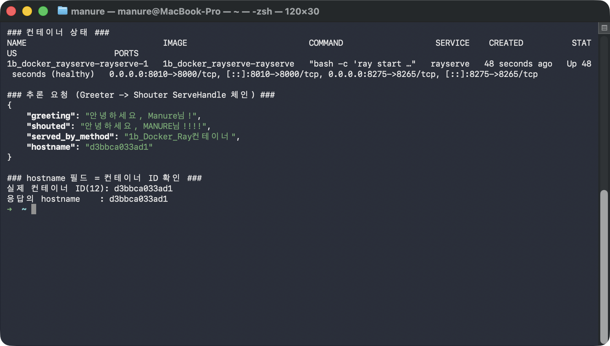
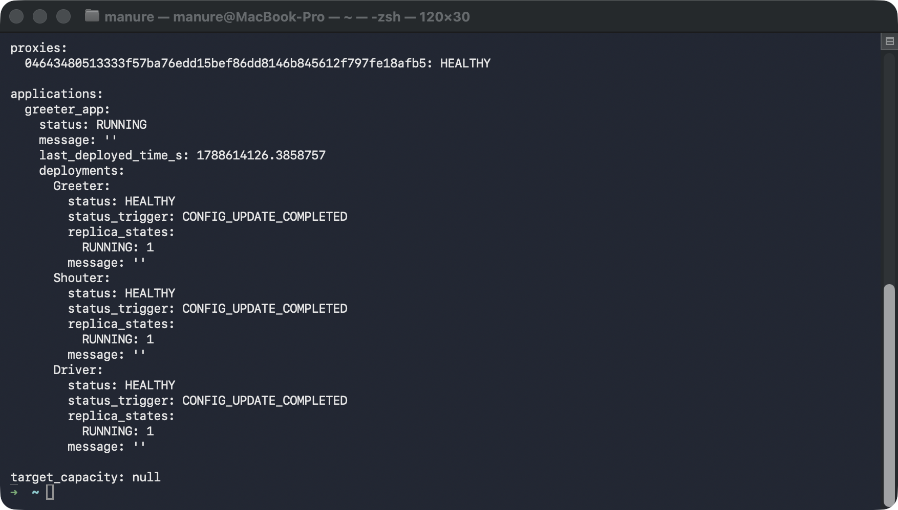
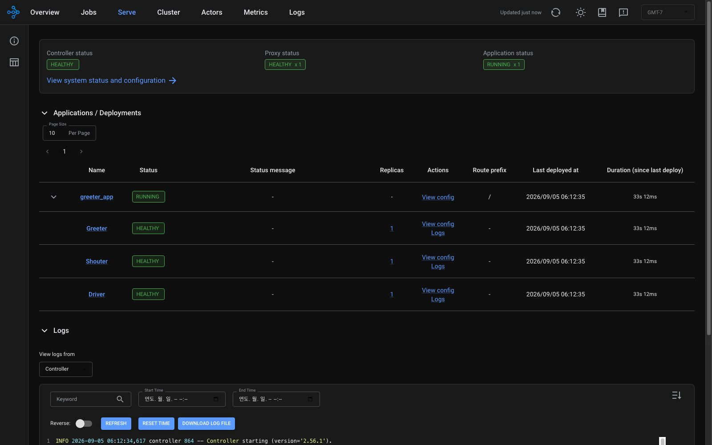

# followup.md — Docker로 Ray Serve 앱 띄우고 컨테이너 서빙 확인하기

Ray Serve 애플리케이션(Greeter → Shouter를 ServeHandle로 잇는 Driver)을
**Docker 컨테이너 하나**로 띄워, 호스트에서 실제 HTTP 추론을 해보고 "정말
컨테이너 안에서 서빙되는지"까지 한 줄씩 직접 확인한다. 호스트에는 Python도
Ray도 설치하지 않는다 — 전부 이미지 안에 들어있다.

## 필요한 파일

| 파일 | 역할 | 몇 단계에서 쓰이나 |
|---|---|---|
| `app.py` | Ray Serve 앱 — `@serve.deployment` 3개(Greeter/Shouter/Driver)와 ServeHandle 체인 | 1단계(이미지에 복사됨) |
| `serve_config.yaml` | `serve run` 대상 config — `http_options.host: 0.0.0.0`(컨테이너 밖 접속용) + app 정의 | 1단계 |
| `Dockerfile` | `rayproject/ray:2.56.1-py311` + 위 두 파일 | 1단계(빌드) |
| `docker-compose.yml` | 컨테이너 1개 — 포트 8010→8000, 8275→8265, `shm_size 2gb`, python 헬스체크 | 1~5단계 |

**필요한 CLI 도구**: `docker`(구동 중이어야 함), `docker compose`, `curl`, `python3`.
호스트에 Ray/Python 패키지 설치는 필요 없다. 이 문서는 `rayproject/ray:2.56.1-py311`,
Docker Compose(macOS)로 실제 검증했다.

## 무엇을 확인해야 하는가

| 확인 항목 | 정상 패턴 | 변동 여부 |
|---|---|---|
| 컨테이너 STATUS | `Up ... (healthy)` | ✅ 고정(항상 healthy여야 정상) |
| `greeting` / `shouted` | `안녕하세요, Manure님!` / `안녕하세요, MANURE님!!!!` | ✅ 고정(모델 로직이 결정적) |
| `hostname` 필드 | **컨테이너 ID와 같음** | ⚠️ 값 자체는 매 실행마다 다름 — "컨테이너 ID와 일치하는가"만 본다 |
| serve status 3개 deployment | 전부 `HEALTHY`, `RUNNING: 1` | ✅ 고정 |

> ⚠️ **실행마다 달라지는 값**: `hostname`(=컨테이너 ID), proxy의 해시 ID,
> `last_deployed_time_s`, `CREATED`/`Up N seconds`는 실행할 때마다 다르다. 숫자
> 자체가 아니라 **"응답 hostname == 실제 컨테이너 ID"라는 일치 관계**와
> **상태값(healthy / HEALTHY / RUNNING)** 만 맞으면 정상이다.

## 0단계 — 이동

```bash
cd 1b_docker_RayServe
```

## 1단계 — 이미지 빌드 + 컨테이너 기동

```bash
docker compose up -d --build
```

`rayproject/ray:2.56.1-py311` 위에 `app.py`·`serve_config.yaml`을 얹은 이미지를
빌드하고, 컨테이너 안에서 `ray start --head`(Dashboard를 0.0.0.0에 바인딩) →
`serve run serve_config.yaml`이 실행된다.

**실행 결과 예시**

```
[+] Running 2/2
 ✔ Network 1b_docker_rayserve_default      Created
 ✔ Container 1b_docker_rayserve-rayserve-1  Started
```

## 2단계 — healthy가 될 때까지 대기

```bash
# 헬스체크가 통과(Serve 엔드포인트가 실제 200)할 때까지 반복 확인 — 보통 15~30초
until [ "$(docker compose ps rayserve --format '{{.Health}}')" = "healthy" ]; do
  echo "  ...대기 중: $(docker compose ps rayserve --format '{{.Health}}')"; sleep 3
done
echo "healthy!"
```

**실행 결과 예시**

```
  ...대기 중: starting
  ...대기 중: starting
healthy!
```

## 3단계 — 호스트에서 실제 추론 + 컨테이너 서빙 증명

```bash
# 컨테이너 상태 확인
docker compose ps

# 추론 요청 (호스트 8010 → 컨테이너 8000) — Greeter가 인사말을 만들고 Shouter가 강조
curl -s "http://127.0.0.1:8010/?name=Manure" | python3 -m json.tool --no-ensure-ascii

# 응답 hostname이 실제 컨테이너 ID와 같은지 확인 (= 이 컨테이너가 서빙 주체)
CID=$(docker compose ps -q rayserve)
echo "실제 컨테이너 ID(12): ${CID:0:12}"
echo "응답의 hostname    : $(curl -s 'http://127.0.0.1:8010/?name=probe' | python3 -c 'import sys,json; print(json.load(sys.stdin)["hostname"])')"
```

`greeting`(Greeter deployment)이 만든 인사말을 `shouted`(Shouter deployment)가
대문자+`!!!`로 다시 가공했다 — Driver가 두 deployment를 **ServeHandle**로 순서대로
원격 호출한 결과다. 그리고 응답의 `hostname`이 실제 컨테이너 ID와 앞 12자리까지
같으면, 호스트가 아니라 **이 컨테이너 안에서** 서빙됐음이 증명된다.

**실행 결과 예시**

```
NAME                        ... STATUS                   PORTS
1b_docker_rayserve-...-1    ... Up 48 seconds (healthy)  0.0.0.0:8010->8000/tcp, 0.0.0.0:8275->8265/tcp

{
    "greeting": "안녕하세요, Manure님!",
    "shouted": "안녕하세요, MANURE님!!!!",
    "served_by_method": "1b_Docker_Ray컨테이너",
    "hostname": "d3bbca033ad1"
}

실제 컨테이너 ID(12): d3bbca033ad1
응답의 hostname    : d3bbca033ad1     ← 두 값이 같으면 ✅
```



## 4단계 — serve status로 3개 deployment 상태 확인

```bash
docker compose exec rayserve serve status
```

Greeter / Shouter / Driver 세 deployment가 각각 `HEALTHY`, `RUNNING: 1`이면
앱 전체(`greeter_app`)가 `RUNNING` 상태로 정상 서빙 중이라는 뜻이다.

**실행 결과 예시**

```
proxies:
  0464348...afb5: HEALTHY

applications:
  greeter_app:
    status: RUNNING
    deployments:
      Greeter: {status: HEALTHY, replica_states: {RUNNING: 1}}
      Shouter: {status: HEALTHY, replica_states: {RUNNING: 1}}
      Driver:  {status: HEALTHY, replica_states: {RUNNING: 1}}
```



## 5단계 — Ray Dashboard 열어보기 (선택)

```bash
open http://localhost:8275/#/serve
```

컨테이너의 Ray Dashboard(8265)가 호스트 8275로 매핑돼 있다. Serve 탭에서
Controller/Proxy/Application 상태와 3개 deployment를 시각적으로 확인할 수 있다.
(`ray start --head --dashboard-host=0.0.0.0`으로 띄웠기 때문에 컨테이너 밖에서
열린다 — 기본값이면 컨테이너 안에서만 보인다.)



## 6단계 — 정리

```bash
docker compose down
```

## 최종 비교표

| 확인 항목 | 이 문서의 값 | 직접 실행한 값 |
|---|---|---|
| 컨테이너 STATUS | Up (healthy) | |
| `greeting` | 안녕하세요, Manure님! | |
| `shouted` | 안녕하세요, MANURE님!!!! | |
| 응답 hostname == 컨테이너 ID | ✅ 일치 (d3bbca033ad1) | |
| serve status 3개 deployment | 전부 HEALTHY / RUNNING:1 | |

`greeting`·`shouted`가 그대로 나오고, 응답 `hostname`이 직접 확인한 컨테이너 ID와
일치했다면 — 호스트에 아무것도 설치하지 않고 컨테이너 하나만으로 Ray Serve 앱을
띄워 서빙하는 것을 스스로 확인한 것이다.
