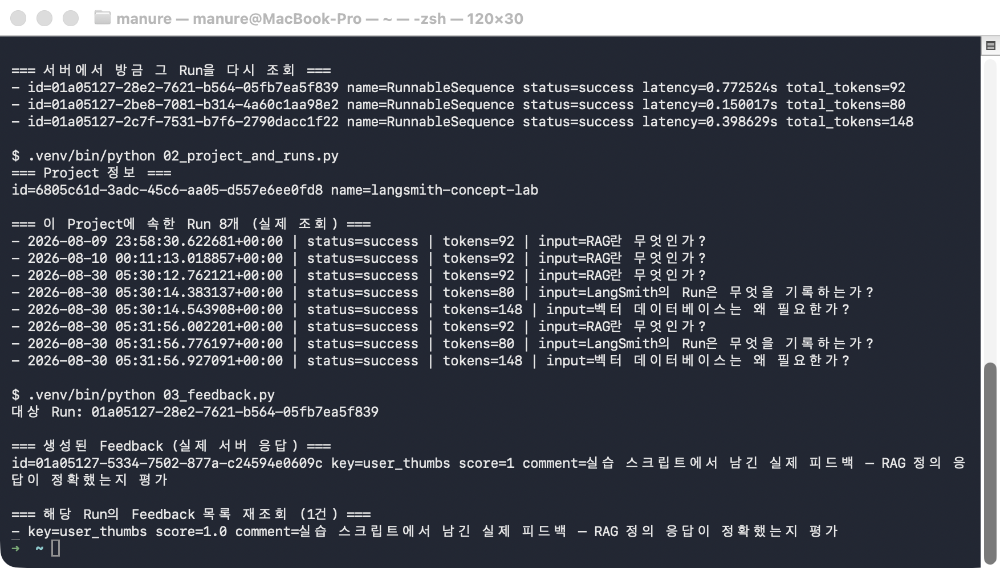
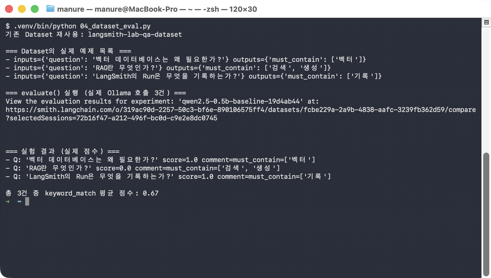
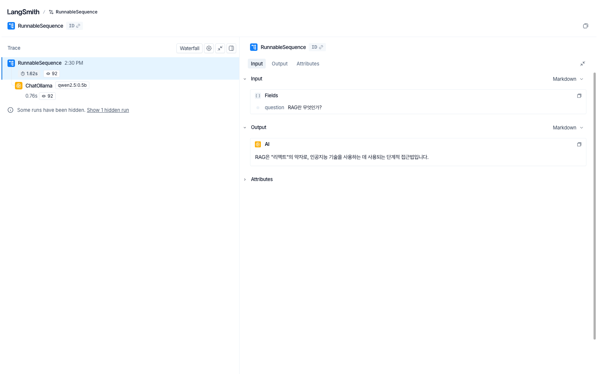
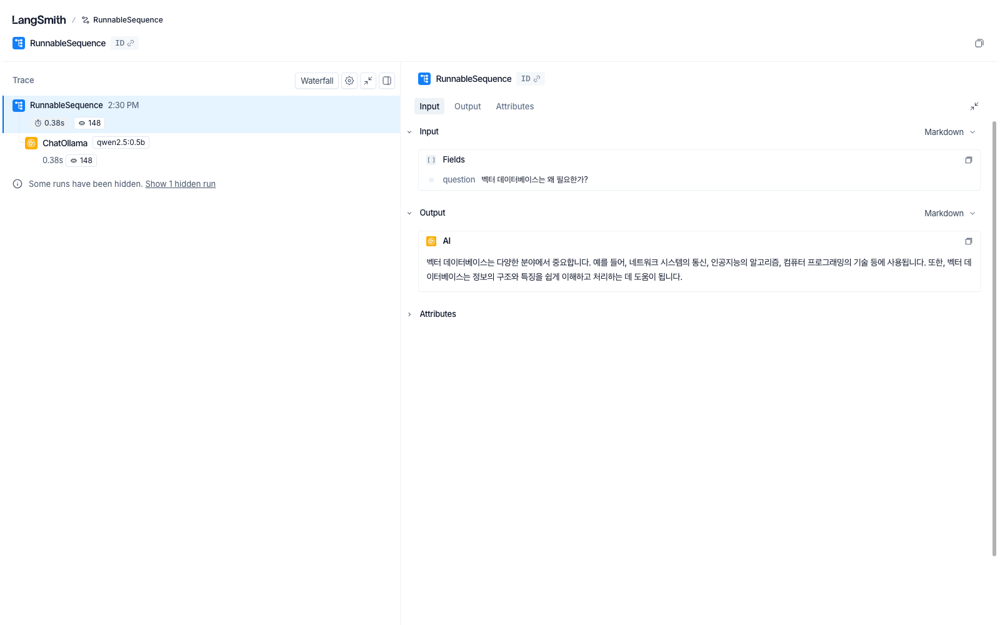

# followup.md — LangSmith Run/Project/Feedback/Dataset/Hub 직접 따라하기

이 가이드는 로컬 Ollama(`qwen2.5:0.5b`)와 실제 LangSmith 계정을 이용해 Run·Project·
Feedback·Dataset·Hub·공개 트레이스 링크를 한 줄씩 직접 만들고 조회하는 실습입니다.
아래 명령을 터미널에 그대로 입력하며 따라가면, 각 단계마다 실제로 무엇이 만들어지고
무엇이 조회되는지 눈으로 확인할 수 있습니다.

## 필요한 파일

| 파일 | 역할 |
|---|---|
| `.env.example` → `.env` | `LANGCHAIN_API_KEY` 등 LangSmith 접속 정보 템플릿 — 복사해서 본인 계정 값으로 채워야 함(실제 키가 든 `.env`는 배포에 포함되지 않음) |
| `chain_setup.py` | 공용 체인 정의 (`ChatPromptTemplate | ChatOllama(qwen2.5:0.5b)`) — 1·4단계가 그대로 import해서 씀 |
| `01_basic_trace.py` ~ `06_capture_screens.py` | 1~6단계에서 순서대로 실행할 스크립트 |
| `.venv/` | Python 3.11 가상환경 (langsmith, langchain, langchain-ollama, langchain-core 설치됨) |

## 사전 준비 (하나라도 빠지면 아래 단계가 실패합니다)

1. **LangSmith API 키** — `.env.example`을 `.env`로 복사한 뒤, 본인 계정의
   `LANGCHAIN_API_KEY` 값으로 채워둡니다(`.env`는 레포/배포본에 커밋되지 않는
   파일입니다).
   ```
   cp .env.example .env
   # .env를 열어 LANGCHAIN_API_KEY=YOUR_API_KEY_HERE 를 실제 키로 교체
   ```
2. **Ollama 서버 + 모델** — 로컬에서 Ollama가 떠 있어야 하고 `qwen2.5:0.5b` 모델이
   있어야 합니다.
   ```
   ollama serve &
   ollama pull qwen2.5:0.5b   # 이미 있으면 건너뜀
   ```
3. **가상환경** — 이미 `.venv/`가 있으면 그대로 쓰면 됩니다. 없다면:
   ```
   uv venv --python 3.11
   uv pip install --python .venv/bin/python langsmith langchain langchain-ollama langchain-core
   ```

## 무엇을 확인해야 하는가

1. `chain.invoke()`만으로 Run이 정말 자동 기록되는가
2. 그 Run들이 정말 Project 아래 모이는가
3. Run에 실제로 피드백을 남기고 다시 읽을 수 있는가
4. Dataset을 만들어 `evaluate()`로 반복 실행하면 진짜 점수가 나오는가
5. 프롬프트를 Hub에 실제로 커밋(push)하고 이름으로 다시 불러올(pull) 수 있는가
6. 이 모든 게 쌓인 실제 LangSmith 웹 화면을 직접 열어 확인할 수 있는가

---

## 0단계 — 폴더 이동

```bash
cd base-langsmith
```

## 1단계 — 질문 3개를 실행해 Run이 자동 기록되는지 확인

```bash
set -a; source .env; set +a
.venv/bin/python 01_basic_trace.py
```

실제 실행 결과(질문 3개에 대한 실제 Ollama 응답 + 서버에서 재조회한 실제 Run 상태):

```
Q: RAG란 무엇인가?
A: RAG은 "리액트"의 약자로, 인공지능 기술을 사용하는 데 사용되는 단계적 접근법입니다.

Q: LangSmith의 Run은 무엇을 기록하는가?
A: LangSmith의 Run는 프로그램 실행 결과를 기록하는 방법입니다.

Q: 벡터 데이터베이스는 왜 필요한가?
A:  벡터 데이터베이스는 다양한 분야에서 중요합니다. 예를 들어, 네트워크 시스템의 통신, 인공지능의 알고리즘, 컴퓨터 프로그래밍의 기술 등에 사용됩니다. 또한, 벡터 데이터베이스는 정보의 구조와 특징을 쉽게 이해하고 처리하는 데 도움이 됩니다.

=== 실제로 생성된 Run ID ===
01a05125-959a-7843-8db9-2a373cd94a79
01a05125-9bef-7f92-a776-90acf906711a
01a05125-9c8f-7c22-8736-f1ce427acff9

=== 서버에서 방금 그 Run을 다시 조회 ===
- id=01a05125-959a-7843-8db9-2a373cd94a79 name=RunnableSequence status=success latency=1.620604s total_tokens=92
- id=01a05125-9bef-7f92-a776-90acf906711a name=RunnableSequence status=success latency=0.160527s total_tokens=80
- id=01a05125-9c8f-7c22-8736-f1ce427acff9 name=RunnableSequence status=success latency=0.376194s total_tokens=148
```

> ⚠️ `qwen2.5:0.5b`는 작은 모델이라 "RAG"를 "리액트"로 잘못 아는 등 실제로 틀린 답을
> 하기도 합니다 — 이것도 지어낸 결과가 아니라 그 모델의 실제 한계입니다.

## 2단계 — Project 아래 Run이 실제로 모여 있는지 조회

```bash
.venv/bin/python 02_project_and_runs.py
```

```
=== Project 정보 ===
id=6805c61d-3adc-45c6-aa05-d557e6ee0fd8 name=langsmith-concept-lab

=== 이 Project에 속한 Run 5개 (실제 조회) ===
- 2026-08-09 23:58:30.622681+00:00 | status=success | tokens=92 | input=RAG란 무엇인가?
- 2026-08-10 00:11:13.018857+00:00 | status=success | tokens=92 | input=RAG란 무엇인가?
- 2026-08-30 05:30:12.762121+00:00 | status=success | tokens=92 | input=RAG란 무엇인가?
- 2026-08-30 05:30:14.383137+00:00 | status=success | tokens=80 | input=LangSmith의 Run은 무엇을 기록하는가?
- 2026-08-30 05:30:14.543908+00:00 | status=success | tokens=148 | input=벡터 데이터베이스는 왜 필요한가?
```

1단계를 실행할 때마다 Run 3개가 이 목록에 새로 쌓입니다 — 위 결과는 이 실습을 이미 몇
번 실행한 계정 기준이라 개수가 다를 수 있습니다. **핵심은 개수 자체가 아니라, 1단계에서
방금 만든 Run이 이 목록 맨 아래(가장 최근)에 실제로 나타난다는 점**입니다.

## 3단계 — Run에 피드백을 남기고 다시 읽어오기

```bash
.venv/bin/python 03_feedback.py
```

```
대상 Run: 01a05125-959a-7843-8db9-2a373cd94a79

=== 생성된 Feedback (실제 서버 응답) ===
id=01a05125-f507-7631-8736-b024bf911baa key=user_thumbs score=1 comment=실습 스크립트에서 남긴 실제 피드백 — RAG 정의 응답이 정확했는지 평가

=== 해당 Run의 Feedback 목록 재조회 (1건) ===
- key=user_thumbs score=1.0 comment=실습 스크립트에서 남긴 실제 피드백 — RAG 정의 응답이 정확했는지 평가
```

`대상 Run`은 1단계에서 방금 만든 Run 중 첫 번째입니다(`run_ids.json`에서 자동으로
읽어옴) — 그래서 이 단계는 반드시 1단계 다음에 실행해야 합니다.

### 스크린샷 — 1~3단계를 실제로 이어서 실행한 화면



> 스크린샷 속 Run ID·타임스탬프·개수는 위 텍스트 예시와 다릅니다 — 같은 스크립트를 다른
> 시점에 실행해 나온 **또 다른 실제 실행 결과**이기 때문입니다. 직접 따라 할 때도
> 여러분의 값은 이 문서의 어느 예시와도 다르게 나옵니다 — **숫자 자체가 아니라 "Run이
> 늘어난다 / 피드백이 실제로 붙는다"는 패턴이 재현되는지**를 확인하세요.

## 4단계 — Dataset을 만들고 evaluate()로 실제 채점

```bash
.venv/bin/python 04_dataset_eval.py
```

```
기존 Dataset 재사용: langsmith-lab-qa-dataset

=== Dataset의 실제 예제 목록 ===
- inputs={'question': '벡터 데이터베이스는 왜 필요한가?'} outputs={'must_contain': ['벡터']}
- inputs={'question': 'RAG란 무엇인가?'} outputs={'must_contain': ['검색', '생성']}
- inputs={'question': 'LangSmith의 Run은 무엇을 기록하는가?'} outputs={'must_contain': ['기록']}

=== evaluate() 실행 (실제 Ollama 호출 3건) ===
View the evaluation results for experiment: 'qwen2.5-0.5b-baseline-19d4ab44' at:
https://smith.langchain.com/o/.../datasets/.../compare?selectedSessions=...

=== 실험 결과 (실제 점수) ===
- Q: '벡터 데이터베이스는 왜 필요한가?' score=1.0 comment=must_contain=['벡터']
- Q: 'RAG란 무엇인가?' score=0.0 comment=must_contain=['검색', '생성']
- Q: 'LangSmith의 Run은 무엇을 기록하는가?' score=1.0 comment=must_contain=['기록']

총 3건 중 keyword_match 평균 점수: 0.67
```

`qwen2.5:0.5b`는 "RAG"를 정확히 정의하지 못해 이 문항만 실제로 0점을 받습니다 — 평가자가
정답을 미리 알고 봐주는 게 아니라, 답변 문자열에 정답 키워드가 있는지만 기계적으로
채점하기 때문에 나오는 실제 결과입니다.

### 스크린샷 — 4단계를 실제로 실행한 화면



## 5단계 — 프롬프트를 Hub에 커밋(push)하고 이름으로 다시 불러오기(pull)

```bash
.venv/bin/python 05_hub_prompt.py
```

```
v1 커밋 완료 — URL(비공개, 로그인 필요): https://smith.langchain.com/prompts/langsmith-lab-qa-prompt/aa350380?organizationId=...
v2 커밋 완료 — URL(비공개, 로그인 필요): https://smith.langchain.com/prompts/langsmith-lab-qa-prompt/664696f3?organizationId=...

=== 이름만으로 pull한 최신 버전(v2) 확인 ===
다음 질문에 한국어로 두 문장 이내로 간결하게 답하라: {question}

=== 실제 커밋 이력 6개 ===
- commit_hash=664696f3...
- commit_hash=aa350380...
- commit_hash=8bd6a308...
- commit_hash=081ac990...
- commit_hash=1c90eeba...
- commit_hash=3877a615...
```

> ⚠️ **계정에 Hub 핸들(사용자명)이 없으면** `is_public=True`로 커밋하려 할 때
> `LangSmithUserError: Cannot create a public prompt without first creating a
> LangChain Hub handle` 오류가 납니다. 이 스크립트는 그래서 처음부터 비공개
> (`is_public=False`, 기본값)로 커밋합니다 — push/pull 왕복 동작 자체는 동일하게
> 검증됩니다.

이름만으로 `pull_prompt()`를 호출했는데 v1이 아니라 **v2(가장 마지막에 커밋한 버전)**가
돌아온다는 점, 그리고 커밋 이력이 실행할 때마다 계속 쌓인다는 점이 이 단계의 핵심입니다.

## 6단계 — 실제 LangSmith 웹 화면을 캡처

```bash
.venv/bin/python 06_capture_screens.py
```

```
[rag] 공개 공유 링크: https://smith.langchain.com/public/f30dbf5f-d31c-4ebd-af4e-811a4aff5721/r
[vector_db] 공개 공유 링크: https://smith.langchain.com/public/4de1e639-1af0-4eb8-848d-7b39d918f726/r
캡처 완료: 01_public_trace_detail.png  <-  https://smith.langchain.com/public/f30dbf5f-d31c-4ebd-af4e-811a4aff5721/r
캡처 완료: 02_public_trace_detail_vector_db.png  <-  https://smith.langchain.com/public/4de1e639-1af0-4eb8-848d-7b39d918f726/r
```

> ⚠️ **같은 Run을 두 번 공유하면** `share_run()`이 `409 Conflict`
> (`{"detail":"Run already shared"}`)를 던집니다. 이 스크립트는 그 경우
> `read_run_shared_link()`로 기존 공유 링크를 그대로 재조회하도록 처리돼 있어, 몇 번을
> 다시 실행해도 안전합니다.

이 스크립트가 여는 링크는 로그인 없이 브라우저로 직접 열어도 됩니다 — `screenshots/`
폴더에 실제로 저장된 화면은 아래와 같습니다.

### 스크린샷 — 실제 공개 트레이스 화면





---

## 값이 실행마다 달라지는 것들 (숫자가 아니라 패턴을 확인하세요)

| 값 | 왜 매번 달라지나 | 무엇을 확인해야 하나 |
|---|---|---|
| Run ID, 타임스탬프 | 실행할 때마다 새 Run이 생성됨 | ID 자체가 아니라 "1단계 직후 새 Run이 실제로 나타났는가" |
| Project의 Run 개수 | 1단계를 실행한 누적 횟수만큼 계속 늘어남 | 절대 개수가 아니라 "실행 전보다 3개 늘었는가" |
| latency(지연시간) | 로컬 머신 부하·모델 웜업 상태에 따라 다름 | 값의 크기가 아니라 "0보다 큰 실제 값이 실제로 찍히는가" |
| Hub commit_hash, 이력 개수 | 5단계를 실행한 누적 횟수만큼 계속 쌓임 | 해시값이 아니라 "실행할 때마다 이력이 2개씩 늘어나는가" |
| 공개 공유 링크 URL | Run마다, 계정마다 다른 토큰이 발급됨 | URL 문자열이 아니라 "그 링크를 로그인 없이 열었을 때 실제 트레이스가 보이는가" |

## 최종 확인표

| 확인 항목 | `LANGSMITH.md`가 말하는 정의(정적) | 이 실습으로 실제 확인한 사실 |
|---|---|---|
| Run | 실행 하나하나의 기록 | `chain.invoke()` 호출 직후 서버에 실제로 Run이 생기고, `read_run()`으로 상태·지연시간·토큰 수까지 재조회됨 |
| Project | Run들을 묶는 단위 | 같은 Project를 반복 조회하면 실행할 때마다 Run이 실제로 누적되어 나타남 |
| Feedback | Run에 붙는 평가 정보 | `create_feedback()` 직후 `list_feedback()`으로 같은 값이 그대로 재조회됨 |
| Dataset + evaluate() | 실험을 반복 실행하는 단위 | 실제 3문항 채점 결과가 0.0~1.0으로 갈렸고, 평균 0.67이라는 실제 숫자가 나옴(0.5b 모델의 실제 한계 반영) |
| Hub | 프롬프트 버전 관리 | 이름 하나로 `push`/`pull`을 반복하면 항상 **최신 버전**이 돌아오고, 커밋 이력이 실제로 누적됨 |
| 공개 트레이스 링크 | 로그인 없이 볼 수 있는 공유 화면 | `curl`로 200 확인 + headless Chrome으로 실제 렌더링까지 성공, 로그인 화면이 아니라 실제 Run 트레이스가 그대로 보임 |
